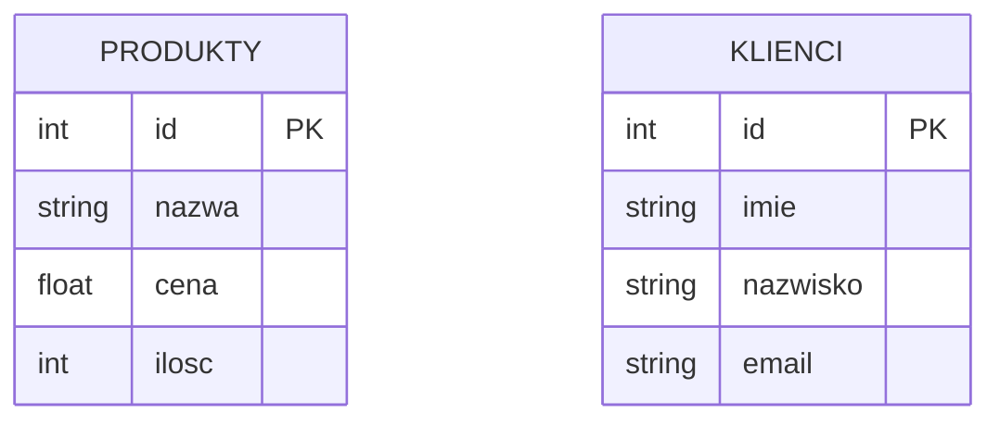

# Laboratorium 1: Podstawy SQL - DDL i DML (część 1)

## Cel laboratorium
Zapoznanie z podstawami języka SQL w zakresie definiowania struktury danych (DDL) oraz manipulacji danymi (DML).

## Podstawy teoretyczne

Język SQL (Structured Query Language) dzieli się na kilka podjęzyków, z których najważniejsze to:

### DDL (Data Definition Language)
Służy do definiowania struktury bazy danych (tworzenie, modyfikacja, usuwanie tabel i innych obiektów).
- `CREATE TABLE` – tworzy nową tabelę.
- `ALTER TABLE` – modyfikuje strukturę istniejącej tabeli.
- `DROP TABLE` – usuwa tabelę.

### DML (Data Manipulation Language)
Służy do operowania na danych wewnątrz tabel.
- `INSERT INTO` – dodaje nowe rekordy.
- `UPDATE` – modyfikuje istniejące dane.
- `DELETE` – usuwa rekordy.

### Przykład relacji i struktury (Mermaid)


## Narzędzia
- SQLite
- DB Browser for SQLite

## Krótka instrukcja pracy z Markdownem
- Nagłówki: używaj `#`, `##`, `###` (więcej `#` = niższy poziom)
- Pogrubienie: `**tekst**`, kursywa: `*tekst*`
- Listy:
  - wypunktowanie: `-` lub `*`
  - numerowanie: `1.`, `2.`
- Kod w linii: `` `fragment` ``, blok kodu:
```md
```sql
SELECT * FROM Produkty;
```
```
- Link: `[tekst](https://adres)`
- Obraz: ``

## Zadanie 1: Tworzenie bazy danych i tabel (DDL)
Stwórz bazę danych `sklep.db`, a w niej tabelę `Produkty` o następującej strukturze:
- `id`: klucz główny, autoinkrementacja
- `nazwa`: tekst, nie może być puste
- `cena`: liczba zmiennoprzecinkowa
- `ilosc`: liczba całkowita

```sql
CREATE TABLE Produkty (
    id INTEGER PRIMARY KEY AUTOINCREMENT,
    nazwa TEXT NOT NULL,
    cena REAL,
    ilosc INTEGER
);
```

### Przykładowy wynik (Oczekiwany rezultat)
Po wykonaniu polecenia `CREATE TABLE`, tabela zostanie utworzona. Możesz to sprawdzić poleceniem:
```sql
.tables
```
**Wynik:**
```text
Produkty
```

## Zadanie 2: Dodawanie danych (DML - INSERT)
Wprowadź do tabeli 5 dowolnych produktów.

```sql
INSERT INTO Produkty (nazwa, cena, ilosc) VALUES ('Chleb', 4.50, 10);
INSERT INTO Produkty (nazwa, cena, ilosc) VALUES ('Mleko', 3.20, 20);
-- Dodaj pozostałe 3 produkty
```

### Przykładowy wynik (Oczekiwany rezultat)
Aby sprawdzić, czy dane zostały dodane, wykonaj:
```sql
SELECT * FROM Produkty;
```
**Wynik (przykładowy):**
```text
id | nazwa | cena | ilosc
---|-------|------|------
1  | Chleb | 4.5  | 10
2  | Mleko | 3.2  | 20
... (pozostałe rekordy)
```

## Zadanie 3: Modyfikacja i usuwanie danych (DML - UPDATE, DELETE)
1. Zmień cenę produktu o id=1.
2. Usuń produkt o nazwie 'Mleko'.

## Ćwiczenie do wykonania
Stwórz tabelę `Klienci` (id, imie, nazwisko, email) i dodaj do niej 3 rekordy.

## Ćwiczenia dodatkowe
1. Dodaj do tabeli `Produkty` kolumnę `kategoria` (TEXT), uzupełnij ją dla istniejących rekordów i przygotuj zapytanie zwracające liczbę produktów w każdej kategorii.
2. Dodaj ograniczenie `CHECK` na kolumnie `ilosc`, aby wartość nie mogła być ujemna. Przetestuj działanie poprzez próbę wstawienia błędnego rekordu.
