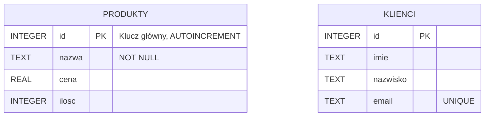

# Laboratorium 1: Podstawy SQL - DDL i DML (część 1)

## Cel laboratorium
Zapoznanie z podstawami języka SQL w zakresie definiowania struktury danych (DDL) oraz manipulacji danymi (DML).

## Podstawy teoretyczne

### Czym jest SQL?
**SQL** (Structured Query Language) to ustrukturyzowany język zapytań służący do zarządzania i operowania na danych w relacyjnych bazach danych (RDBMS). Pozwala on na tworzenie struktur bazy, dodawanie danych, ich modyfikację oraz pobieranie informacji spełniających określone kryteria.

### Architektura danych: Tabela
W relacyjnych bazach danych dane przechowywane są w **tabelach**. Tabela składa się z:
- **Kolumn (Pól)** – definiują rodzaj przechowywanych informacji (np. imię, cena, data). Każda kolumna ma określony typ danych.
- **Wierszy (Rekordów)** – konkretne wystąpienia danych w tabeli (np. konkretny produkt lub klient).

#### Przykład wizualny tabeli `Produkty`:
| id (PK) | nazwa | cena | ilosc |
|:---:|:---|:---:|:---:|
| 1 | Chleb | 4.50 | 10 |
| 2 | Mleko | 3.20 | 20 |

### Klucz Główny (Primary Key)
Każda tabela powinna posiadać **Klucz Główny (PK)**. Jest to kolumna (lub zestaw kolumn), która jednoznacznie identyfikuje każdy rekord w tabeli. Wartości w tej kolumnie muszą być unikalne i nie mogą być puste (`NOT NULL`).

### Podjęzyki SQL
Język SQL dzieli się na kilka grup poleceń w zależności od ich przeznaczenia:

1.  **DDL (Data Definition Language)** – Język definicji danych. Służy do tworzenia, modyfikowania i usuwania struktur bazy danych (tabel, widoków, indeksów).
    - `CREATE` – tworzenie nowych obiektów.
    - `ALTER` – zmiana struktury istniejących obiektów.
    - `DROP` – usuwanie obiektów.
2.  **DML (Data Manipulation Language)** – Język manipulacji danymi. Służy do pracy na konkretnych rekordach.
    - `INSERT` – dodawanie nowych wierszy.
    - `UPDATE` – modyfikacja istniejących danych.
    - `DELETE` – usuwanie wierszy.
3.  **DQL (Data Query Language)** – Język zapytań. Służy do pobierania danych z bazy.
    - `SELECT` – wybieranie danych.

### Typy danych w SQLite
Podczas tworzenia tabeli musimy określić, jakiego rodzaju dane będą przechowywane w kolumnach. Najpopularniejsze typy w SQLite to:
- `INTEGER` – liczby całkowite.
- `REAL` – liczby zmiennoprzecinkowe (dziesiętne).
- `TEXT` – ciągi znaków (napisy).
- `BLOB` – dane binarne (np. zdjęcia).
- `NULL` – brak wartości.

### Wizualizacja struktury (Diagram Mermaid)
Diagramy encji (ERD) pozwalają graficznie przedstawić strukturę bazy danych i relacje między tabelami.


```mermaid
erDiagram
    PRODUKTY {
        INTEGER id PK "Klucz główny, AUTOINCREMENT"
        TEXT nazwa "NOT NULL"
        REAL cena
        INTEGER ilosc
    }
    KLIENCI {
        INTEGER id PK
        TEXT imie
        TEXT nazwisko
        TEXT email "UNIQUE"
    }
```

---

## Narzędzia
- SQLite
- DB Browser for SQLite

## Krótka instrukcja pracy z Markdownem
- Nagłówki: używaj `#`, `##`, `###` (więcej `#` = niższy poziom)
- Pogrubienie: `**tekst**`, kursywa: `*tekst*`
- Listy:
  - wypunktowanie: `-` lub `*`
  - numerowanie: `1.`, `2.`
- Kod w linii: `` `fragment` ``, blok kodu:
```md
```sql
SELECT * FROM Produkty;
```
```
- Link: `[tekst](https://adres)`
- Obraz: ``

## Zadanie 1: Tworzenie bazy danych i tabel (DDL)
Stwórz bazę danych `sklep.db`, a w niej tabelę `Produkty` o następującej strukturze:
- `id`: klucz główny, autoinkrementacja
- `nazwa`: tekst, nie może być puste
- `cena`: liczba zmiennoprzecinkowa
- `ilosc`: liczba całkowita

```sql
CREATE TABLE Produkty (
    id INTEGER PRIMARY KEY AUTOINCREMENT,
    nazwa TEXT NOT NULL,
    cena REAL,
    ilosc INTEGER
);
```

### Przykładowy wynik (Oczekiwany rezultat)
Po wykonaniu polecenia `CREATE TABLE`, tabela zostanie utworzona. Możesz to sprawdzić poleceniem:
```sql
.tables
```
**Wynik:**
```text
Produkty
```

## Zadanie 2: Dodawanie danych (DML - INSERT)
Wprowadź do tabeli 5 dowolnych produktów.

```sql
INSERT INTO Produkty (nazwa, cena, ilosc) VALUES ('Chleb', 4.50, 10);
INSERT INTO Produkty (nazwa, cena, ilosc) VALUES ('Mleko', 3.20, 20);
-- Dodaj pozostałe 3 produkty
```

### Przykładowy wynik (Oczekiwany rezultat)
Aby sprawdzić, czy dane zostały dodane, wykonaj:
```sql
SELECT * FROM Produkty;
```
**Wynik (przykładowy):**
```text
id | nazwa | cena | ilosc
---|-------|------|------
1  | Chleb | 4.5  | 10
2  | Mleko | 3.2  | 20
... (pozostałe rekordy)
```

## Zadanie 3: Modyfikacja i usuwanie danych (DML - UPDATE, DELETE)
1. Zmień cenę produktu o id=1.
2. Usuń produkt o nazwie 'Mleko'.

## Ćwiczenie do wykonania
Stwórz tabelę `Klienci` (id, imie, nazwisko, email) i dodaj do niej 3 rekordy.

## Ćwiczenia dodatkowe
1. Dodaj do tabeli `Produkty` kolumnę `kategoria` (TEXT), uzupełnij ją dla istniejących rekordów i przygotuj zapytanie zwracające liczbę produktów w każdej kategorii.
2. Dodaj ograniczenie `CHECK` na kolumnie `ilosc`, aby wartość nie mogła być ujemna. Przetestuj działanie poprzez próbę wstawienia błędnego rekordu.
