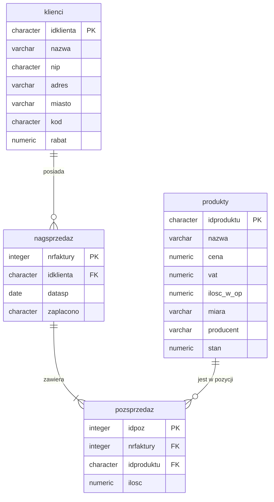

# Laboratorium 1: Podstawy SQL - Zapytania SELECT (Baza Rembud)

## Cel laboratorium
Opanowanie umiejętności pobierania danych z bazy danych przy użyciu polecenia `SELECT`, filtrowania wyników, sortowania oraz ograniczania liczby rekordów.

## Podstawy teoretyczne

### DQL (Data Query Language)
Służy do pobierania (odczytywania) danych z bazy. Głównym poleceniem jest `SELECT`.

#### Składnia polecenia SELECT:
- `SELECT` – wybiera określone kolumny (użyj `*` dla wszystkich).
- `FROM` – wskazuje tabelę.
- `WHERE` – filtruje rekordy (np. `cena > 100`).
- `ORDER BY` – sortuje wyniki (`ASC` - rosnąco, `DESC` - malejąco).
- `LIMIT` – ogranicza liczbę zwracanych wierszy.
- `DISTINCT` – usuwa duplikaty z wyników.

### Przygotowanie środowiska
Baza `rembud` ma być używana w pewnym dużym sklepie z materiałami remontowo-budowlanymi. Dozwolone są jedynie operacje wyszukiwania danych (SELECT).

Przed przystąpieniem do zadań należy zaimportować strukturę bazy danych i przykładowe dane:
👉 [Skrypt SQL: lab01_rembudSQL.sql](lab01_rembudSQL.sql)

## Schemat bazy danych (Mermaid)
Przeznaczenie tabel:
- **klienci** – podstawowe dane klientów sklepu (drobni przedsiębiorcy, rabaty itp.).
- **produkty** – dane o produktach sklepu.
- **nagsprzedaz** – nagłówki sprzedaży (faktury).
- **pozsprzedaz** – pozycje sprzedaży (produkty na konkretnym dokumencie).

```mermaid
erDiagram
    klienci ||--o{ nagsprzedaz : "posiada"
    nagsprzedaz ||--|{ pozsprzedaz : "zawiera"
    produkty ||--o{ pozsprzedaz : "jest w pozycji"
    
    klienci {
        character idklienta PK
        varchar nazwa
        character nip
        varchar adres
        varchar miasto
        character kod
        numeric rabat
    }
    produkty {
        character idproduktu PK
        varchar nazwa
        numeric cena
        numeric vat
        numeric ilosc_w_op
        varchar miara
        varchar producent
        numeric stan
    }
    nagsprzedaz {
        integer nrfaktury PK
        character idklienta FK
        date datasp
        character zaplacono
    }
    pozsprzedaz {
        integer idpoz PK
        integer nrfaktury FK
        character idproduktu FK
        numeric ilosc
    }
```

## Zadania
Wykonaj poniższe zapytania SQL na tabelach przygotowanych w skrypcie:

1. Podaj wszystkie dane o klientach (SELECT * FROM klienci).
2. Podaj identyfikator, nazwę, producenta i cenę każdego produktu.
3. Nazwa, cena, stan produktów producenta Cersanit.
4. Identyfikator, nazwa, producent, cena produktów droższych niż 100.
5. Numer faktury, id klienta, data dokumentów sprzedaży z okresu 15 – 25 stycznia.
6. Nazwa, cena, miara i stan lakierów.
7. Identyfikator, nazwa, adres klientów z Gdyni i Sopotu.
8. Nazwa, producent, stan produktów Malfarba i Cersanita ze stanami w granicach [200, 2000].
9. Nazwa, miasto, rabat klientów z Gdyni lub Słupska lub z niezerowym rabatem.
10. Identyfikator, nazwa klienta z niezerowym rabatem z Gdyni lub Gdańska.
11. Pełna informacja o każdym produkcie oraz jego cena brutto (w tabeli przechowujemy cenę netto).
12. Pełna informacja o nieopłaconych dokumentach sprzedaży oraz liczba dni jakie minęły od dnia sprzedaży do dziś.
13. Numery dokumentów sprzedaży na które sprzedano produkty o identyfikatorach P06, P15, P36.
14. Identyfikatory klientów, którzy kupowali w styczniu.
15. Identyfikatory produktów, które były sprzedawane.
16. Wartości poszczególnych produktów, jakie mamy na stanie.
17. Numery i daty nieopłaconych dokumentów sprzedaży zrealizowanych w lutym.
18. Kiedy (data) pojawił się pierwszy klient.
19. Nazwa i producent najdroższego produktu.
20. Pełna informacja o dokumentach sprzedaży wraz z pełnymi danymi klienta.
21. Pełny opis pozycji sprzedaży oraz jej wartość netto i brutto.
22. Nazwy, miary i stany sprzedawanych produktów producenta Cersanit.
23. Nazwy i miary farb i emulsji, które sprzedano w ilościach (ilosc*ilość_w_op) większych niż 10.
24. Numery dokumentów sprzedaży, na które kupowano farby i taśmę malarską (na jednym dokumencie).
25. Identyfikatory produktów zakupionych w okresie 15 stycznia – 15 lutego.
