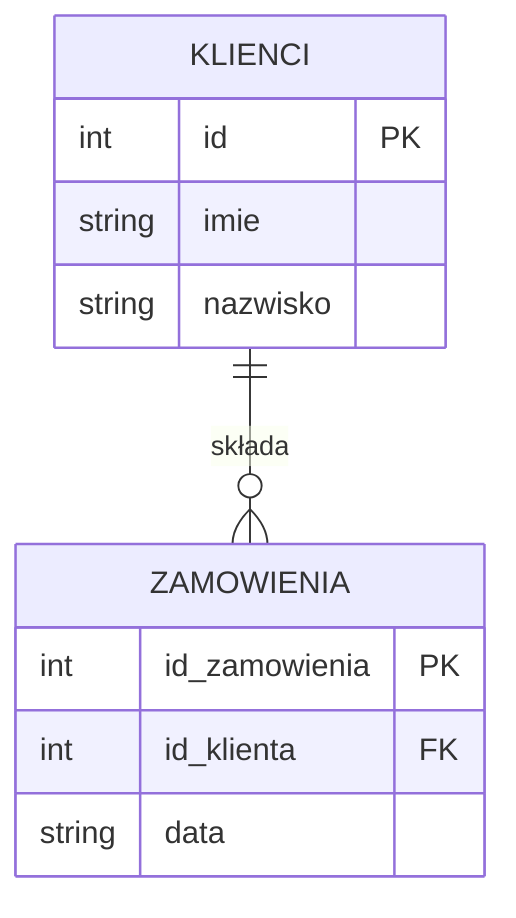

# Laboratorium 2: SQL - Zapytania, złączenia i agregacja (część 2)

## Cel laboratorium
Opanowanie umiejętności pobierania danych z wielu tabel, filtrowania wyników oraz korzystania z funkcji agregujących.

## Podstawy teoretyczne

### DQL (Data Query Language)
Służy do pobierania (odczytywania) danych z bazy. Głównym poleceniem jest `SELECT`.
- `SELECT ... FROM ... WHERE ...` – wybieranie kolumn z tabeli z opcjonalnym filtrowaniem.
- `ORDER BY` – sortowanie wyników (domyślnie `ASC` - rosnąco, `DESC` - malejąco).

### Agregacja i grupowanie
- `COUNT()`, `SUM()`, `AVG()`, `MIN()`, `MAX()` – funkcje wykonujące obliczenia na zbiorze rekordów.
- `GROUP BY` – grupuje rekordy o tych samych wartościach w określonych kolumnach.
- `HAVING` – warunek filtrujący dla grup (odpowiednik `WHERE` dla zgrupowanych danych).

### Złączenia (JOINs)
Złączenia pozwalają na łączenie danych z wielu tabel na podstawie powiązanych kolumn.
- `INNER JOIN` – zwraca tylko rekordy pasujące w obu tabelach.
- `LEFT JOIN` – zwraca wszystkie rekordy z lewej tabeli i dopasowane rekordy z prawej (jeśli brak dopasowania, wstawia NULL).

### Schemat złączenia (Mermaid)


## Zadania
1. **SELECT z filtrowaniem**: Pobierz produkty o cenie wyższej niż 5.00.
2. **JOIN**: Połącz tabelę `Zamowienia` (którą należy utworzyć) z tabelą `Klienci`.
3. **Agregacja**: Oblicz średnią cenę produktów w sklepie.

## Przykład JOIN
```sql
CREATE TABLE Zamowienia (
    id_zamowienia INTEGER PRIMARY KEY,
    id_klienta INTEGER,
    data TEXT,
    FOREIGN KEY(id_klienta) REFERENCES Klienci(id)
);

SELECT Klienci.imie, Klienci.nazwisko, Zamowienia.data
FROM Klienci
JOIN Zamowienia ON Klienci.id = Zamowienia.id_klienta;
```

## Ćwiczenie
Wyświetl liczbę produktów w poszczególnych kategoriach (dodaj kolumnę `kategoria` do tabeli `Produkty`).

## Ćwiczenia dodatkowe
1. Wyświetl listę klientów, którzy nie złożyli żadnego zamówienia (użyj `LEFT JOIN` i `WHERE Zamowienia.id_zamowienia IS NULL`).
2. Wyświetl kategorie produktów wraz ze średnią ceną, ale tylko te kategorie, w których jest co najmniej 3 produktów (`GROUP BY`, `HAVING COUNT(*) >= 3`).
