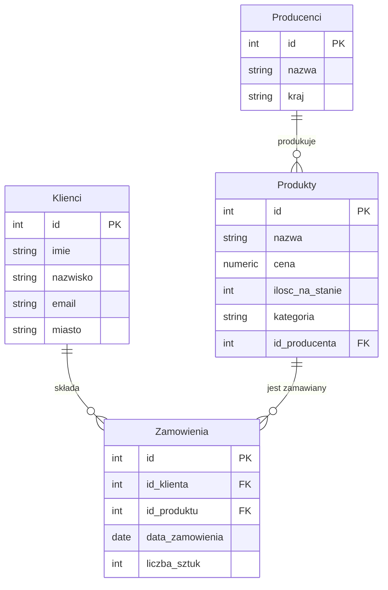

### Laboratorium 2: Podstawy kwerend – filtrowanie danych SQL

### Cel laboratorium
Celem zajęć jest opanowanie umiejętności filtrowania danych w SQL przy użyciu klauzuli `WHERE`, operatorów porównania, operatorów logicznych (`AND`, `OR`, `NOT`) oraz specjalnych operatorów takich jak `BETWEEN`, `IN`, `LIKE` oraz `IS NULL`.

### Podstawy teoretyczne

Filtrowanie danych pozwala na pobranie z bazy tylko tych rekordów, które spełniają określone kryteria. Służy do tego klauzula `WHERE`.

#### 1. Operatory porównania
- `=` (równe), `<>` lub `!=` (różne)
- `<` (mniejsze), `>` (większe)
- `<=` (mniejsze lub równe), `>=` (większe lub równe)

#### 2. Operatory logiczne
- `AND` – oba warunki muszą być spełnione.
- `OR` – przynajmniej jeden warunek musi być spełniony.
- `NOT` – zaprzeczenie warunku.

#### 3. Operatory specjalne
- `BETWEEN wartość1 AND wartość2` – zakres domknięty (liczby, daty, tekst).
- `IN (wartość1, wartość2, ...)` – przynależność do zbioru.
- `LIKE` – dopasowanie wzorca tekstowego:
    - `%` – dowolny ciąg znaków (0 lub więcej).
    - `_` – dokładnie jeden dowolny znak.
- `IS NULL` / `IS NOT NULL` – sprawdzanie, czy kolumna zawiera wartość pustą.

### Przygotowanie środowiska
Przed przystąpieniem do zadań należy zaimportować strukturę bazy danych i przykładowe dane:
👉 [Skrypt SQL: lab02_computer_shop.sql](lab02_computer_shop.sql)

### Schemat bazy danych (Mermaid)

```mermaid
erDiagram
    Producenci ||--o{ Produkty : "produkuje"
    Klienci ||--o{ Zamowienia : "składa"
    Produkty ||--o{ Zamowienia : "jest zamawiany"
    
    Producenci {
        int id PK
        string nazwa
        string kraj
    }
    Produkty {
        int id PK
        string nazwa
        numeric cena
        int ilosc_na_stanie
        string kategoria
        int id_producenta FK
    }
    Klienci {
        int id PK
        string imie
        string nazwisko
        string email
        string miasto
    }
    Zamowienia {
        int id PK
        int id_klienta FK
        int id_produktu FK
        date data_zamowienia
        int liczba_sztuk
    }
```

---

### Zadania do wykonania (Filtrowanie danych)

1. Wyświetl wszystkie produkty, których cena jest wyższa niż 2000 zł.
2. Wyświetl listę klientów, którzy mieszkają w Warszawie.
3. Wyświetl produkty z kategorii 'Procesory', których ilość na stanie jest większa niż 10.
4. Znajdź wszystkich producentów z 'USA' lub 'Tajwanu'.
5. Wyświetl produkty, których cena mieści się w przedziale od 500 do 1500 zł (użyj `BETWEEN`).
6. Wyświetl zamówienia złożone w pierwszej połowie października 2023 (od 2023-10-01 do 2023-10-15).
7. Znajdź klientów, których nazwisko zaczyna się na literę 'K'.
8. Wyświetl produkty, których kategoria to 'Monitory', 'Dyski' lub 'RAM' (użyj `IN`).
9. Wyświetl wszystkich klientów, którzy mają adres e-mail w domenie `@email.pl`.
10. Wyświetl produkty, które NIE należą do kategorii 'Laptopy' ani 'Drukarki'.
11. Znajdź produkty, których nazwa zawiera słowo 'GeForce' lub 'Radeon'.
12. Wyświetl klientów z miast innych niż 'Warszawa' i 'Kraków'.
13. Wyświetl zamówienia, w których zakupiono więcej niż 2 sztuki produktu.
14. Znajdź produkty, których cena jest niższa niż 1000 zł, a jednocześnie ich ilość na stanie jest mniejsza niż 20.
15. Wyświetl producentów, których nazwa kończy się na literę 'i'.
16. Znajdź klientów, których imię to 'Jan' lub 'Anna', a nazwisko zawiera literę 'o'.
17. Wyświetl produkty o nazwie składającej się dokładnie z 5 znaków (użyj operatora `_` w `LIKE`).
18. Znajdź produkty, których `id_producenta` to 1, 2 lub 3, a cena przekracza 1500 zł.
19. Wyświetl zamówienia dokonane po 15 października 2023 roku.
20. Wyświetl listę produktów, których nazwa zaczyna się od 'Ultra' i kosztują więcej niż 2000 zł.

