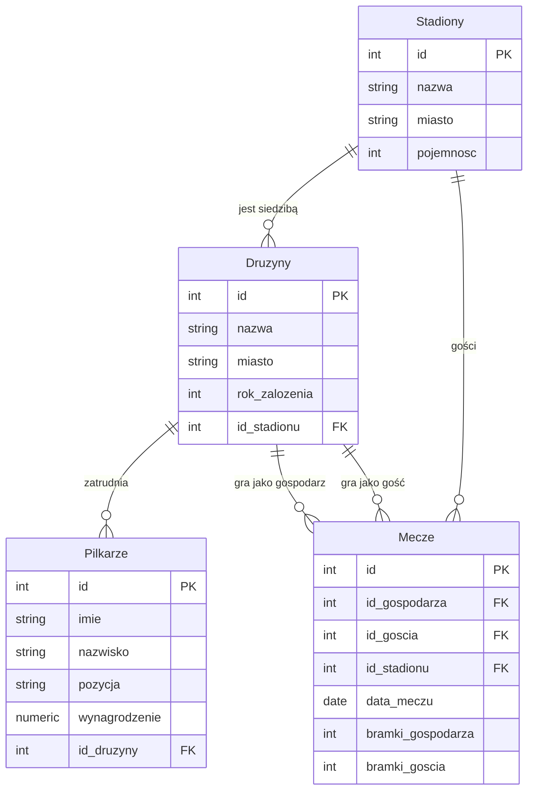
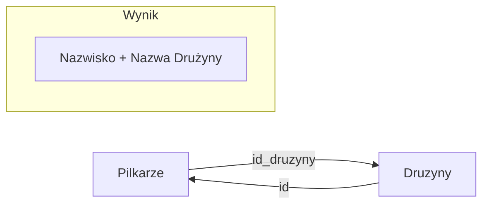
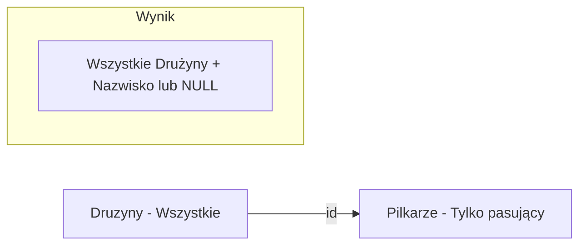
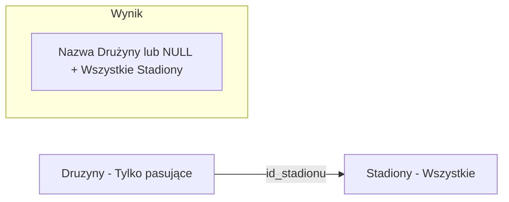
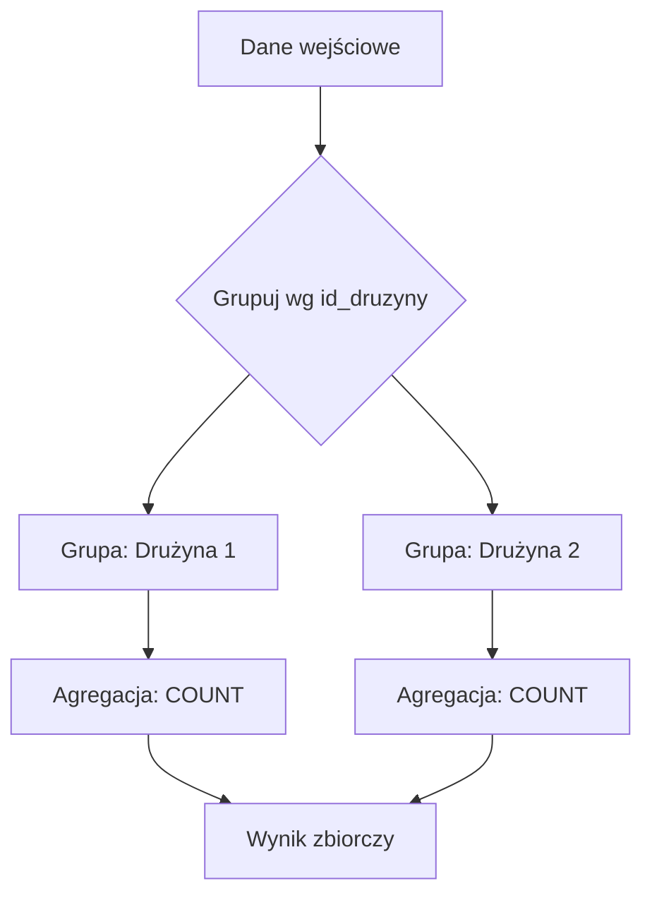
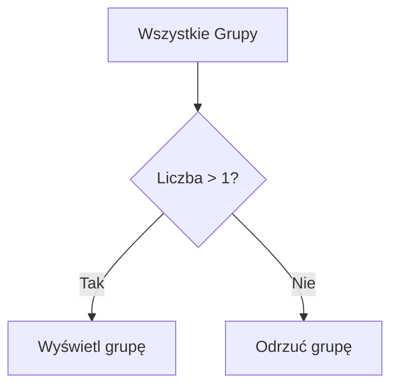
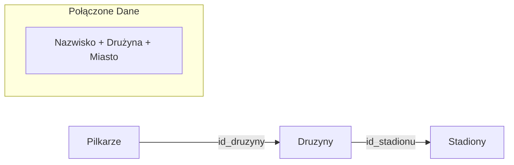

### Laboratorium 3: Łączenie tabel i funkcje agregujące.

### Cel laboratorium
Celem zajęć jest opanowanie umiejętności łączenia danych z wielu tabel za pomocą operatorów `JOIN` oraz wykonywania obliczeń na grupach rekordów przy użyciu funkcji agregujących (`COUNT`, `SUM`, `AVG`, `MIN`, `MAX`) wraz z klauzulami `GROUP BY` i `HAVING`.

### Podstawy teoretyczne

#### 1. Łączenie tabel (JOIN)
- `INNER JOIN` – zwraca tylko te wiersze, które mają dopasowanie w obu tabelach.
- `LEFT JOIN` – zwraca wszystkie wiersze z lewej tabeli oraz dopasowane wiersze z prawej tabeli. Jeśli nie ma dopasowania, zwraca `NULL` dla kolumn z prawej tabeli.
- `RIGHT JOIN` – zwraca wszystkie wiersze z prawej tabeli oraz dopasowane wiersze z lewej tabeli. Jeśli nie ma dopasowania, zwraca `NULL` dla kolumn z lewej tabeli.
- `FULL JOIN` – zwraca wszystkie wiersze, gdy istnieje dopasowanie w jednej z tabel.

```sql
SELECT kolumny
FROM TabelaA
INNER | LEFT | RIGHT | FULL JOIN TabelaB ON TabelaA.klucz_obcy = TabelaB.id;
```

#### 2. Funkcje agregujące
Służą do wykonywania obliczeń na zbiorze wartości i zwracania pojedynczego wyniku:
- `COUNT(*)` – liczy liczbę wierszy.
- `SUM(kolumna)` – sumuje wartości w kolumnie.
- `AVG(kolumna)` – oblicza średnią wartość.
- `MIN(kolumna)` / `MAX(kolumna)` – znajduje wartość minimalną lub maksymalną.

#### 3. Grupowanie danych (GROUP BY i HAVING)
- `GROUP BY` – dzieli wynik zapytania na grupy w celu zastosowania funkcji agregujących dla każdej grupy.
- `HAVING` – służy do filtrowania grup (działa jak `WHERE`, ale dla wyników funkcji agregujących).

### Przygotowanie środowiska
Zadania należy wykonywać na własnej bazie danych. Przed przystąpieniem do zadań należy zaimportować strukturę bazy danych i przykładowe dane dotyczące ligi piłkarskiej:
👉 [Skrypt SQL: lab03_football_league.sql](lab03_football_league.sql)

### Schemat bazy danych (Mermaid)


---

### Przykłady startowe: Łączenie i agregacja

#### Jak działa `INNER JOIN`?

Łącząc tabele `Pilkarze` i `Druzyny`, SQL dopasowuje `id_druzyny` z tabeli `Pilkarze` do `id` z tabeli `Druzyny`. Zwraca tylko tych piłkarzy, którzy mają przypisaną drużynę oraz tylko te drużyny, które mają piłkarzy.

```sql
SELECT Pilkarze.nazwisko, Druzyny.nazwa 
FROM Pilkarze 
INNER JOIN Druzyny ON Pilkarze.id_druzyny = Druzyny.id;
```

**Wizualizacja złączenia:**



#### Jak działa `LEFT JOIN`?

Zwraca wszystkich piłkarzy, nawet jeśli nie mają przypisanej drużyny. W naszej bazie każdy piłkarz ma drużynę, więc spróbujmy w drugą stronę: wyświetlmy wszystkie drużyny i ich piłkarzy. Drużyny bez piłkarzy (np. 'Podbeskidzie') również pojawią się na liście, ale z wartością `NULL` w kolumnach piłkarza.

```sql
SELECT D.nazwa AS nazwa_druzyny, P.nazwisko
FROM Druzyny D
LEFT JOIN Pilkarze P ON D.id = P.id_druzyny;
```

**Wizualizacja `LEFT JOIN`:**



#### Jak działa `RIGHT JOIN`?

Zwraca wszystkie rekordy z "prawej" tabeli. Przykład: wyświetlmy wszystkie stadiony i drużyny, które mają tam swoją siedzibę. Stadion Narodowy nie jest siedzibą żadnej drużyny w naszej bazie, więc przy `INNER JOIN` by nie wystąpił, ale przy `RIGHT JOIN` na tabelę `Stadiony` zostanie wyświetlony.

```sql
SELECT D.nazwa AS nazwa_druzyny, S.nazwa AS nazwa_stadionu
FROM Druzyny D
RIGHT JOIN Stadiony S ON D.id_stadionu = S.id;
```

**Wizualizacja `RIGHT JOIN`:**



#### Jak działa `FULL JOIN`?

Łączy cechy `LEFT JOIN` i `RIGHT JOIN`. Zwraca wszystkie rekordy z obu tabel, uzupełniając brakujące dopasowania wartościami `NULL`.

```sql
SELECT D.nazwa AS nazwa_druzyny, S.nazwa AS nazwa_stadionu
FROM Druzyny D
FULL JOIN Stadiony S ON D.id_stadionu = S.id;
```

#### Jak działa `GROUP BY`?

Grupowanie pozwala na policzenie rekordów (np. ilu piłkarzy gra w każdej drużynie).

```sql
SELECT id_druzyny, COUNT(*) AS liczba_pilkarzy
FROM Pilkarze
GROUP BY id_druzyny;
```

**Wizualizacja grupowania:**



#### Jak działa `HAVING`?

Klauzula `HAVING` służy do filtrowania grup danych po wykonaniu agregacji. Różni się od `WHERE` tym, że może operować na wynikach funkcji takich jak `COUNT` czy `SUM`.

```sql
SELECT id_druzyny, COUNT(*) AS liczba_pilkarzy
FROM Pilkarze
GROUP BY id_druzyny
HAVING COUNT(*) > 1; -- Filtrowanie tylko tych grup, które mają więcej niż 1 piłkarza
```

**Wizualizacja filtrowania grup:**



#### Łączenie wielu tabel

W SQL możemy łączyć więcej niż dwie tabele jednocześnie, aby uzyskać pełniejszy obraz danych.

```sql
-- Wyświetl zawodnika, jego drużynę oraz miasto, w którym znajduje się ich stadion
SELECT P.nazwisko, D.nazwa AS nazwa_druzyny, S.miasto
FROM Pilkarze P
INNER JOIN Druzyny D ON P.id_druzyny = D.id
INNER JOIN Stadiony S ON D.id_stadionu = S.id;
```

**Wizualizacja połączenia wielokrotnego:**



---

1. Wyświetl listę piłkarzy wraz z nazwą ich drużyny.
2. Wyświetl wszystkie mecze, podając nazwy drużyn gospodarzy i gości zamiast ich identyfikatorów.
3. Znajdź wszystkie stadiony, na których swoje mecze rozgrywa drużyna 'Legia Warszawa' (użyj złączenia tabel `Druzyny` i `Stadiony`).
4. Policz, ilu piłkarzy gra w każdej z drużyn. Wynik powinien zawierać nazwę drużyny i liczbę graczy.
5. Oblicz średnie wynagrodzenie piłkarzy w całej lidze.
6. Znajdź maksymalne i minimalne wynagrodzenie w drużynie 'Lech Poznań'.
7. Wyświetl nazwy drużyn wraz z łączną sumą wynagrodzeń ich piłkarzy, posortowaną malejąco.
8. Wyświetl listę stadionów wraz z liczbą meczów, które się na nich odbyły.
9. Oblicz łączną liczbę bramek strzelonych przez gospodarzy we wszystkich meczach.
10. Wyświetl nazwy drużyn, które mają więcej niż 1 piłkarza w kadrze (użyj `GROUP BY` i `HAVING`).
11. Wyświetl mecze (data, nazwa gospodarza, nazwa gościa), które odbyły się na stadionach o pojemności powyżej 30 000 miejsc.
12. Znajdź średnią liczbę bramek strzelonych przez gości w meczach rozegranych we wrześniu 2023 roku.
13. Wyświetl imiona i nazwiska piłkarzy grających na pozycji 'Napastnik' wraz z nazwą ich drużyny.
14. Znajdź drużyny założone przed 1920 rokiem i policz ich piłkarzy.
15. Wyświetl nazwę stadionu i jego miasto dla wszystkich meczów, w których padł remis (bramki gospodarza = bramki gościa).
16. Wyświetl wszystkie stadiony oraz nazwy drużyn, które mają na nich swoją siedzibę (użyj `LEFT JOIN`, aby uwzględnić stadiony bez drużyn).
17. Wyświetl wszystkie drużyny oraz nazwiska ich piłkarzy (użyj `LEFT JOIN`, aby uwzględnić drużyny bez piłkarzy).
18. Wyświetl listę wszystkich miast z tabeli `Stadiony` oraz odpowiadające im drużyny z tych miast, używając `FULL JOIN`.
