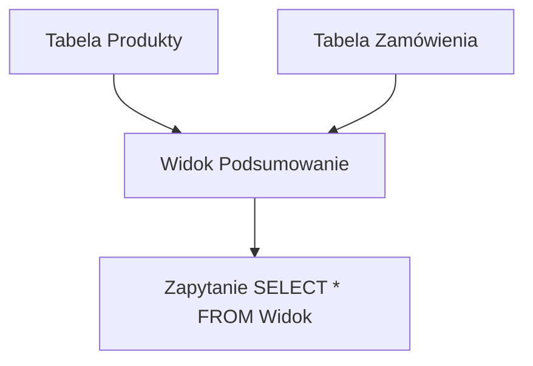

# Laboratorium 3: Zaawansowany SQL - Podzapytania i widoki

## Cel laboratorium
Poznanie mechanizmów podzapytań (subqueries) oraz tworzenia wirtualnych tabel (widoków).

## Podstawy teoretyczne

### Podzapytania (Subqueries)
Są to zapytania zagnieżdżone wewnątrz innych zapytań SQL. Mogą występować w klauzulach `SELECT`, `FROM`, `WHERE` oraz `HAVING`.

- **Nieskorelowane**: Podzapytanie jest niezależne od głównego zapytania i może być wykonane samodzielnie.
- **Skorelowane**: Podzapytanie odnosi się do kolumn z zewnętrznego zapytania (jest wykonywane dla każdego wiersza głównego zapytania).
- **Operatory pomocnicze**: `IN`, `EXISTS`, `ANY`, `ALL`.

### Widoki (Views)
Widok to wirtualna tabela, która przechowuje zdefiniowane zapytanie `SELECT`. Nie zajmuje miejsca na dysku (poza definicją zapytania) i jest aktualizowany automatycznie przy każdej zmianie danych w tabelach bazowych.

Zalety widoków:
- Uproszczenie skomplikowanych zapytań.
- Bezpieczeństwo (ograniczenie dostępu do wybranych kolumn).
- Stała struktura (izolacja aplikacji od zmian w schemacie tabel).

### Diagram Widoku (Mermaid)


## Zadania
1. **Podzapytania nieskorelowane**: Znajdź produkty, których cena jest wyższa od średniej ceny wszystkich produktów.
2. **Podzapytania skorelowane**: Znajdź klientów, którzy złożyli przynajmniej jedno zamówienie.
3. **Widoki (Views)**: Stwórz widok `PodsumowanieSprzedazy`, który łączy informacje o produktach, zamówieniach i klientach.

## Przykład Widoku
```sql
CREATE VIEW WidokZamowien AS
SELECT z.id_zamowienia, k.nazwisko, z.data
FROM Zamowienia z
JOIN Klienci k ON z.id_klienta = k.id;

SELECT * FROM WidokZamowien;
```

### Przykładowy wynik (Oczekiwany rezultat)
Dla przykładowego zamówienia klienta o nazwisku Kowalski:
**Wynik:**
```text
id_zamowienia | nazwisko | data
--------------|----------|-----------
1             | Kowalski | 2023-10-01
```

## Ćwiczenie
Stwórz widok, który pokazuje tylko produkty o niskim stanie magazynowym (np. `ilosc < 5`).

## Ćwiczenia dodatkowe
1. Używając `EXISTS`, znajdź klientów, którzy zamówili przynajmniej jeden produkt z kategorii "Napoje".
2. Utwórz widok agregujący `SprzedazNaKlienta`, który zwraca `id_klienta`, `liczba_zamowien` oraz `laczna_wartosc` (suma wartości pozycji zamówień) i zaprezentuj zapytanie odczytujące top 5 klientów po wartości.
