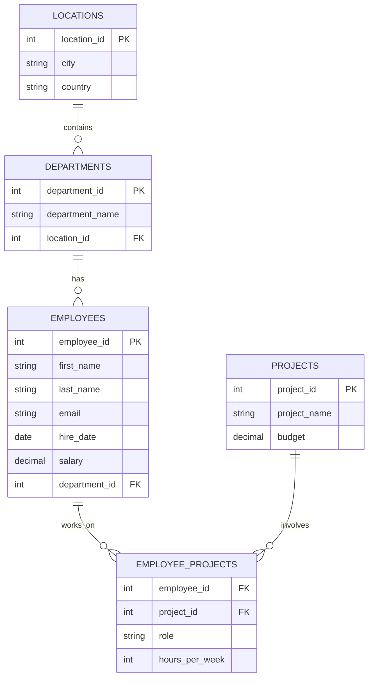

# Laboratorium 4: Normalizacja – relacje bazodanowe

## Cel laboratorium
Zrozumienie procesu normalizacji baz danych, identyfikacja redundancji oraz anomalii, a także praktyczne zastosowanie zasad 1NF, 2NF i 3NF na przykładzie danych o pracownikach.

## Podstawy teoretyczne

### Czym jest normalizacja?
Normalizacja to proces organizowania danych w bazie, mający na celu:
1. **Eliminację redundancji** (powtarzania się danych).
2. **Zminimalizowanie ryzyka wystąpienia anomalii** (problemów przy operacjach INSERT, UPDATE, DELETE).
3. **Zapewnienie logicznej spójności danych**.

### Postacie Normalne (NF) - Przykłady

#### 1. Pierwsza Postać Normalna (1NF)
**Zasada:** Każda kolumna musi zawierać wartości atomowe (niepodzielne). Brak list i grup powtarzających się.

**Błędna tabela (Naruszenie 1NF):**

| ID | Klient | Telefony |
| :--- | :--- | :--- |
| 1 | Jan Kowalski | 111-222-333, 444-555-666 |

**Poprawna tabela (1NF):**

| ID | Klient | Telefon |
| :--- | :--- | :--- |
| 1 | Jan Kowalski | 111-222-333 |
| 1 | Jan Kowalski | 444-555-666 |

---

#### 2. Druga Postać Normalna (2NF)
**Zasada:** Musi spełniać 1NF. Wszystkie kolumny niebędące kluczem muszą w pełni zależeć od **całego** klucza głównego (istotne przy kluczach złożonych).

**Błędna tabela (Naruszenie 2NF):**

*Klucz złożony: (ID_Kursu, ID_Studenta)*

| ID_Kursu | ID_Studenta | Nazwa_Kursu | Ocena |
| :--- | :--- | :--- | :--- |
| K1 | S1 | Bazy Danych | 5.0 |
| K1 | S2 | Bazy Danych | 4.0 |

*Problem: `Nazwa_Kursu` zależy tylko od `ID_Kursu`, a nie od całego klucza (ID_Kursu + ID_Studenta).*

**Poprawna struktura (2NF):**

*Tabela Kursy:*

| ID_Kursu | Nazwa_Kursu |
| :--- | :--- |
| K1 | Bazy Danych |

*Tabela Oceny:*

| ID_Kursu | ID_Studenta | Ocena |
| :--- | :--- | :--- |
| K1 | S1 | 5.0 |
| K1 | S2 | 4.0 |

---

#### 3. Trzecia Postać Normalna (3NF)
**Zasada:** Musi spełniać 2NF. Brak zależności przechodnich – kolumna niekluczowa nie może zależeć od innej kolumny niekluczowej.

**Błędna tabela (Naruszenie 3NF):**

| ID_Pracownika | Nazwisko | ID_Biura | Miasto_Biura |
| :--- | :--- | :--- | :--- |
| 1 | Nowak | B10 | Kraków |

*Problem: `Miasto_Biura` zależy od `ID_Biura`, a `ID_Biura` zależy od `ID_Pracownika`. Mamy zależność przechodnią.*

**Poprawna struktura (3NF):**

*Tabela Pracownicy:*

| ID_Pracownika | Nazwisko | ID_Biura |
| :--- | :--- | :--- |
| 1 | Nowak | B10 |

*Tabela Biura:*

| ID_Biura | Miasto_Biura |
| :--- | :--- |
| B10 | Kraków |

### Anomalie bazodanowe
- **Anomalia dodawania**: Brak możliwości dodania informacji (np. o nowym departamencie) bez dodania pracownika.
- **Anomalia usuwania**: Usunięcie ostatniego pracownika z departamentu powoduje utratę informacji o samym departamencie.
- **Anomalia modyfikacji**: Konieczność zmiany nazwy departamentu w wielu rekordach jednocześnie.

### Diagram relacji (Mermaid)
Poniższy diagram przedstawia znormalizowaną strukturę bazy danych pracowników (3NF):

## Baza danych
Do zadań wykorzystaj plik [lab04_employees.sql](./lab04_employees.sql). Zawiera on strukturę znormalizowaną oraz tabelę `employee_unnormalized`, która służy do ćwiczeń z identyfikacji problemów projektowych.

## Zadania dla studentów

1. **Identyfikacja naruszeń 1NF**: Przeanalizuj tabelę `employee_unnormalized`. Wymień wszystkie kolumny, które nie spełniają zasady atomowości danych i uzasadnij dlaczego.
   *   *Podpowiedź: Spójrz na kolumny `emp_data` oraz `projects_list`. Czy jedna komórka przechowuje tam tylko jedną informację? Pomocna komenda: `SELECT * FROM employee_unnormalized;`*

2. **Normalizacja do 1NF**: Zaproponuj, jak powinna wyglądać tabela `employee_unnormalized` po doprowadzeniu jej do 1NF. Co zrobisz z kolumnami `projects_list` i `skills`? Czy wystarczy jedna tabela?
   *   *Podpowiedź: Aby zachować 1NF, musisz rozbić listy (np. skille) na osobne rekordy lub przenieść je do nowej tabeli łączącej (relacja wiele-do-wielu). Pseudokod struktury: `CREATE TABLE pracownik_umiejetnosci (id_pracownika, nazwa_umiejetnosci);`*

3. **Anomalie w praktyce**: Załóżmy, że chcemy zmienić miasto działu 'IT' z 'Kraków' na 'Wrocław' w tabeli `employee_unnormalized`. Ile rekordów musisz zaktualizować? Opisz, jakiej anomalii to dotyczy.
   *   *Podpowiedź: Policz ilu pracowników pracuje w IT w tabeli nienormalizowanej. Jeśli musisz zmieniać tę samą informację w wielu miejscach, to mamy do czynienia z anomalią modyfikacji. Komenda: `SELECT COUNT(*) FROM employee_unnormalized WHERE dept_info LIKE 'IT%';`*

4. **Zależności funkcyjne**: W znormalizowanej tabeli `departments`, jakie występują zależności funkcyjne? Czy nazwa departamentu zależy bezpośrednio od `location_id`?
   *   *Podpowiedź: Zależność funkcyjna A -> B oznacza, że znając wartość A, zawsze jednoznacznie określisz wartość B. Czy znając tylko `location_id` (np. Kraków), wiesz na pewno, jaki to departament? Sprawdź to: `SELECT DISTINCT location_id, department_name FROM departments;`*

5. **Przejście do 2NF**: Dlaczego tabela `employee_projects` posiada klucz złożony `(employee_id, project_id)`? Czy kolumna `hours_per_week` jest w pełni zależna od tego klucza, czy tylko od jego części?
   *   *Podpowiedź: Zastanów się, czy liczba godzin dotyczy konkretnego pracownika (bez względu na projekt), czy konkretnego projektu (bez względu na osobę), czy może właśnie pary pracownik-projekt. Sprawdź strukturę: `\d employee_projects` lub `SELECT * FROM employee_projects;`*

6. **Eliminacja zależności przechodnich (3NF)**: W pliku SQL mamy tabele `departments` i `locations`. Wyjaśnij korzyści płynące z wydzielenia miasta i kraju do osobnej tabeli zamiast trzymania ich bezpośrednio w `departments`.
   *   *Podpowiedź: Co się stanie, jeśli 10 departamentów mieści się w tym samym mieście, a miasto zmieni nazwę? Gdzie łatwiej wprowadzić zmianę? Spróbuj pogrupować: `SELECT city, COUNT(*) FROM locations JOIN departments USING (location_id) GROUP BY city;`*

7. **Weryfikacja 3NF**: Sprawdź strukturę tabeli `employees`. Czy spełnia ona 3NF? Czy istnieją w niej kolumny, które zależą od siebie nawzajem (np. czy email zależy od imienia i nazwiska)?
   *   *Podpowiedź: W 3NF każda kolumna niekluczowa musi zależeć TYLKO od klucza głównego (employee_id). Jeśli e-mail jest generowany z imienia i nazwiska, to czy jest to zależność funkcyjna? Komenda do podglądu danych: `SELECT first_name, last_name, email FROM employees;`*

8. **Praktyczny DDL**: Napisz polecenie `CREATE TABLE`, które stworzy tabelę `employee_skills` łączącą pracowników z umiejętnościami w sposób znormalizowany (relacja wiele-do-wielu, 1NF).
   *   *Podpowiedź: Tabela ta powinna zawierać dwa klucze obce: do tabeli pracowników i (potencjalnej) tabeli umiejętności. Sugerowana komenda: `CREATE TABLE employee_skills (employee_id INT REFERENCES employees(employee_id), skill_id INT, PRIMARY KEY (employee_id, skill_id));`*

9. **Migracja danych (SELECT)**: Napisz zapytanie (pseudokod lub SQL), które pobrałoby dane z `employee_unnormalized` i sformatowało je tak, aby można było je wstawić do znormalizowaną tabeli `employees` (zwróć uwagę na rozdzielenie imienia i nazwiska).
   *   *Podpowiedź: Użyj funkcji tekstowych, takich jak `SUBSTR` i `INSTR` (w SQLite) lub `split_part` (w PostgreSQL), aby podzielić `emp_data` na dwa pola. Przykład: `SELECT split_part(emp_data, ' ', 1) AS imie FROM employee_unnormalized;`*

10. **Refaktoryzacja bazy**: Zaproponuj dodanie nowej tabeli `countries` i powiązanie jej z tabelą `locations`. Jak to wpłynie na postać normalną bazy danych i jakie korzyści przyniesie (np. walidacja nazw krajów)?
    *   *Podpowiedź: Przechowywanie nazwy kraju jako tekst w tabeli `locations` to redundancja. Wydzielenie jej to krok w stronę czystszej 3NF. Pseudokod: `CREATE TABLE countries (country_id PK, country_name); ALTER TABLE locations ADD country_id FK;`*

## Ćwiczenia dodatkowe
1. Spróbuj przenieść wszystkie dane z tabeli `employee_unnormalized` do znormalizowanych tabel (`employees`, `departments`, `locations`) za pomocą serii zapytań `INSERT INTO ... SELECT`.
   *   *Podpowiedź: Pamiętaj o zachowaniu kolejności – najpierw zasil tabele "nadrzędne" (locations, departments), aby móc potem użyć ich kluczy obcych w tabeli employees. Wykorzystaj `DISTINCT`, aby uniknąć duplikatów. Komenda: `INSERT INTO locations (city, country) SELECT DISTINCT split_part(dept_info, ', ', 2), 'Polska' FROM employee_unnormalized;`*
2. Dodaj więzy `CHECK` do tabeli `employee_projects`, aby `hours_per_week` nie mogło przekraczać 168 (liczba godzin w tygodniu).
   *   *Podpowiedź: Użyj polecenia `ALTER TABLE`, aby zmodyfikować istniejącą strukturę i dodać ograniczenie. Sugerowana komenda: `ALTER TABLE employee_projects ADD CONSTRAINT chk_max_hours CHECK (hours_per_week <= 168);`*
