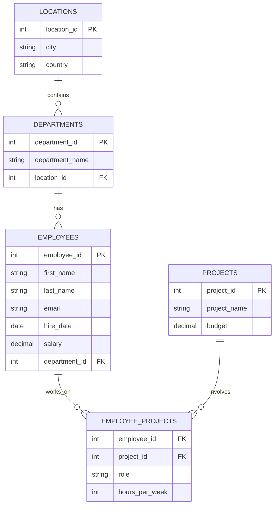

# Laboratorium 4: Normalizacja – relacje bazodanowe

## Cel laboratorium
Zrozumienie procesu normalizacji baz danych, identyfikacja redundancji oraz anomalii, a także praktyczne zastosowanie zasad 1NF, 2NF i 3NF na przykładzie danych o pracownikach.

## Podstawy teoretyczne

### Czym jest normalizacja?
Normalizacja to proces organizowania danych w bazie, mający na celu:
1. **Eliminację redundancji** (powtarzania się danych).
2. **Zminimalizowanie ryzyka wystąpienia anomalii** (problemów przy operacjach INSERT, UPDATE, DELETE).
3. **Zapewnienie logicznej spójności danych**.

### Postacie Normalne (NF)

1. **Pierwsza Postać Normalna (1NF)**:
   - Każda kolumna zawiera tylko wartości atomowe (niepodzielne).
   - Brak powtarzających się grup lub list w jednej kolumnie.
   - Każdy rekord posiada unikalny identyfikator (Klucz Główny).

2. **Druga Postać Normalna (2NF)**:
   - Spełnia wymogi 1NF.
   - Wszystkie kolumny niebędące kluczem są w pełni zależne funkcyjnie od **całego** klucza głównego (ważne przy kluczach złożonych).

3. **Trzecia Postać Normalna (3NF)**:
   - Spełnia wymogi 2NF.
   - Żadna kolumna niebędąca kluczem nie zależy od innej kolumny niebędącej kluczem (brak zależności przechodnich).

### Anomalie bazodanowe
- **Anomalia dodawania**: Brak możliwości dodania informacji (np. o nowym departamencie) bez dodania pracownika.
- **Anomalia usuwania**: Usunięcie ostatniego pracownika z departamentu powoduje utratę informacji o samym departamencie.
- **Anomalia modyfikacji**: Konieczność zmiany nazwy departamentu w wielu rekordach jednocześnie.

### Diagram relacji (Mermaid)
Poniższy diagram przedstawia znormalizowaną strukturę bazy danych pracowników (3NF):

## Baza danych
Do zadań wykorzystaj plik [lab04_employees.sql](./lab04_employees.sql). Zawiera on strukturę znormalizowaną oraz tabelę `employee_unnormalized`, która służy do ćwiczeń z identyfikacji problemów projektowych.

## Zadania dla studentów

1. **Identyfikacja naruszeń 1NF**: Przeanalizuj tabelę `employee_unnormalized`. Wymień wszystkie kolumny, które nie spełniają zasady atomowości danych i uzasadnij dlaczego.
2. **Normalizacja do 1NF**: Zaproponuj, jak powinna wyglądać tabela `employee_unnormalized` po doprowadzeniu jej do 1NF. Co zrobisz z kolumnami `projects_list` i `skills`? Czy wystarczy jedna tabela?
3. **Anomalie w praktyce**: Załóżmy, że chcemy zmienić miasto działu 'IT' z 'Kraków' na 'Wrocław' w tabeli `employee_unnormalized`. Ile rekordów musisz zaktualizować? Opisz, jakiej anomalii to dotyczy.
4. **Zależności funkcyjne**: W znormalizowanej tabeli `departments`, jakie występują zależności funkcyjne? Czy nazwa departamentu zależy bezpośrednio od `location_id`?
5. **Przejście do 2NF**: Dlaczego tabela `employee_projects` posiada klucz złożony `(employee_id, project_id)`? Czy kolumna `hours_per_week` jest w pełni zależna od tego klucza, czy tylko od jego części?
6. **Eliminacja zależności przechodnich (3NF)**: W pliku SQL mamy tabele `departments` i `locations`. Wyjaśnij korzyści płynące z wydzielenia miasta i kraju do osobnej tabeli zamiast trzymania ich bezpośrednio w `departments`.
7. **Weryfikacja 3NF**: Sprawdź strukturę tabeli `employees`. Czy spełnia ona 3NF? Czy istnieją w niej kolumny, które zależą od siebie nawzajem (np. czy email zależy od imienia i nazwiska)?
8. **Praktyczny DDL**: Napisz polecenie `CREATE TABLE`, które stworzy tabelę `employee_skills` łączącą pracowników z umiejętnościami w sposób znormalizowany (relacja wiele-do-wielu, 1NF).
9. **Migracja danych (SELECT)**: Napisz zapytanie (pseudokod lub SQL), które pobrałoby dane z `employee_unnormalized` i sformatowało je tak, aby można było je wstawić do znormalizowanej tabeli `employees` (zwróć uwagę na rozdzielenie imienia i nazwiska).
10. **Refaktoryzacja bazy**: Zaproponuj dodanie nowej tabeli `countries` i powiązanie jej z tabelą `locations`. Jak to wpłynie na postać normalną bazy danych i jakie korzyści przyniesie (np. walidacja nazw krajów)?

## Ćwiczenia dodatkowe
1. Spróbuj przenieść wszystkie dane z tabeli `employee_unnormalized` do znormalizowanych tabel (`employees`, `departments`, `locations`) za pomocą serii zapytań `INSERT INTO ... SELECT`.
2. Dodaj więzy `CHECK` do tabeli `employee_projects`, aby `hours_per_week` nie mogło przekraczać 168 (liczba godzin w tygodniu).
