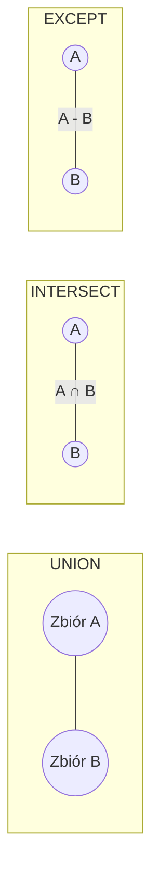

# Laboratorium 4: SQL - Funkcje i operacje na zbiorach

## Cel laboratorium
Praca z wbudowanymi funkcjami (tekstowe, daty) oraz operatory zbiorowe (UNION, INTERSECT, EXCEPT).

## Podstawy teoretyczne

### Funkcje wbudowane
Bazy danych oferują zestaw gotowych funkcji do manipulacji danymi:
- **Tekstowe**: `UPPER()`, `LOWER()`, `LENGTH()`, `SUBSTR()`, `REPLACE()`.
- **Liczbowe**: `ROUND()`, `ABS()`, `COALESCE()` (zwraca pierwszą niepustą wartość).
- **Daty i czasu**: `DATE()`, `TIME()`, `DATETIME()`, `STRFTIME()`.

### Operacje zbiorowe
Pozwalają na łączenie wyników dwóch lub więcej zapytań `SELECT`. Zapytania muszą mieć tę samą liczbę kolumn o zgodnych typach danych.
- `UNION` – suma zbiorów (usuwa duplikaty).
- `UNION ALL` – suma zbiorów (zachowuje duplikaty).
- `INTERSECT` – część wspólna zbiorów.
- `EXCEPT` – różnica zbiorów (rekordy z pierwszego zapytania, których nie ma w drugim).

### Diagram operacji zbiorowych (Mermaid)


## Zadania
1. **Funkcje tekstowe**: Zamień wszystkie nazwiska klientów na wielkie litery.
2. **Funkcje dat**: Wyciągnij rok z daty zamówienia.
3. **Operacje na zbiorach**: Pobierz listę produktów, które nigdy nie zostały zamówione (używając `EXCEPT`).

## Przykład UNION
```sql
SELECT imie FROM Klienci
UNION
SELECT nazwa FROM Produkty;
```

### Przykładowy wynik (Oczekiwany rezultat)
Jeśli w tabeli `Klienci` masz "Jan", a w `Produkty` masz "Chleb":
**Wynik:**
```text
imie
-----
Chleb
Jan
```
*(Wyniki są posortowane alfabetycznie przy użyciu UNION)*

## Ćwiczenie
Znajdź wszystkich klientów, których nazwisko zaczyna się na literę 'K' (użyj `LIKE`).

## Ćwiczenia dodatkowe
1. Użyj `COALESCE`, aby zastąpić brakujące ceny (`NULL`) wartością 0 i oblicz średnią cenę po zastąpieniu.
2. Wyświetl zamówienia w formacie `YYYY-MM` (użyj `strftime('%Y-%m', data)`) i zlicz liczbę zamówień na miesiąc. Porównaj wyniki dla `UNION` i `UNION ALL` przy łączeniu danych z dwóch tabel.
