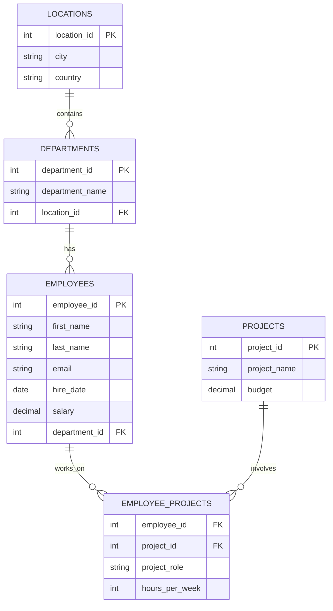

# Laboratorium 4: Powtórzenie materiału i wprowadzenie do normalizacji

## Zadania powtórzeniowe (Lab 1 - Lab 3)

Poniższe zadania opierają się na strukturze bazy danych zawartej w pliku `lab04_employees.sql`. Twoim zadaniem jest napisanie zapytań SQL, które zwrócą wymagane dane.

### Diagram relacji (Mermaid)

Poniższy diagram przedstawia znormalizowaną strukturę bazy danych pracowników (3NF):

### Podstawy SELECT i filtrowanie (Lab 1 & Lab 2)

1. Wyświetl imiona i nazwiska wszystkich pracowników posortowane alfabetycznie według nazwiska.
1. Wyświetl unikalne nazwy krajów, w których firma posiada swoje biura (tabela `locations`).
1. Znajdź wszystkich pracowników, których wynagrodzenie (`salary`) jest większe niż 6000. Wyświetl ich imię, nazwisko i pensję.
1. Wyświetl listę pracowników zatrudnionych po 1 stycznia 2021 roku.
1. Znajdź pracowników, których nazwisko zaczyna się na literę 'K' i wyświetl ich pełne dane.

### Złączenia tabel - JOIN (Lab 3)

6. Wyświetl imię, nazwisko pracownika oraz nazwę departamentu, w którym pracuje.
1. Wyświetl listę wszystkich departamentów wraz z miastem i krajem, w którym się znajdują.
1. Dla każdego pracownika wyświetl jego imię, nazwisko oraz miasto, w którym pracuje (wymaga złączenia trzech tabel: `employees`, `departments`, `locations`).
1. Wyświetl listę projektów oraz imiona i nazwiska pracowników, którzy są do nich przypisani (użyj tabeli łączącej `employee_projects`).
1. Znajdź wszystkich pracowników i ich role (`project_role`) w projekcie o nazwie 'System ERP'.
1. Wyświetl wszystkie departamenty i ich lokalizacje (miasto), używając `LEFT JOIN`, aby uwzględnić departamenty, które mogą nie mieć przypisanej lokalizacji.
1. Wyświetl listę pracowników wraz z projektami, do których są przypisani. Uwzględnij pracowników, którzy obecnie nie pracują nad żadnym projektem (`LEFT JOIN`).

### Agregacja i grupowanie danych (Lab 3)

13. Policz, ilu pracowników pracuje w każdym z departamentów. Wynik powinien zawierać nazwę departamentu i liczbę osób.
01. Oblicz średnie wynagrodzenie w całej firmie.
01. Znajdź najwyższe i najniższe wynagrodzenie w departamencie 'IT'.
01. Wyświetl nazwy departamentów, w których łączna suma wynagrodzeń pracowników przekracza 15 000.
01. Policz, w ilu projektach bierze udział każdy pracownik (wyświetl imię, nazwisko i liczbę projektów).
01. Oblicz całkowity budżet wszystkich projektów realizowanych przez firmę.
01. Wyświetl miasta, w których pracuje więcej niż 2 pracowników (wymaga złączenia `employees`, `departments`, `locations` oraz użycia `GROUP BY` i `HAVING`).
01. Oblicz średnią liczbę godzin tygodniowo (`hours_per_week`) poświęcanych na projekty przez pracowników w poszczególnych rolach (np. Developer, Manager, wykorzystując kolumnę `project_role`).
