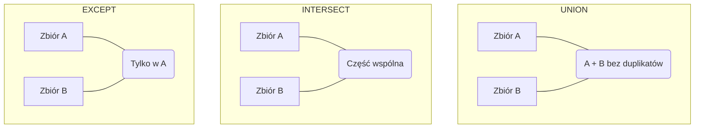
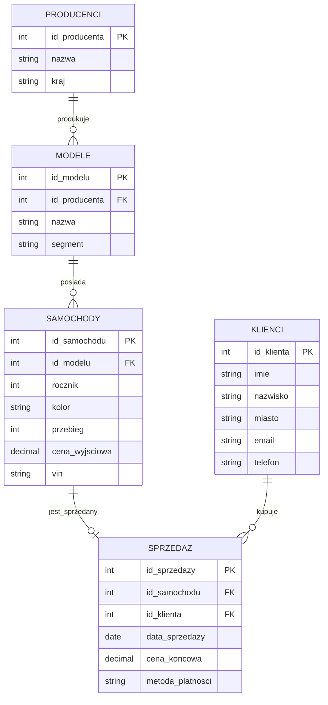

# Laboratorium 5: SQL - Funkcje, operacje na zbiorach i wyrażenia regularne

## Cel laboratorium
Praca z wbudowanymi funkcjami SQL, operatorami zbiorowymi oraz wyrażeniami regularnymi na przykładzie systemu sprzedaży samochodów.

## Dane do laboratorium
Wszystkie zadania należy wykonywać na bazie danych przygotowanej w pliku `lab05_cars.sql`. Skrypt zawiera tabele: `producenci`, `klienci`, `modele`, `samochody` oraz `sprzedaz`.

## Podstawy teoretyczne

### Funkcje wbudowane
Bazy danych oferują zestaw gotowych funkcji do manipulacji danymi.

#### Przykłady i zastosowanie funkcji

| Funkcja | Przykład | Wynik | Opis |
| :--- | :--- | :--- | :--- |
| `UPPER` | `UPPER('Baza danych')` | `'BAZA DANYCH'` | Wszystkie litery wielkie |
| `LOWER` | `LOWER('BAZA DANYCH')` | `'baza danych'` | Wszystkie litery małe |
| `SUBSTRING` | `SUBSTRING('ABCDEFG', 1, 3)` | `'ABC'` | Fragment tekstu (od poz. 1, 3 znaki) |
| `LENGTH` | `LENGTH('SQL')` | `3` | Liczba znaków w tekście |
| `REPLACE` | `REPLACE('A-B-C', '-', '_')` | `'A_B_C'` | Zamiana fragmentu tekstu |
| `ROUND` | `ROUND(123.456, 2)` | `123.46` | Zaokrąglenie do 2 miejsc po przecinku |
| `ROUND` | `ROUND(1250, -2)` | `1300` | Zaokrąglenie do pełnych setek |
| `COALESCE` | `COALESCE(NULL, 'N/A')` | `'N/A'` | Pierwsza wartość nie-null |

- **Tekstowe**:
  - `UPPER(str)` / `LOWER(str)` – zmiana wielkości liter.
  - `LENGTH(str)` – długość ciągu znaków.
  - `SUBSTRING(str, start, len)` – wycięcie fragmentu tekstu.
  - `REPLACE(str, from, to)` – zamiana fragmentu tekstu.
  - `CONCAT(s1, s2)` lub operator `||` – łączenie ciągów znaków.

- **Liczbowe**:
  - `ROUND(n, d)` – zaokrąglenie liczby `n` do `d` miejsc po przecinku.
  - `ABS(n)` – wartość bezwzględna.
  - `COALESCE(val1, val2, ...)` – zwraca pierwszą niepustą (`NOT NULL`) wartość z listy.

- **Daty i czasu**:
  - `CURRENT_DATE`, `NOW()` – bieżąca data/czas.
  - `EXTRACT(part FROM date)` (PostgreSQL) – wyciąganie fragmentu daty:
    - `EXTRACT(YEAR FROM NOW())` -> rok (np. 2024).
    - `EXTRACT(MONTH FROM NOW())` -> miesiąc (1-12).
    - `EXTRACT(DOW FROM NOW())` -> dzień tygodnia (0-6, niedziela to 0).
  - `AGE(date1, date2)` (PostgreSQL) – oblicza różnicę między datami (np. wiek klienta).
  - Dodawanie/odejmowanie interwałów czasowych (np. `NOW() + INTERVAL '7 days'`).

#### Przykładowe zapytania z wynikami

**Przykład 1: Łączenie tekstu i zmiana wielkości liter**
```sql
SELECT imie, UPPER(nazwisko) AS nazwisko_duze, LENGTH(imie) AS dlugosc_imienia
FROM klienci
LIMIT 3;
```
| imie | nazwisko_duze | dlugosc_imienia |
| :--- | :--- | :--- |
| Jan | KOWALSKI | 3 |
| Anna | NOWAK | 4 |
| Piotr | WIŚNIEWSKI | 5 |

**Przykład 2: Zaokrąglanie i obliczenia na datach**
```sql
SELECT 
    id_sprzedazy, 
    ROUND(cena_koncowa, -3) AS cena_zaokraglona,
    EXTRACT(YEAR FROM data_sprzedazy) AS rok_sprzedazy
FROM sprzedaz
LIMIT 2;
```
| id_sprzedazy | cena_zaokraglona | rok_sprzedazy |
| :--- | :--- | :--- |
| 1 | 45000 | 2023 |
| 2 | 120000 | 2023 |

### Operacje zbiorowe
Pozwalają na łączenie wyników dwóch lub więcej zapytań `SELECT`. Warunkiem jest zgodność liczby i typów kolumn.



- `UNION` – suma zbiorów (usuwa duplikaty).
  - *Przykład: Lista wszystkich unikalnych miast klientów i miast salonów.*
- `UNION ALL` – suma zbiorów (zachowuje wszystkie rekordy).
  - *Przykład: Połączenie list sprzedaży z dwóch różnych lat (nawet jeśli ten sam klient kupił dwa auta).*
- `INTERSECT` – część wspólna (tylko rekordy występujące w obu wynikach).
  - *Przykład: Klienci, którzy są jednocześnie pracownikami (ich ID występuje w obu zbiorach).*
  - `EXCEPT` – różnica (rekordy z pierwszego zapytania, których nie ma w drugim).
  - *Przykład: Lista wszystkich dostępnych modeli, które jeszcze nigdy nie zostały sprzedane.*

#### Przykładowe zapytania z wynikami

**Przykład: Modele, które nie zostały jeszcze sprzedane (EXCEPT)**
```sql
SELECT id_modelu FROM modele
EXCEPT
SELECT m.id_modelu FROM samochody s JOIN modele m ON s.id_modelu = m.id_modelu;
```
| id_modelu |
| :--- |
| 15 |
| 22 |

### Wyrażenia regularne (Regex)
Pozwalają na wyszukiwanie zaawansowanych wzorców w tekście. W PostgreSQL używamy operatora `~` (lub `~*` dla ignorowania wielkości liter) lub `SIMILAR TO`.

| Symbol | Znaczenie | Przykład |
| :--- | :--- | :--- |
| `.` | Dowolny znak | `'.a.'` -> 'cat', 'bat' |
| `^` / `$` | Początek / koniec ciągu | `'^A.*'` -> Zaczyna się na A |
| `[0-9]` | Dowolna cyfra | `'[0-9]{3}'` -> Dokładnie 3 cyfry |
| `[a-z]` | Dowolna mała litera | `'[a-z]+'` -> Jeden lub więcej małych liter |
| `*` | Zero lub więcej powtórzeń | `'A*B'` -> 'B', 'AB', 'AAB' |
| `+` | Jedno lub więcej powtórzeń | `'A+B'` -> 'AB', 'AAB' (nie pasuje 'B') |
| `{n}` | Dokładnie n powtórzeń | `'[0-9]{9}'` -> Numer telefonu (9 cyfr) |
| `|` | Alternatywa (LUB) | `'Tak\|Nie'` -> 'Tak' lub 'Nie' |

**Więcej przykładów Regex:**
- `'^.{5}$'` - Dokładnie 5 dowolnych znaków.
- `'[0-9]{2}-[0-9]{3}'` - Format kodu pocztowego (np. 00-001).
- `'.*@gmail\.com$'` - Wszystkie adresy w domenie gmail.com.

**Przykład użycia (PostgreSQL):**
```sql
SELECT * FROM klienci WHERE email ~ '^[a-zA-Z0-9._%+-]+@[a-zA-Z0-9.-]+\.[a-zA-Z]{2,}$';
```
*(Powyższy wzorzec wyszukuje poprawne formaty adresów e-mail)*

#### Przykładowe zapytania z wynikami

**Przykład: Klienci z polskimi numerami telefonów (z myślnikami lub bez)**
```sql
SELECT imie, nazwisko, telefon 
FROM klienci 
WHERE telefon ~ '^[0-9]{3}-?[0-9]{3}-?[0-9]{3}$'
LIMIT 2;
```
| imie | nazwisko | telefon |
| :--- | :--- | :--- |
| Jan | Kowalski | 123-456-789 |
| Anna | Nowak | 987654321 |

### Diagram relacji (Mermaid)
Poniższy diagram przedstawia strukturę bazy danych systemu sprzedaży samochodów:



---

## Zadania do wykonania (20 zadań)

### Funkcje tekstowe i liczbowe
1. Wyświetl imiona i nazwiska wszystkich klientów połączone w jedną kolumnę `klient` (użyj `UPPER` dla nazwiska).
   *(Podpowiedź: Użyj operatora `||` oraz funkcji `UPPER`)*
2. Wyświetl listę VIN-ów samochodów, pokazując tylko pierwsze 5 znaków każdego z nich.
   *(Podpowiedź: Wykorzystaj funkcję `SUBSTRING`)*
3. Policz długość nazw wszystkich producentów i posortuj wyniki malejąco.
   *(Podpowiedź: Użyj funkcji `LENGTH` w sekcji `SELECT` oraz `ORDER BY`)*
4. Wyświetl modele samochodów oraz ich segmenty. Segmenty powinny być wypisane małymi literami (`LOWER`).
   *(Podpowiedź: Użyj funkcji `LOWER(segment)`)*
5. Dla każdego samochodu w tabeli `sprzedaz` oblicz różnicę między `cena_wyjsciowa` (z tabeli `samochody`) a `cena_koncowa`. Wynik nazwij `rabat`.
   *(Podpowiedź: Połącz tabele `sprzedaz` i `samochody` za pomocą `JOIN`)*
6. Zaokrąglij wszystkie ceny końcowe w tabeli `sprzedaz` do pełnych tysięcy (użyj funkcji `ROUND`).
   *(Podpowiedź: `ROUND(cena, -3)` zaokrągla do tysięcy)*
7. Wyświetl listę klientów, podmieniając brakujące numery telefonów tekstem 'Brak numeru' (użyj `COALESCE`).
   *(Podpowiedź: `COALESCE(telefon, 'tekst')`)*

### Funkcje dat i czasu
8. Wyświetl wszystkie sprzedaże, które miały miejsce w październiku 2023 roku.
   *(Podpowiedź: Użyj `EXTRACT(MONTH FROM ...)` lub operatora `BETWEEN`)*
9. Oblicz, ile lat ma każdy samochód w momencie sprzedaży (różnica między rokiem sprzedaży a rokiem produkcji).
   *(Podpowiedź: Odejmij `rocznik` od roku wyciągniętego z `data_sprzedazy`)*
10. Wyświetl daty sprzedaży w formacie `DD-MM-YYYY` (skorzystaj z odpowiedniej funkcji formatującej dla Twojego silnika bazy danych).
    *(Podpowiedź: W PostgreSQL użyj `TO_CHAR`, w SQLite `strftime`)*
11. Wyświetl listę samochodów, które zostały sprzedane w ciągu ostatnich 30 dni od dzisiaj (użyj `CURRENT_DATE`).
    *(Podpowiedź: Odejmij `INTERVAL '30 days'` od `CURRENT_DATE`)*

### Operacje zbiorowe
12. Stwórz listę unikalnych nazw miast, w których mieszkają klienci, oraz krajów, z których pochodzą producenci (użyj `UNION`).
    *(Podpowiedź: `SELECT miasto FROM ... UNION SELECT kraj FROM ...`)*
13. Wyświetl identyfikatory samochodów, które mają przebieg powyżej 50 000 km, oraz tych, które zostały sprzedane za gotówkę (użyj `UNION ALL`).
    *(Podpowiedź: Połącz dwa zapytania `SELECT` za pomocą `UNION ALL`)*
14. Znajdź identyfikatory modeli, które występują w tabeli `modele`, ale nie mają żadnego przypisanego egzemplarza w tabeli `samochody` (użyj `EXCEPT`).
    *(Podpowiedź: Pierwsze zapytanie to wszystkie ID modeli, drugie to te z tabeli `samochody`)*
15. Wyświetl identyfikatory klientów, którzy mieszkają w Warszawie I jednocześnie dokonali zakupu auta (użyj `INTERSECT`).
    *(Podpowiedź: Część wspólna klientów z Warszawy oraz tych z tabeli `sprzedaz`)*

### Wyrażenia regularne
16. Wyświetl wszystkich klientów, których adres e-mail kończy się na `.pl`.
    *(Podpowiedź: Użyj operatora `~` i wzorca `'\.pl$'`)*
17. Znajdź samochody, których numer VIN zawiera cyfrę '9' dokładnie trzy razy pod rząd.
    *(Podpowiedź: Wzorzec to `'9{3}'`)*
18. Wyświetl klientów, których imię zaczyna się na literę 'A' lub 'M'.
    *(Podpowiedź: Użyj wzorca `'^[AM]'`)*
19. Wyświetl VIN-y samochodów, które nie zawierają żadnych cyfr (tylko litery).
    *(Podpowiedź: Użyj operatora `!~` i klasy znaków `[0-9]`)*
20. Wyświetl klientów, których numer telefonu pasuje do polskiego formatu (np. '123-456-789' lub '123456789').
    *(Podpowiedź: Skorzystaj z opcjonalnego myślnika `'-?'` we wzorcu)*

## Ćwiczenia dodatkowe
1. Przygotuj zapytanie, które wyświetli raport sprzedaży: Marka, Model, Cena końcowa oraz informację "PROMOCJA", jeśli rabat był większy niż 5000 zł (użyj instrukcji `CASE`).
2. Stwórz widok `v_raport_sprzedazy`, który łączy dane z 4 tabel i wykorzystuje funkcje formatujące datę oraz tekst.
