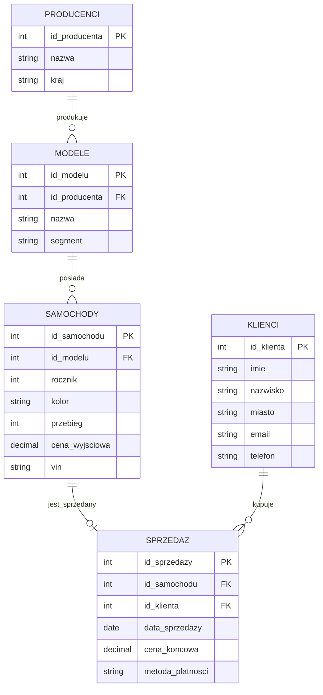

# Laboratorium 5: SQL - Funkcje, operacje na zbiorach i integralność danych

## Cel laboratorium
Praca z wbudowanymi funkcjami SQL, operatorami zbiorowymi oraz zrozumienie i stosowanie więzów integralności danych na przykładzie systemu sprzedaży samochodów.

## Dane do laboratorium
Wszystkie zadania należy wykonywać na bazie danych przygotowanej w pliku `lab05_cars.sql`. Skrypt zawiera tabele: `producenci`, `klienci`, `modele`, `samochody` oraz `sprzedaz`.

## Podstawy teoretyczne

### Funkcje wbudowane
Bazy danych oferują zestaw gotowych funkcji do manipulacji danymi.

- **Tekstowe**:
  - `UPPER(str)` / `LOWER(str)` – zmiana wielkości liter.
  - `LENGTH(str)` – długość ciągu znaków.
  - `SUBSTRING(str, start, len)` – wycięcie fragmentu tekstu.
  - `REPLACE(str, from, to)` – zamiana fragmentu tekstu.
  - `CONCAT(s1, s2)` lub operator `||` – łączenie ciągów znaków.

- **Liczbowe**:
  - `ROUND(n, d)` – zaokrąglenie liczby `n` do `d` miejsc po przecinku.
  - `ABS(n)` – wartość bezwzględna.
  - `COALESCE(val1, val2, ...)` – zwraca pierwszą niepustą (`NOT NULL`) wartość z listy.

- **Daty i czasu**:
  - `CURRENT_DATE`, `NOW()` – bieżąca data/czas.
  - `EXTRACT(part FROM date)` (PostgreSQL) lub `strftime(format, date)` (SQLite) – wyciąganie fragmentu daty (rok, miesiąc, dzień).
  - Dodawanie/odejmowanie interwałów czasowych (np. `date + INTERVAL '1 year'`).

### Operacje zbiorowe
Pozwalają na łączenie wyników dwóch lub więcej zapytań `SELECT`. Warunkiem jest zgodność liczby i typów kolumn.
- `UNION` – suma zbiorów (usuwa duplikaty).
- `UNION ALL` – suma zbiorów (zachowuje wszystkie rekordy).
- `INTERSECT` – część wspólna (tylko rekordy występujące w obu wynikach).
- `EXCEPT` – różnica (rekordy z pierwszego zapytania, których nie ma w drugim).

### Integralność danych
Zbiór reguł zapewniających spójność danych:
1. **Integralność encji**: Klucz główny (`PRIMARY KEY`) musi być unikalny i nie może zawierać wartości `NULL`.
2. **Integralność referencyjna**: Klucz obcy (`FOREIGN KEY`) musi wskazywać na istniejący rekord w tabeli nadrzędnej.
3. **Integralność domenowa**: Wartości muszą należeć do określonego zakresu lub zbioru (typ danych, `NOT NULL`, `CHECK`).

#### Przykład ograniczenia CHECK (PostgreSQL/SQLite)
```sql
ALTER TABLE samochody ADD CONSTRAINT chk_rok CHECK (rocznik >= 1900);
```

### Diagram relacji (Mermaid)
Poniższy diagram przedstawia strukturę bazy danych systemu sprzedaży samochodów:



---

## Zadania do wykonania (20 zadań)

### Funkcje tekstowe i liczbowe
1. Wyświetl imiona i nazwiska wszystkich klientów połączone w jedną kolumnę `klient` (użyj `UPPER` dla nazwiska).
2. Wyświetl listę VIN-ów samochodów, pokazując tylko pierwsze 5 znaków każdego z nich.
3. Policz długość nazw wszystkich producentów i posortuj wyniki malejąco.
4. Wyświetl modele samochodów oraz ich segmenty. Segmenty powinny być wypisane małymi literami (`LOWER`).
5. Dla każdego samochodu w tabeli `sprzedaz` oblicz różnicę między `cena_wyjsciowa` (z tabeli `samochody`) a `cena_koncowa`. Wynik nazwij `rabat`.
6. Zaokrąglij wszystkie ceny końcowe w tabeli `sprzedaz` do pełnych tysięcy (użyj funkcji `ROUND`).
7. Wyświetl listę klientów, podmieniając brakujące numery telefonów tekstem 'Brak numeru' (użyj `COALESCE`).

### Funkcje dat i czasu
8. Wyświetl wszystkie sprzedaże, które miały miejsce w październiku 2023 roku.
9. Oblicz, ile lat ma każdy samochód w momencie sprzedaży (różnica między rokiem sprzedaży a rokiem produkcji).
10. Wyświetl daty sprzedaży w formacie `DD-MM-YYYY` (skorzystaj z odpowiedniej funkcji formatującej dla Twojego silnika bazy danych).
11. Wyświetl listę samochodów, które zostały sprzedane w ciągu ostatnich 30 dni od dzisiaj (użyj `CURRENT_DATE`).

### Operacje zbiorowe
12. Stwórz listę unikalnych nazw miast, w których mieszkają klienci, oraz krajów, z których pochodzą producenci (użyj `UNION`).
13. Wyświetl identyfikatory samochodów, które mają przebieg powyżej 50 000 km, oraz tych, które zostały sprzedane za gotówkę (użyj `UNION ALL`).
14. Znajdź identyfikatory modeli, które występują w tabeli `modele`, ale nie mają żadnego przypisanego egzemplarza w tabeli `samochody` (użyj `EXCEPT`).
15. Wyświetl identyfikatory klientów, którzy mieszkają w Warszawie I jednocześnie dokonali zakupu auta (użyj `INTERSECT`).

### Integralność danych i ograniczenia
16. Spróbuj wstawić do tabeli `samochody` rekord z rocznikiem `1850`. Zaobserwuj błąd ograniczenia `CHECK`.
17. Dodaj do tabeli `sprzedaz` ograniczenie `CHECK`, które upewni się, że `cena_koncowa` jest zawsze większa od 0.
18. Spróbuj usunąć producenta 'Toyota' z tabeli `producenci`. Opisz, dlaczego baza danych blokuje tę operację (integralność referencyjna).
19. Spróbuj wstawić do tabeli `klienci` nowy rekord z adresem e-mail, który już istnieje w bazie. Zaobserwuj błąd klucza unikalnego (`UNIQUE`).
20. Dodaj nową kolumnę `status` do tabeli `samochody` z ograniczeniem `CHECK`, które pozwala tylko na wartości: 'dostępny', 'sprzedany', 'rezerwacja'.

## Ćwiczenia dodatkowe
1. Przygotuj zapytanie, które wyświetli raport sprzedaży: Marka, Model, Cena końcowa oraz informację "PROMOCJA", jeśli rabat był większy niż 5000 zł (użyj instrukcji `CASE`).
2. Stwórz widok `v_raport_sprzedazy`, który łączy dane z 4 tabel i wykorzystuje funkcje formatujące datę oraz tekst.
