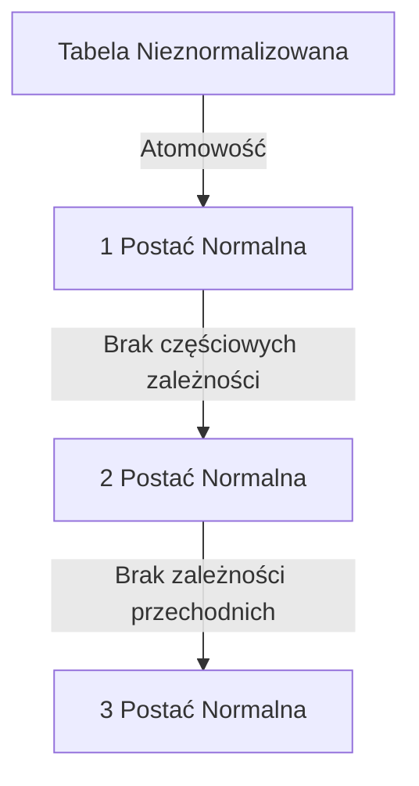

# Laboratorium 5: Integralność danych i normalizacja

## Cel laboratorium
Zrozumienie więzów integralności oraz zasad projektowania baz danych (1NF, 2NF, 3NF).

## Podstawy teoretyczne

### Integralność danych
Zbiór reguł zapewniających poprawność i spójność danych:
- **Encji**: Klucz główny (`PRIMARY KEY`) musi być unikalny i nie może być nullem.
- **Referencyjna**: Klucz obcy (`FOREIGN KEY`) musi odnosić się do istniejącego klucza w innej tabeli.
- **Domenowa**: Wartości w kolumnie muszą spełniać określone kryteria (`CHECK`, `NOT NULL`, typ danych).

### Normalizacja
Proces organizowania danych w bazie w celu uniknięcia redundancji (powtarzania się danych) oraz anomalii (problemów przy dodawaniu, usuwaniu i modyfikacji).
1. **1NF**: Wartości w kolumnach muszą być atomowe (niepodzielne).
2. **2NF**: Musi spełniać 1NF i każda kolumna niebędąca kluczem musi zależeć od całego klucza głównego.
3. **3NF**: Musi spełniać 2NF i żadna kolumna niebędąca kluczem nie może zależeć od innej kolumny niebędącej kluczem (brak zależności przechodnich).

### Proces Normalizacji (Mermaid)


## Integralność danych
SQLite wspiera:
- `NOT NULL`
- `UNIQUE`
- `PRIMARY KEY`
- `FOREIGN KEY`
- `CHECK`

### Przykład CHECK
```sql
ALTER TABLE Produkty ADD COLUMN status TEXT CHECK(status IN ('dostępny', 'brak'));

-- Próba wstawienia niepoprawnej wartości
INSERT INTO Produkty (nazwa, cena, ilosc, status) VALUES ('Test', 10, 5, 'niedostępny');
```

### Przykładowy wynik (Oczekiwany rezultat)
Baza danych powinna zwrócić błąd naruszenia ograniczenia:
**Wynik:**
```text
Error: CHECK constraint failed: status IN ('dostępny', 'brak')
```

## Normalizacja
Zadanie polega na przekształceniu nieprawidłowo zaprojektowanej tabeli:
`Tabela_Nieznormalizowana (Klient, Adres, Produkt, Cena, Data_Zamowienia)`
do postaci znormalizowanej (3NF).

### Schemat po normalizacji:
- `Klienci (id_klienta, imie_nazwisko, adres)`
- `Produkty (id_produktu, nazwa, cena)`
- `Zamowienia (id_zamowienia, id_klienta, data)`
- `Pozycje_Zamowienia (id_zamowienia, id_produktu, ilosc)`

## Ćwiczenie
Zaprojektuj bazę danych dla biblioteki (książki, autorzy, wypożyczenia) i określ klucze obce.
Doprowadź projekt do 3 postaci normalnej.

## Ćwiczenia dodatkowe
1. Wskaż przykładowe zależności funkcyjne w tabeli `Pozycje_Zamowienia` oraz zaproponuj ewentualne dodatkowe więzy (np. `CHECK(ilosc > 0)`).
2. Przygotuj skrypty DDL tworzące wszystkie tabele po normalizacji (3NF) wraz z kluczami obcymi i ograniczeniami integralności (NOT NULL, UNIQUE, CHECK).
