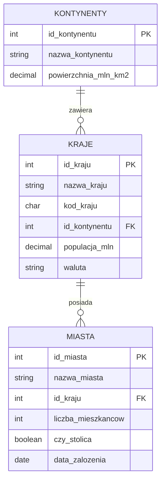

# Laboratorium 6: Funkcje w SQL

## Cel laboratorium

Celem laboratorium jest zapoznanie się z wykorzystaniem wbudowanych funkcji SQL (tekstowych, numerycznych, daty) oraz tworzeniem własnych funkcji (User-Defined Functions - UDF) w systemie PostgreSQL.

## Schemat bazy danych

Laboratorium bazuje na danych o miastach, krajach i kontynentach.



## Podstawy teoretyczne

### 1. Funkcje tekstowe

Pozwalają na manipulację ciągami znaków.

- `UPPER(string)`, `LOWER(string)` - zmiana wielkości liter.
- `LENGTH(string)` - długość ciągu.
- `SUBSTRING(string FROM start FOR count)` - wycinanie fragmentu.
- `CONCAT(s1, s2, ...)` lub operator `||` - łączenie ciągów.
- `REPLACE(string, old, new)` - zamiana fragmentu tekstu.

### 2. Funkcje numeryczne

Służą do operacji na liczbach.

- `ROUND(numer, miejsca)` - zaokrąglanie.
- `CEIL(numer)`, `FLOOR(numer)` - zaokrąglanie w górę/dół.
- `ABS(numer)` - wartość bezwzględna.
- `RANDOM()` - liczba losowa z zakresu \[0, 1).

### 3. Funkcje daty i czasu

Umożliwiają pracę z typami czasowymi.

- `NOW()` - bieżąca data i czas.
- `CURRENT_DATE`, `CURRENT_TIME`.
- `EXTRACT(field FROM source)` - pobranie części daty (np. `YEAR`, `MONTH`, `DAY`).
- `AGE(timestamp)` - oblicza różnicę czasu od teraz do podanej daty.

### 4. Instrukcja CASE WHEN

Pozwala na stosowanie logiki warunkowej wewnątrz zapytania SQL, co jest odpowiednikiem konstrukcji if-else w językach programowania.

**Przykład:**

```sql
SELECT nazwa_miasta,
       CASE
           WHEN liczba_mieszkancow > 1000000 THEN 'Metropolia'
           WHEN liczba_mieszkancow > 500000 THEN 'Duże miasto'
           ELSE 'Mniejsze miasto'
       END AS kategoria_miasta
FROM miasta;
```

### 5. Funkcje definiowane przez użytkownika (UDF)

W PostgreSQL funkcje tworzy się za pomocą polecenia `CREATE FUNCTION`. Jeśli funkcja korzysta ze zmiennych lokalnych, należy użyć sekcji `DECLARE` przed blokiem `BEGIN ... END`.

**Przykład 1:** Funkcja przeliczająca populację na miliony z dopiskiem jednostki (prosta funkcja bez zmiennych):

```sql
CREATE OR REPLACE FUNCTION formatuj_populacje(populacja numeric)
RETURNS text AS $$
BEGIN
    RETURN populacja || ' mln';
END;
$$ LANGUAGE plpgsql;
```

**Przykład 2:** Funkcja obliczająca gęstość zaludnienia z użyciem sekcji `DECLARE` dla zmiennej pomocniczej:

```sql
CREATE OR REPLACE FUNCTION gestosc_zaludnienia(populacja_mln numeric, powierzchnia numeric)
RETURNS numeric AS $$
DECLARE
    wynik numeric;
BEGIN
    IF powierzchnia = 0 THEN
        RETURN 0;
    END IF;
    wynik := (populacja_mln * 1000000) / powierzchnia;
    RETURN wynik;
END;
$$ LANGUAGE plpgsql;
```

**Przykład 3:** Funkcja sprawdzająca, czy miasto jest "duże" (powyżej 1 mln mieszkańców):

```sql
CREATE OR REPLACE FUNCTION czy_duze_miasto(liczba_mieszkancow int)
RETURNS boolean AS $$
BEGIN
    RETURN liczba_mieszkancow > 1000000;
END;
$$ LANGUAGE plpgsql;
```

## Zadania do wykonania

1. Wyświetl nazwy wszystkich miast zapisane wielkimi literami. *(Podpowiedź: użyj `UPPER`)*
1. Wyświetl nazwy krajów oraz ich kod kraju w nawiasach (np. "Polska (POL)"). *(Podpowiedź: użyj operatora `||` lub funkcji `CONCAT`)*
1. Znajdź miasta, których nazwa ma więcej niż 8 znaków. *(Podpowiedź: użyj funkcji `LENGTH` w klauzuli `WHERE`)*
1. Wyświetl nazwy miast i pierwsze trzy litery ich nazwy w osobnej kolumnie. *(Podpowiedź: użyj `SUBSTRING` lub `LEFT`)*
1. Oblicz, ile lat temu zostało założone każde miasto. *(Podpowiedź: użyj `EXTRACT(YEAR FROM AGE(NOW(), data_zalozenia))`)*
1. Wyświetl nazwy krajów, zamieniając w ich nazwach literę 'a' na '@'. *(Podpowiedź: użyj funkcji `REPLACE`)*
1. Wyświetl nazwy miast oraz kolumnę informującą o liczbie mieszkańców w tysiącach (zaokrągloną do całości). *(Podpowiedź: podziel liczbę mieszkańców przez 1000 i użyj `ROUND`)*
1. Wyświetl aktualną datę w formacie: "Dzisiaj jest: [data]". *(Podpowiedź: użyj `CONCAT` i `CURRENT_DATE`)*
1. Dla każdego kraju wyświetl informację: "Kraj [nazwa] używa waluty [waluta]". *(Podpowiedź: użyj operatora `||`)*
1. Wyświetl miasta założone w XVIII wieku (lata 1701-1800). *(Podpowiedź: użyj `EXTRACT(YEAR FROM ...)` lub operatora `BETWEEN`)*
1. Stwórz funkcję `staz_miasta(id_miasta_param int)`, która zwraca liczbę lat od założenia miasta do dziś. *(Podpowiedź: wzoruj się na zadaniu 5, użyj `SELECT data_zalozenia INTO ... FROM miasta ...`)*
1. Użyj stworzonej funkcji `staz_miasta`, aby wyświetlić miasta starsze niż 500 lat. *(Podpowiedź: wywołaj funkcję w klauzuli `WHERE`)*
1. Wyświetl nazwy kontynentów oraz ich powierzchnię zaokrągloną do jednego miejsca po przecinku. *(Podpowiedź: użyj funkcji `ROUND`)*
1. Wylosuj dla każdego miasta "liczbę szczęścia" z zakresu od 1 do 100. *(Podpowiedź: użyj `FLOOR(RANDOM() * 100) + 1`)*
1. Wyświetl miasta, których nazwa kończy się na literę 'a'. \*(Podpowiedź: użyj `RIGHT(nazwa, 1)` lub operatora `LIKE`) \*
1. Oblicz średnią liczbę mieszkańców dla wszystkich miast, wynik zaokrąglij do dwóch miejsc po przecinku. *(Podpowiedź: użyj `ROUND(AVG(...), 2)`)*
1. Stwórz funkcję `czy_stara_stolica(id_miasta_param int)`, która zwraca `TRUE`, jeśli miasto jest stolicą i zostało założone przed 1500 rokiem. *(Podpowiedź: użyj instrukcji `IF` i pobierz dane o mieście do zmiennych)*
1. Wyświetl nazwy miast, usuwając spacje z początku i końca. *(Podpowiedź: użyj funkcji `TRIM`)*
1. Wyodrębnij dzień tygodnia (jako liczbę lub nazwę), w którym zostało założone każde miasto. *(Podpowiedź: użyj `EXTRACT(DOW FROM ...)` lub `to_char`)*
1. Napisz zapytanie, które wyświetli nazwę miasta i informację, czy liczba mieszkańców jest parzysta czy nieparzysta. *(Podpowiedź: użyj operatora `% 2` i instrukcji `CASE`)*
1. Stwórz funkcję `kraj_z_waluta(nazwa_kraju_param text)`, która zwraca tekst: "Kraj [nazwa] ma walutę [symbol]". *(Podpowiedź: funkcja powinna przyjmować tekst i zwracać sformatowany tekst po pobraniu danych z tabeli `kraje`)*
1. Stwórz funkcję `liczba_miast_w_kraju(id_kraju_param int)`, która zwraca liczbę miast przypisanych do danego kraju. *(Podpowiedź: użyj `SELECT COUNT(*) INTO ... FROM miasta WHERE id_kraju = ...`)*
