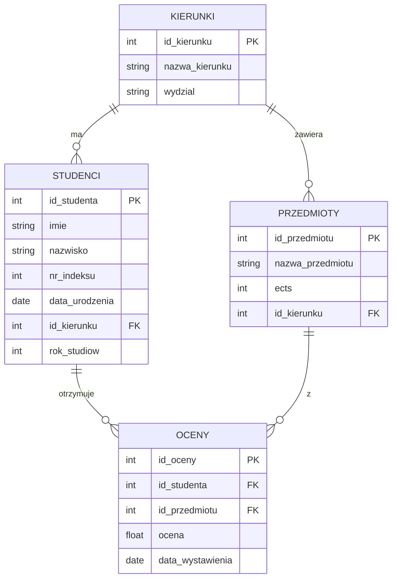

# Laboratorium 6: Podzapytania w SQL

## Cel laboratorium

Celem laboratorium jest zapoznanie się z koncepcją podzapytań (ang. subqueries) w języku SQL. Student nauczy się wykorzystywać podzapytania w różnych częściach instrukcji SELECT, stosować operatory porównania z podzapytaniami oraz tworzyć podzapytania skorelowane.

## Podstawy teoretyczne

Podzapytanie to zapytanie `SELECT` umieszczone wewnątrz innego zapytania SQL. Może być używane w klauzulach `SELECT`, `FROM`, `WHERE` oraz `HAVING`.

### Rodzaje podzapytań:

1. **Podzapytania nieskorelowane (proste)** – podzapytanie może zostać wykonane niezależnie od zapytania zewnętrznego. Jest wykonywane raz, a jego wynik jest przekazywany do zapytania głównego.
1. **Podzapytania skorelowane** – podzapytanie odnosi się do kolumn z zapytania zewnętrznego. Jest wykonywane wielokrotnie – po jednym razie dla każdego wiersza przetwarzanego przez zapytanie zewnętrzne.

### Operatory używane z podzapytaniami:

- **IN** – sprawdza, czy wartość znajduje się w zbiorze wynikowym podzapytania.
- **EXISTS / NOT EXISTS** – sprawdza, czy podzapytanie zwraca jakiekolwiek wiersze.
- **ANY / SOME / ALL** – porównuje wartość z zestawem wartości zwróconych przez podzapytanie (np. `> ALL` oznacza większy od wszystkich).
- **Operatory porównania (=, \<, >, \<=, >=, \<>)** – używane, gdy podzapytanie zwraca dokładnie jedną wartość (podzapytanie skalarne).

### Diagram relacji (ERD)

Poniższy diagram przedstawia strukturę bazy danych wykorzystywaną w tym laboratorium:

## Zadania do wykonania

Baza danych znajduje się w pliku `lab06_students.sql`.

1. Wyświetl imiona i nazwiska studentów, którzy studiują na tym samym kierunku co 'Jan Kowalski' (wyklucz Jana Kowalskiego z listy).
1. Znajdź przedmioty, które mają liczbę punktów ECTS większą niż średnia liczba punktów ECTS wszystkich przedmiotów.
1. Wyświetl studentów (imię, nazwisko), którzy otrzymali co najmniej jedną ocenę 5.0. Użyj operatora `IN`.
1. Wyświetl studentów, którzy nie otrzymali jeszcze żadnej oceny. Użyj operatora `NOT IN`.
1. Wyświetl nazwy przedmiotów, z których nie wystawiono jeszcze żadnej oceny. Użyj operatora `NOT EXISTS`.
1. Znajdź studenta (imię, nazwisko), który ma najwyższą średnią ocen.
1. Wyświetl kierunki studiów, na których studiuje więcej studentów niż wynosi średnia liczba studentów na kierunek.
1. Dla każdego studenta wyświetl jego imię, nazwisko oraz liczbę ocen, które otrzymał (użyj podzapytania w klauzuli `SELECT`).
1. Wyświetl nazwy przedmiotów oraz imię i nazwisko studenta, który otrzymał z tego przedmiotu najwyższą ocenę.
1. Znajdź studentów, którzy otrzymali ocenę wyższą niż średnia ocen z przedmiotu 'Bazy Danych'.
1. Wyświetl imiona i nazwiska studentów urodzonych po najstarszym studencie z kierunku 'Informatyka'.
1. Znajdź przedmioty, z których średnia ocen jest wyższa niż ogólna średnia ocen wszystkich studentów.
1. Wyświetl studentów, którzy mają wszystkie oceny powyżej 3.0.
1. Wyświetl nazwy kierunków, na których nie ma żadnego studenta urodzonego przed rokiem 2001.
1. Dla każdego kierunku wyświetl nazwę przedmiotu z największą liczbą punktów ECTS na tym kierunku.
1. Znajdź studentów, którzy studiują na wydziale 'Wydział Zarządzania' i otrzymali co najmniej jedną ocenę 2.0.
1. Wyświetl studentów (imię, nazwisko), których średnia ocen jest wyższa niż średnia ocen na ich macierzystym kierunku (podzapytanie skorelowane).
1. Znajdź przedmiot, który ma najwięcej ocen niedostatecznych (2.0).
1. Wyświetl listę studentów wraz z informacją, ile punktów ECTS zdobyli (suma ECTS z przedmiotów, z których mają ocenę >= 3.0).
1. Wyświetl studentów, którzy otrzymali oceny z co najmniej dwóch różnych przedmiotów przypisanych do innego kierunku niż ten, który studiują.
