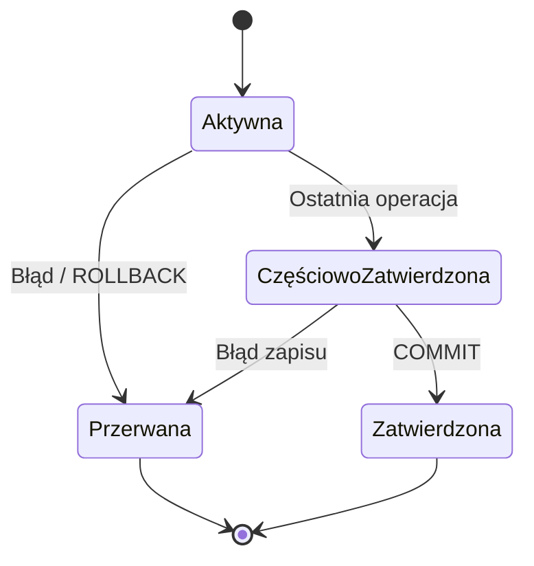

# Laboratorium 6: Transakcje w bazach danych

## Cel laboratorium
Zrozumienie koncepcji transakcji (ACID) oraz ich praktyczne zastosowanie w SQLite.

## Podstawy teoretyczne

Transakcja to zbiór operacji na bazie danych, które stanowią jedną logiczną całość. Aby transakcja była poprawna, musi spełniać zestaw właściwości zwany **ACID**:

1. **Atomicity (Atomowość)** – transakcja jest wykonywana w całości lub wcale ("wszystko albo nic"). Jeśli którakolwiek operacja zawiedzie, cała transakcja jest wycofywana.
2. **Consistency (Spójność)** – po zakończeniu transakcji baza danych musi pozostać w stanie spójnym (nie mogą zostać naruszone żadne więzy integralności).
3. **Isolation (Izolacja)** – transakcje wykonywane równocześnie nie powinny na siebie wpływać. Wynik jednej transakcji powinien być niewidoczny dla innych, dopóki nie zostanie ona zatwierdzona.
4. **Durability (Trwałość)** – po zatwierdzeniu transakcji (`COMMIT`), zmiany są trwale zapisane w bazie (np. na dysku) i nie zostaną utracone nawet w przypadku awarii systemu.

### Cykl życia transakcji (Mermaid)


## Zadanie: Przelew bankowy
Wyobraźmy sobie tabelę `Konta`:
```sql
CREATE TABLE Konta (
    id_konta INTEGER PRIMARY KEY,
    wlasciciel TEXT,
    saldo REAL
);

INSERT INTO Konta VALUES (1, 'Jan Kowalski', 1000);
INSERT INTO Konta VALUES (2, 'Anna Nowak', 500);
```

### Wykonanie transakcji
```sql
BEGIN TRANSACTION;

UPDATE Konta SET saldo = saldo - 100 WHERE id_konta = 1;
UPDATE Konta SET saldo = saldo + 100 WHERE id_konta = 2;

-- Sprawdzenie stanu przed zatwierdzeniem
SELECT * FROM Konta;

COMMIT;
```

### Przykładowy wynik (Oczekiwany rezultat)
Jeśli przed transakcją Konta miały salda: 1 -> 1000, 2 -> 500.
**Wynik po UPDATE (wewnątrz transakcji):**
```text
id_konta | wlasciciel    | saldo
---------|---------------|-------
1        | Jan Kowalski  | 900
2        | Anna Nowak    | 600
```
Po wykonaniu `COMMIT` zmiany stają się trwałe.

## Ćwiczenie
Spróbuj wykonać transakcję, która kończy się błędem (np. naruszenie więzu CHECK na ujemne saldo) i wycofaj zmiany.

## Ćwiczenia dodatkowe
1. Zademonstruj użycie `SAVEPOINT`, `RELEASE` i `ROLLBACK TO` na przykładzie operacji częściowo udanych w ramach większej transakcji.
2. Porównaj `BEGIN DEFERRED`, `BEGIN IMMEDIATE` i `BEGIN EXCLUSIVE` w SQLite: przygotuj krótkie demo (nawet jednosesyjne), które pokazuje różnice w blokadach podczas wykonywania `UPDATE` na tej samej tabeli.
