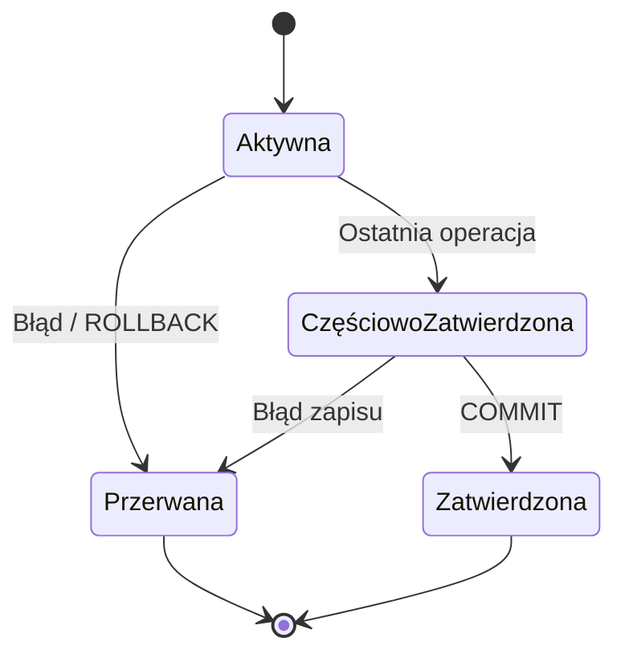

# Laboratorium 6: Transakcje w bazach danych

## Cel laboratorium
Zrozumienie koncepcji transakcji (ACID) oraz ich praktyczne zastosowanie w SQLite.

## Podstawy teoretyczne

Transakcja to zbiór operacji na bazie danych, które stanowią jedną logiczną całość. Aby transakcja była poprawna, musi spełniać zestaw właściwości zwany **ACID**:

1. **Atomicity (Atomowość)** – transakcja jest wykonywana w całości lub wcale ("wszystko albo nic"). Jeśli którakolwiek operacja zawiedzie, cała transakcja jest wycofywana.
2. **Consistency (Spójność)** – po zakończeniu transakcji baza danych musi pozostać w stanie spójnym (nie mogą zostać naruszone żadne więzy integralności).
3. **Isolation (Izolacja)** – transakcje wykonywane równocześnie nie powinny na siebie wpływać. Wynik jednej transakcji powinien być niewidoczny dla innych, dopóki nie zostanie ona zatwierdzona.
4. **Durability (Trwałość)** – po zatwierdzeniu transakcji (`COMMIT`), zmiany są trwale zapisane w bazie (np. na dysku) i nie zostaną utracone nawet w przypadku awarii systemu.

### Cykl życia transakcji (Mermaid)

```mermaid
stateDiagram-v2
    [*] --> Aktywna
    Aktywna --> CzęściowoZatwierdzona : Ostatnia operacja
    CzęściowoZatwierdzona --> Zatwierdzona : COMMIT
    Aktywna --> Przerwana : Błąd / ROLLBACK
    CzęściowoZatwierdzona --> Przerwana : Błąd zapisu
    Przerwana --> [*]
    Zatwierdzona --> [*]
```

## Zadanie: Przelew bankowy
Wyobraźmy sobie tabelę `Konta`:
**Przykład dla PostgreSQL:**
```sql
CREATE TABLE Konta (
    id_konta SERIAL PRIMARY KEY,
    wlasciciel VARCHAR(100),
    saldo NUMERIC(15, 2) CHECK (saldo >= 0)
);

INSERT INTO Konta (wlasciciel, saldo) VALUES ('Jan Kowalski', 1000);
INSERT INTO Konta (wlasciciel, saldo) VALUES ('Anna Nowak', 500);
```

**Przykład dla SQLite (opcjonalnie):**
```sql
CREATE TABLE Konta (
    id_konta INTEGER PRIMARY KEY,
    wlasciciel TEXT,
    saldo REAL
);
```

### Wykonanie transakcji
**Przykład dla PostgreSQL:**
```sql
BEGIN;

UPDATE Konta SET saldo = saldo - 100 WHERE id_konta = 1;
UPDATE Konta SET saldo = saldo + 100 WHERE id_konta = 2;

-- Sprawdzenie stanu przed zatwierdzeniem
SELECT * FROM Konta;

COMMIT;
```

**Przykład dla SQLite (opcjonalnie):**
```sql
BEGIN TRANSACTION;
-- ... operacje ...
COMMIT;
```

### Przykładowy wynik (Oczekiwany rezultat)
Jeśli przed transakcją Konta miały salda: 1 -> 1000, 2 -> 500.
**Wynik po UPDATE (wewnątrz transakcji):**
```text
 id_konta |  wlasciciel  | saldo  
----------+--------------+--------
        1 | Jan Kowalski | 900.00
        2 | Anna Nowak   | 600.00
```
Po wykonaniu `COMMIT` zmiany stają się trwałe.

## Ćwiczenie
Spróbuj wykonać transakcję w PostgreSQL, która kończy się błędem (np. naruszenie więzu `CHECK` na ujemne saldo poprzez zbyt duży przelew) i zaobserwuj, jak baza danych reaguje na błąd.

## Ćwiczenia dodatkowe
1. Zademonstruj użycie `SAVEPOINT`, `RELEASE SAVEPOINT` i `ROLLBACK TO SAVEPOINT` w PostgreSQL na przykładzie operacji częściowo udanych w ramach większej transakcji.
2. Porównaj poziomy izolacji transakcji w PostgreSQL (`READ COMMITTED`, `REPEATABLE READ`, `SERIALIZABLE`). Przygotuj krótkie demo pokazujące różnicę między nimi.
