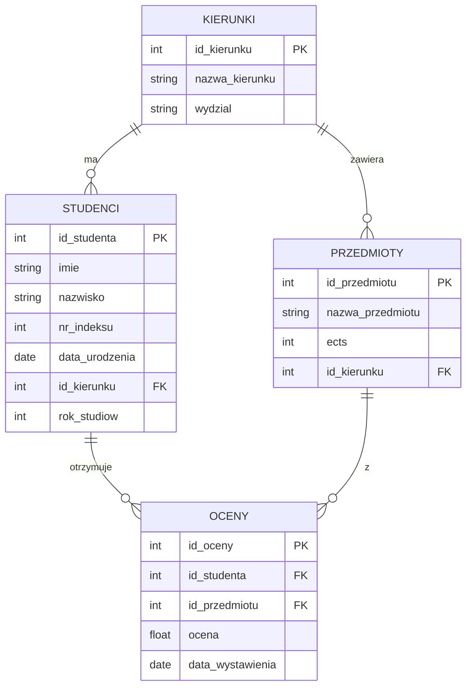

# Laboratorium 7: Grupowanie, Widoki i Podzapytania w SQL

## Cel laboratorium

Celem laboratorium jest zapoznanie się z zaawansowanymi technikami manipulacji danymi w języku SQL. Student nauczy się agregować dane za pomocą klauzul `GROUP BY` i `HAVING`, tworzyć wirtualne tabele (widoki) oraz stosować podzapytania (subqueries) w różnych częściach instrukcji SQL.

## Podstawy teoretyczne

### 1. Grupowanie danych (GROUP BY i HAVING)

Klauzula `GROUP BY` pozwala na grupowanie wierszy, które mają te same wartości w określonych kolumnach. Jest ona nierozerwalnie związana z **funkcjami agregującymi**:

- `COUNT(*)` / `COUNT(kolumna)` – zlicza wiersze / niepuste wartości.
- `SUM(kolumna)` – oblicza sumę wartości numerycznych.
- `AVG(kolumna)` – oblicza średnią arytmetyczną.
- `MIN(kolumna)` / `MAX(kolumna)` – znajduje wartość minimalną / maksymalną.

**Klauzula HAVING** służy do filtrowania *grup*, podobnie jak `WHERE` służy do filtrowania *wierszy*. `WHERE` jest wykonywane przed grupowaniem, a `HAVING` po nim.

**Przykład:**
Wyświetl wydziały, na których studiuje więcej niż 5 studentów:

```sql
SELECT wydzial, COUNT(*) as liczba_studentów
FROM Kierunki K
JOIN Studenci S ON K.id_kierunku = S.id_kierunku
GROUP BY wydzial
HAVING liczba_studentów > 5;
```

### 2. Widoki (Views)

Widok to zapisane zapytanie `SELECT`, które możemy traktować jak tabelę. Nie przechowuje on danych (z wyjątkiem specyficznych przypadków), a jedynie instrukcję ich pobierania.

**Zalety:**

- Ukrywanie złożoności zapytania (składowanie skomplikowanych JOIN-ów).
- Bezpieczeństwo (udostępnianie tylko części kolumn).
- Spójność (używamy tej samej logiki w wielu miejscach).

**Przykład:**
Utworzenie widoku z podstawowymi danymi studenta i jego kierunku:

```sql
CREATE VIEW widok_studenci_kierunki AS
SELECT S.imie, S.nazwisko, K.nazwa_kierunku
FROM Studenci S
JOIN Kierunki K ON S.id_kierunku = K.id_kierunku;

-- Użycie widoku:
SELECT * FROM widok_studenci_kierunki WHERE nazwa_kierunku = 'Informatyka';
```

### 3. Podzapytania (Subqueries)

Podzapytanie to zapytanie `SELECT` umieszczone wewnątrz innego zapytania.

**Rodzaje podzapytań:**

1. **Nieskorelowane:** Wykonywane raz, niezależnie od zapytania zewnętrznego. Często używane z operatorami `IN`, `ANY`, `ALL` lub operatorami porównania.
1. **Skorelowane:** Odwołuje się do kolumn z zapytania zewnętrznego. Wykonywane dla każdego wiersza zapytania głównego.
1. **W klauzuli SELECT:** Zwraca pojedynczą wartość (skalarną) dla każdego wiersza.
1. **W klauzuli FROM:** Traktowane jako tymczasowa tabela.

**Przykład (podzapytanie nieskorelowane):**
Studenci, którzy mają ocenę wyższą niż średnia ogólna:

```sql
SELECT imie, nazwisko
FROM Studenci
WHERE id_studenta IN (
    SELECT id_studenta FROM Oceny WHERE ocena > (SELECT AVG(ocena) FROM Oceny)
);
```

**Przykład (podzapytanie skorelowane):**
Studenci, którzy mają najwyższą ocenę ze swojego kierunku (wymaga połączenia tabel):

```sql
SELECT S.imie, S.nazwisko, O.ocena
FROM Studenci S
JOIN Oceny O ON S.id_studenta = O.id_studenta
WHERE O.ocena = (
    SELECT MAX(O2.ocena)
    FROM Oceny O2
    JOIN Studenci S2 ON O2.id_studenta = S2.id_studenta
    WHERE S2.id_kierunku = S.id_kierunku
);
```

## Diagram relacji (ERD)

Struktura bazy danych wykorzystywana w zadaniach:



## Zadania do wykonania

Baza danych znajduje się w pliku `lab07_university.sql`.

1. **Grupowanie:** Wyświetl liczbę studentów na każdym kierunku. Podaj nazwę kierunku i liczbę studentów.
   - *Podpowiedź: Użyj JOIN między tabelami Studenci i Kierunki oraz GROUP BY.*
1. **Grupowanie:** Znajdź średnią ocenę dla każdego przedmiotu. Wyświetl nazwę przedmiotu i średnią.
   - *Podpowiedź: Funkcja AVG(ocena) w połączeniu z GROUP BY nazwa_przedmiotu.*
1. **Grupowanie:** Wyświetl kierunki, na których studiuje więcej niż 3 studentów.
   - *Podpowiedź: Użyj klauzuli HAVING do odfiltrowania grup z COUNT(*) > 3.\*
1. **Widoki:** Stwórz widok `v_najlepsi_studenci`, który wyświetla imiona i nazwiska studentów ze średnią ocen powyżej 4.5.
   - *Podpowiedź: Musisz obliczyć średnią ocen dla każdego studenta w definicji widoku.*
1. **Widoki:** Stwórz widok `v_plan_studiow`, łączący nazwy kierunków z przypisanymi do nich przedmiotami i ich punktami ECTS.
   - *Podpowiedź: Prosty JOIN między Kierunki i Przedmioty.*
1. **Widoki:** Wyświetl dane z widoku `v_plan_studiow` tylko dla wydziału 'Wydział Zarządzania'.
   - *Podpowiedź: Pamiętaj, że z widoku korzystasz jak ze zwykłej tabeli (SELECT * FROM ... WHERE ...).*
1. **Podzapytania:** Wyświetl imiona i nazwiska studentów, którzy studiują na tym samym kierunku co 'Jan Kowalski' (pamiętaj, aby nie wyświetlić samego Jana Kowalskiego).
   - *Podpowiedź: Użyj podzapytania w WHERE, aby pobrać id_kierunku dla Jana Kowalskiego.*
1. **Podzapytania:** Znajdź przedmioty, których liczba punktów ECTS jest większa niż średnia ECTS wszystkich przedmiotów.
   - *Podpowiedź: W WHERE porównaj ects z wynikiem podzapytania (SELECT AVG(ects) FROM Przedmioty).*
1. **Podzapytania:** Wyświetl studentów, którzy otrzymali co najmniej jedną ocenę 5.0. Użyj operatora `IN`.
   - *Podpowiedź: WHERE id_studenta IN (SELECT id_studenta FROM Oceny WHERE ocena = 5.0).*
1. **Podzapytania:** Wyświetl studentów, którzy nie otrzymali jeszcze żadnej oceny. Użyj operatora `NOT EXISTS`.
   - *Podpowiedź: W podzapytaniu skorelowanym sprawdź istnienie rekordów w tabeli Oceny dla danego id_studenta.*
1. **Grupowanie + Podzapytania:** Wyświetl studentów (imię i nazwisko), których średnia ocen jest wyższa niż średnia ocen wszystkich studentów.
   - *Podpowiedź: Oblicz średnią w GROUP BY dla każdego studenta i porównaj w HAVING z globalną średnią.*
1. **Podzapytania:** Znajdź nazwę przedmiotu, z którego wystawiono najwięcej ocen.
   - *Podpowiedź: Możesz użyć GROUP BY i ORDER BY z LIMIT 1 lub podzapytania w HAVING.*
1. **Widoki:** Stwórz widok `v_statystyki_kierunkow`, który dla każdego kierunku podaje liczbę studentów, średnią ocenę na kierunku i maksymalną zdobytą ocenę.
   - *Podpowiedź: Wymaga połączenia wszystkich czterech tabel.*
1. **Podzapytania skorelowane:** Dla każdego studenta wyświetl jego imię, nazwisko oraz liczbę przedmiotów, z których ma ocenę pozytywną (>= 3.0).
   - *Podpowiedź: Podzapytanie SELECT COUNT(*) może znaleźć się bezpośrednio na liście kolumn głównego SELECT.\*
1. **Grupowanie:** Wyświetl rok studiów i liczbę studentów na tym roku, ale tylko dla kierunku 'Informatyka'.
   - *Podpowiedź: Przefiltruj kierunek w WHERE, a potem grupuj po rok_studiow.*
1. **Podzapytania:** Wyświetl przedmioty, które nie są przypisane do żadnego kierunku na wydziale 'Wydział Chemiczny'.
   - *Podpowiedź: Użyj NOT IN z listą id_kierunku z danego wydziału.*
1. **Grupowanie + HAVING:** Wyświetl studentów, którzy mają średnią ocen mniejszą niż 3.0.
   - *Podpowiedź: Grupowanie po id_studenta i warunek w HAVING AVG(ocena) < 3.0.*
1. **Podzapytania:** Wyświetl studentów urodzonych po najstarszym studencie z kierunku 'Informatyka'.
   - *Podpowiedź: Najstarszy student ma MIN(data_urodzenia).*
1. **Złożone:** Znajdź studenta (imię i nazwisko), który zdobył najwięcej punktów ECTS (suma ECTS za przedmioty z oceną >= 3.0).
   - *Podpowiedź: Zsumuj ECTS grupując po studencie, a następnie znajdź maksimum.*
1. **Widoki:** Usuń widok `v_najlepsi_studenci`.
   - *Podpowiedź: DROP VIEW nazwa_widoku.*
