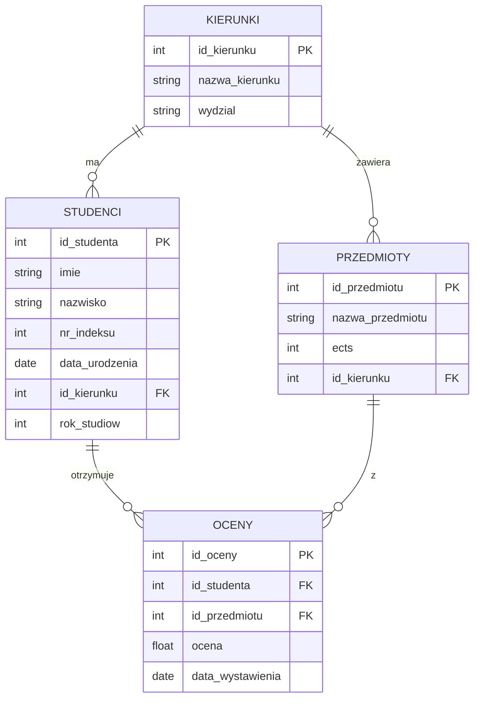

# Laboratorium 7: Grupowanie, Widoki i Podzapytania w SQL

## Cel laboratorium

Celem laboratorium jest zapoznanie się z zaawansowanymi technikami manipulacji danymi w języku SQL. Student nauczy się agregować dane za pomocą klauzul `GROUP BY` i `HAVING`, tworzyć wirtualne tabele (widoki) oraz stosować podzapytania (subqueries) w różnych częściach instrukcji SQL.

## Podstawy teoretyczne

### 1. Grupowanie danych (GROUP BY i HAVING)

Klauzula `GROUP BY` pozwala na grupowanie wierszy, które mają te same wartości w określonych kolumnach. Jest ona nierozerwalnie związana z **funkcjami agregującymi**:

- `COUNT(*)` / `COUNT(kolumna)` – zlicza wiersze / niepuste wartości.
- `SUM(kolumna)` – oblicza sumę wartości numerycznych.
- `AVG(kolumna)` – oblicza średnią arytmetyczną.
- `MIN(kolumna)` / `MAX(kolumna)` – znajduje wartość minimalną / maksymalną.

**Zasady grupowania:**

1. Każda kolumna wybrana w `SELECT`, która nie jest użyta w funkcji agregującej, **musi** znaleźć się w klauzuli `GROUP BY`.
1. Możemy grupować po wielu kolumnach jednocześnie.
1. Klauzula `WHERE` filtruje wiersze **przed** grupowaniem, natomiast `HAVING` filtruje grupy **po** ich utworzeniu i wyliczeniu agregatów.

**Przykład 1 (Grupowanie po wielu kolumnach):**
Liczba studentów na każdym roku w ramach każdego kierunku:

```sql
SELECT id_kierunku, rok_studiow, COUNT(*) as liczba_studentow
FROM Studenci
GROUP BY id_kierunku, rok_studiow
ORDER BY id_kierunku, rok_studiow;
```

**Przykład 2 (WHERE vs HAVING):**
Średnia ocen powyżej 4.0 dla przedmiotów, które mają przypisane więcej niż 5 ECTS:

```sql
SELECT id_przedmiotu, AVG(ocena) as srednia
FROM Oceny O
JOIN Przedmioty P ON O.id_przedmiotu = P.id_przedmiotu
WHERE P.ects > 5              -- Filtrowanie wierszy (przedmiotów)
GROUP BY id_przedmiotu
HAVING AVG(ocena) > 4.0;      -- Filtrowanie grup (średniej z ocen)
```

### 2. Widoki (Views)

Widok to zapisane zapytanie `SELECT`, które możemy traktować jak wirtualną tabelę. Nie przechowuje on danych (z wyjątkiem widoków zmaterializowanych), a jedynie definicję ich pobierania.

**Zalety i ograniczenia:**

- **Ukrywanie złożoności:** Skomplikowane złączenia (JOIN) i obliczenia można zamknąć w jednym widoku.
- **Bezpieczeństwo:** Możemy udostępnić użytkownikowi widok zawierający tylko wybrane kolumny, zamiast całej tabeli.
- **Aktualizacja danych:** Wiele systemów DBMS pozwala na aktualizację danych przez widoki (INSERT/UPDATE), ale tylko jeśli widok jest "prosty" (odnosi się do jednej tabeli, nie zawiera `GROUP BY`, `DISTINCT` ani funkcji agregujących).

**Przykład (Widok z agregacją):**
Średnie ocen wszystkich studentów:

```sql
CREATE VIEW v_srednie_studentow AS
SELECT S.id_studenta, S.imie, S.nazwisko, AVG(O.ocena) as srednia
FROM Studenci S
LEFT JOIN Oceny O ON S.id_studenta = O.id_studenta
GROUP BY S.id_studenta, S.imie, S.nazwisko;

-- Wykorzystanie widoku:
SELECT * FROM v_srednie_studentow WHERE srednia > 4.0;
```

### 3. Podzapytania (Subqueries)

Podzapytanie to zapytanie `SELECT` umieszczone wewnątrz innego zapytania (głównego).

**Rodzaje i operatory:**

1. **Podzapytania skalarne:** Zwracają dokładnie jedną wartość (jeden wiersz i jedną kolumnę). Mogą być użyte tam, gdzie pojedyncza wartość (np. w `SELECT` lub po operatorze porównania `=, <, >`).
1. **Podzapytania wielowierszowe:** Zwracają listę wartości. Używane z operatorami:
   - `IN` – wartość znajduje się na liście.
   - `ANY` / `SOME` – porównanie z przynajmniej jedną wartością z listy.
   - `ALL` – porównanie ze wszystkimi wartościami z listy.
1. **Operator EXISTS:** Sprawdza, czy podzapytanie zwraca jakiekolwiek wiersze. Często stosowany w podzapytaniach skorelowanych.

**Przykład (Podzapytanie w klauzuli FROM):**
Traktujemy wynik podzapytania jak tymczasową tabelę. Wymaga ona nadania aliasu.

```sql
SELECT AVG(liczba_ocen)
FROM (
    SELECT id_studenta, COUNT(*) as liczba_ocen
    FROM Oceny
    GROUP BY id_studenta
) AS statystyki_studentow;
```

**Przykład (Operator ANY):**
Przedmioty, które mają tyle samo ECTS, co dowolny przedmiot na kierunku 'Informatyka':

```sql
SELECT nazwa_przedmiotu, ects
FROM Przedmioty
WHERE ects = ANY (
    SELECT ects FROM Przedmioty P
    JOIN Kierunki K ON P.id_kierunku = K.id_kierunku
    WHERE K.nazwa_kierunku = 'Informatyka'
);
```

**Przykład (Operator EXISTS):**
Kierunki, na których studiuje co najmniej jeden student urodzony przed 2000 rokiem:

```sql
SELECT nazwa_kierunku
FROM Kierunki K
WHERE EXISTS (
    SELECT 1 FROM Studenci S
    WHERE S.id_kierunku = K.id_kierunku
    AND S.data_urodzenia < '2000-01-01'
);
```

## Diagram relacji (ERD)

Struktura bazy danych wykorzystywana w zadaniach:



## Zadania do wykonania

Baza danych znajduje się w pliku `lab07_university.sql`.

1. **Grupowanie:** Wyświetl liczbę studentów na każdym kierunku. Podaj nazwę kierunku i liczbę studentów.
   - *Podpowiedź: Użyj JOIN między tabelami Studenci i Kierunki oraz GROUP BY.*
1. **Grupowanie:** Znajdź średnią ocenę dla każdego przedmiotu. Wyświetl nazwę przedmiotu i średnią.
   - *Podpowiedź: Funkcja AVG(ocena) w połączeniu z GROUP BY nazwa_przedmiotu.*
1. **Grupowanie:** Wyświetl kierunki, na których studiuje więcej niż 3 studentów.
   - *Podpowiedź: Użyj klauzuli HAVING do odfiltrowania grup z COUNT(*) > 3.\*
1. **Widoki:** Stwórz widok `v_najlepsi_studenci`, który wyświetla imiona i nazwiska studentów ze średnią ocen powyżej 4.5.
   - *Podpowiedź: Musisz obliczyć średnią ocen dla każdego studenta w definicji widoku.*
1. **Widoki:** Stwórz widok `v_plan_studiow`, łączący nazwy kierunków z przypisanymi do nich przedmiotami i ich punktami ECTS.
   - *Podpowiedź: Prosty JOIN między Kierunki i Przedmioty.*
1. **Widoki:** Wyświetl dane z widoku `v_plan_studiow` tylko dla wydziału 'Wydział Zarządzania'.
   - *Podpowiedź: Pamiętaj, że z widoku korzystasz jak ze zwykłej tabeli (SELECT * FROM ... WHERE ...).*
1. **Podzapytania:** Wyświetl imiona i nazwiska studentów, którzy studiują na tym samym kierunku co 'Jan Kowalski' (pamiętaj, aby nie wyświetlić samego Jana Kowalskiego).
   - *Podpowiedź: Użyj podzapytania w WHERE, aby pobrać id_kierunku dla Jana Kowalskiego.*
1. **Podzapytania:** Znajdź przedmioty, których liczba punktów ECTS jest większa niż średnia ECTS wszystkich przedmiotów.
   - *Podpowiedź: W WHERE porównaj ects z wynikiem podzapytania (SELECT AVG(ects) FROM Przedmioty).*
1. **Podzapytania:** Wyświetl studentów, którzy otrzymali co najmniej jedną ocenę 5.0. Użyj operatora `IN`.
   - *Podpowiedź: WHERE id_studenta IN (SELECT id_studenta FROM Oceny WHERE ocena = 5.0).*
1. **Podzapytania:** Wyświetl studentów, którzy nie otrzymali jeszcze żadnej oceny. Użyj operatora `NOT EXISTS`.
   - *Podpowiedź: W podzapytaniu skorelowanym sprawdź istnienie rekordów w tabeli Oceny dla danego id_studenta.*
1. **Grupowanie + Podzapytania:** Wyświetl studentów (imię i nazwisko), których średnia ocen jest wyższa niż średnia ocen wszystkich studentów.
   - *Podpowiedź: Oblicz średnią w GROUP BY dla każdego studenta i porównaj w HAVING z globalną średnią.*
1. **Podzapytania:** Znajdź nazwę przedmiotu, z którego wystawiono najwięcej ocen.
   - *Podpowiedź: Możesz użyć GROUP BY i ORDER BY z LIMIT 1 lub podzapytania w HAVING.*
1. **Widoki:** Stwórz widok `v_statystyki_kierunkow`, który dla każdego kierunku podaje liczbę studentów, średnią ocenę na kierunku i maksymalną zdobytą ocenę.
   - *Podpowiedź: Wymaga połączenia wszystkich czterech tabel.*
1. **Podzapytania skorelowane:** Dla każdego studenta wyświetl jego imię, nazwisko oraz liczbę przedmiotów, z których ma ocenę pozytywną (>= 3.0).
   - *Podpowiedź: Podzapytanie SELECT COUNT(*) może znaleźć się bezpośrednio na liście kolumn głównego SELECT.\*
1. **Grupowanie:** Wyświetl rok studiów i liczbę studentów na tym roku, ale tylko dla kierunku 'Informatyka'.
   - *Podpowiedź: Przefiltruj kierunek w WHERE, a potem grupuj po rok_studiow.*
1. **Podzapytania:** Wyświetl przedmioty, które nie są przypisane do żadnego kierunku na wydziale 'Wydział Chemiczny'.
   - *Podpowiedź: Użyj NOT IN z listą id_kierunku z danego wydziału.*
1. **Grupowanie + HAVING:** Wyświetl studentów, którzy mają średnią ocen mniejszą niż 3.0.
   - *Podpowiedź: Grupowanie po id_studenta i warunek w HAVING AVG(ocena) < 3.0.*
1. **Podzapytania:** Wyświetl studentów urodzonych po najstarszym studencie z kierunku 'Informatyka'.
   - *Podpowiedź: Najstarszy student ma MIN(data_urodzenia).*
1. **Złożone:** Znajdź studenta (imię i nazwisko), który zdobył najwięcej punktów ECTS (suma ECTS za przedmioty z oceną >= 3.0).
   - *Podpowiedź: Zsumuj ECTS grupując po studencie, a następnie znajdź maksimum.*
1. **Widoki:** Usuń widok `v_najlepsi_studenci`.
   - *Podpowiedź: DROP VIEW nazwa_widoku.*
