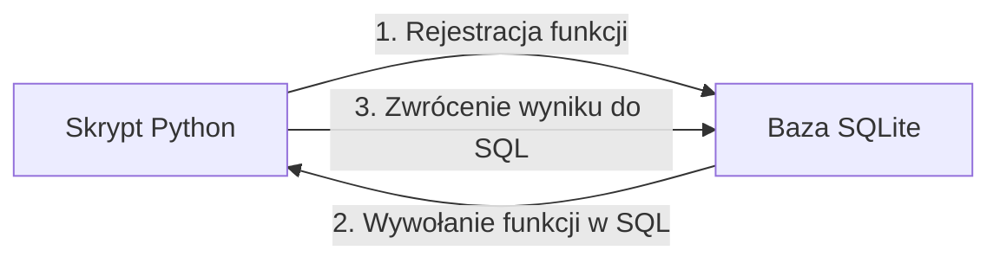

# Laboratorium 7: Proceduralne rozszerzenia SQL - Wstęp (Python + SQLite)

## Cel laboratorium
Implementacja logiki biznesowej z wykorzystaniem języka Python jako proceduralnego rozszerzenia dla SQLite.

## Podstawy teoretyczne

### Języki proceduralne w bazach danych
Większość profesjonalnych systemów (PostgreSQL, Oracle, SQL Server) posiada własne języki proceduralne (PL/pgSQL, PL/SQL, T-SQL), które pozwalają na pisanie skomplikowanej logiki bezpośrednio wewnątrz bazy.

**SQLite** jest lekki i nie posiada wbudowanego języka proceduralnego. Jednak dzięki bibliotece `sqlite3` w Pythonie, możemy:
1. **Rejestrować własne funkcje skalarne** (`create_function`) – do użycia w zapytaniach SQL.
2. **Rejestrować funkcje agregujące** (`create_aggregate`) – do obliczeń na zbiorach danych.
3. **Sterować transakcjami** – za pomocą metod `commit()` i `rollback()`.

### Integracja Python <-> SQLite (Mermaid)


## Zadanie: Rejestracja własnej funkcji
```python
import sqlite3

def podatek_vat(cena):
    return round(cena * 0.23, 2)

conn = sqlite3.connect('sklep.db')
# Rejestracja funkcji w SQLite
conn.create_function("oblicz_vat", 1, podatek_vat)

cursor = conn.cursor()
for row in cursor.execute("SELECT nazwa, cena, oblicz_vat(cena) FROM Produkty"):
    print(row)

conn.close()
```

## Zadanie: Procedura składowana (Emulacja)
W Pythonie tworzymy funkcję, która realizuje złożoną operację (np. złożenie zamówienia z aktualizacją stanu magazynowego).

```python
def zloz_zamowienie(produkt_id, ilosc):
    # Logika sprawdzająca stan i aktualizująca tabele
    pass
```

## Ćwiczenie
Napisz skrypt w Pythonie, który oblicza sumaryczną wartość magazynu (cena * ilosc) dla każdej kategorii produktów, korzystając z zarejestrowanej funkcji Pythona.

## Ćwiczenia dodatkowe
1. Zarejestruj własną funkcję agregującą w Pythonie (np. `SUMA_CEN`) i wykorzystaj ją w zapytaniu do policzenia łącznej wartości zamówienia.
2. Zaimplementuj funkcję `waliduj_email(email)` i zarejestruj ją w SQLite. Przygotuj zapytanie, które wybierze tylko poprawne adresy e‑mail z tabeli `Klienci`.
