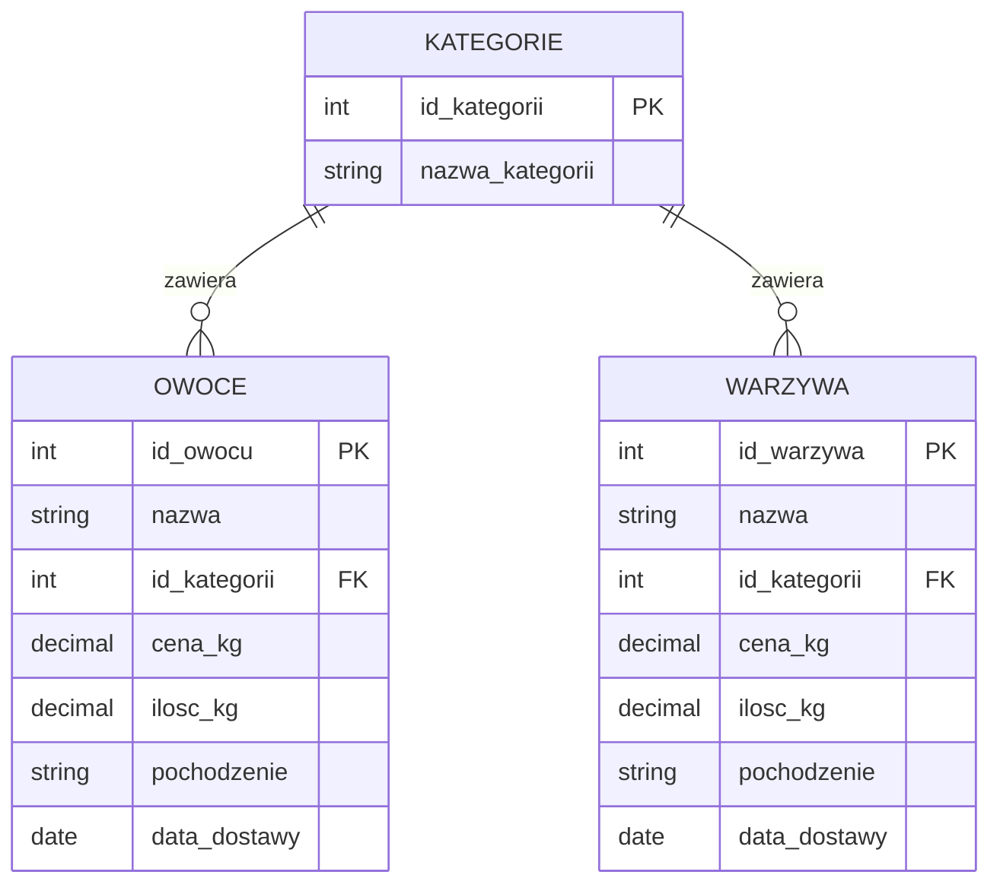

# Laboratorium 7: Widoki (perspektywy) i grupowanie w SQL

## Cel laboratorium

Celem laboratorium jest zapoznanie się z koncepcją widoków (perspektyw) oraz zaawansowanymi technikami grupowania danych w języku SQL. Student nauczy się tworzyć, modyfikować i usuwać widoki, a także wykorzystywać klauzule `GROUP BY` i `HAVING` do agregacji danych.

## Podstawy teoretyczne

### Widoki (Views)

Widok to wirtualna tabela, której treść jest definiowana przez zapytanie SQL. Widok nie przechowuje danych fizycznie (z wyjątkiem widoków zmaterializowanych), a jedynie definicję zapytania, które jest wykonywane za każdym razem, gdy odwołujemy się do widoku.

**Zalety stosowania widoków:**

- **Uproszczenie złożonych zapytań:** Możemy ukryć skomplikowane złączenia i podzapytania pod prostą nazwą widoku.
- **Bezpieczeństwo:** Możemy ograniczyć dostęp użytkownika do określonych kolumn lub wierszy tabeli bazowej.
- **Niezależność danych:** Zmiana struktury tabel bazowych nie musi wpływać na aplikacje korzystające z widoków (wystarczy zmienić definicję widoku).

**Składnia:**

```sql
CREATE VIEW nazwa_widoku AS
SELECT kolumny
FROM tabele
WHERE warunki;
```

### Grupowanie danych (GROUP BY)

Klauzula `GROUP BY` służy do dzielenia rekordów zwróconych przez zapytanie na grupy. Często jest używana z funkcjami agregującymi, takimi jak:

- `COUNT()` – zlicza wiersze,
- `SUM()` – sumuje wartości,
- `AVG()` – oblicza średnią,
- `MIN()` / `MAX()` – znajduje wartość minimalną/maksymalną.

### Klauzula HAVING

Klauzula `HAVING` służy do filtrowania grup utworzonych przez `GROUP BY`. Różni się od `WHERE` tym, że `WHERE` filtruje pojedyncze wiersze przed grupowaniem, a `HAVING` filtruje grupy po ich utworzeniu.

______________________________________________________________________

## Diagram relacji (ERD)

Poniższy diagram przedstawia strukturę bazy danych "Owoce i warzywa" wykorzystywaną w tym laboratorium:



______________________________________________________________________

## Zadania do wykonania

Baza danych znajduje się w pliku `lab07_fruits_and_vegetables.sql`.

1. Stwórz widok `widok_owoce_polska`, który wyświetla wszystkie owoce pochodzące z Polski.
1. Stwórz widok `widok_tanie_warzywa`, który wyświetla nazwy i ceny warzyw o cenie poniżej 5 zł za kg.
1. Wyświetl średnią cenę owoców dla każdej kategorii (użyj `GROUP BY`).
1. Znajdź kraje pochodzenia, z których pochodzi więcej niż 3 rodzaje owoców.
1. Stwórz widok `podsumowanie_zapasow`, który zawiera kolumny: `rodzaj` ('Owoc' lub 'Warzywo'), `laczna_ilosc_kg` oraz `srednia_cena`.
1. Wyświetl kategorie, w których suma zapasów (ilość kg) warzyw przekracza 500 kg.
1. Dla każdej kategorii wyświetl najdroższy i najtańszy owoc.
1. Stwórz widok `produkty_egzotyczne`, który łączy owoce i warzywa z kategorii 'Egzotyczne'.
1. Zlicz, ile produktów (łącznie owoce i warzywa) pochodzi z poszczególnych krajów.
1. Wyświetl kraje, z których pochodzą owoce o łącznej wartości (cena * ilość) większej niż 2000 zł.
1. Stwórz widok `dostawy_luty`, zawierający produkty dostarczone w lutym 2026 roku.
1. Znajdź kategorie, które mają więcej niż 5 produktów typu 'warzywo'.
1. Oblicz łączną wartość wszystkich zapasów owoców w podziale na kategorie.
1. Wyświetl kraje pochodzenia, które dostarczają zarówno owoce, jak i warzywa (użyj `GROUP BY` i `INTERSECT` lub podzapytania).
1. Stwórz widok `stan_magazynowy`, który wyświetla nazwę produktu i informację 'Mało', jeśli ilość < 50 kg, lub 'Dużo' w przeciwnym razie.
1. Wyświetl średnią cenę produktów mrożonych (kategoria 'Mrożonki') w podziale na owoce i warzywa.
1. Znajdź najczęstszy kraj pochodzenia dla warzyw.
1. Stwórz widok `ranking_cenowy_owocow`, który wyświetla owoce posortowane od najdroższego w każdej kategorii.
1. Wyświetl kategorie, w których średnia cena warzyw jest wyższa niż średnia cena owoców.
1. Usuń widok `widok_owoce_polska`.
