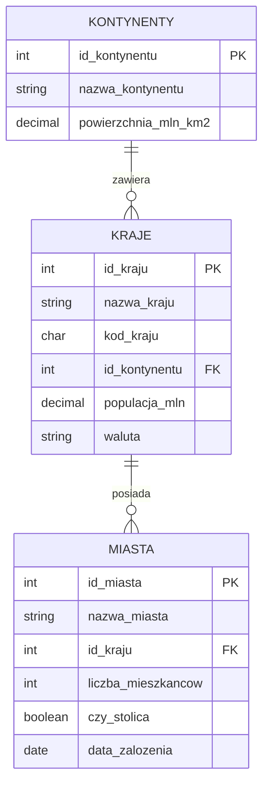

# Laboratorium 8: Funkcje w SQL

## Cel laboratorium

Celem laboratorium jest zapoznanie się z wykorzystaniem wbudowanych funkcji SQL (tekstowych, numerycznych, daty) oraz tworzeniem własnych funkcji (User-Defined Functions - UDF) w systemie PostgreSQL.

## Schemat bazy danych

Laboratorium bazuje na danych o miastach, krajach i kontynentach.



## Podstawy teoretyczne

### 1. Funkcje tekstowe

Pozwalają na manipulację ciągami znaków.

- `UPPER(string)`, `LOWER(string)` - zmiana wielkości liter.
- `LENGTH(string)` - długość ciągu.
- `SUBSTRING(string FROM start FOR count)` - wycinanie fragmentu.
- `CONCAT(s1, s2, ...)` lub operator `||` - łączenie ciągów.
- `REPLACE(string, old, new)` - zamiana fragmentu tekstu.

### 2. Funkcje numeryczne

Służą do operacji na liczbach.

- `ROUND(numer, miejsca)` - zaokrąglanie.
- `CEIL(numer)`, `FLOOR(numer)` - zaokrąglanie w górę/dół.
- `ABS(numer)` - wartość bezwzględna.
- `RANDOM()` - liczba losowa z zakresu \[0, 1).

### 3. Funkcje daty i czasu

Umożliwiają pracę z typami czasowymi.

- `NOW()` - bieżąca data i czas.
- `CURRENT_DATE`, `CURRENT_TIME`.
- `EXTRACT(field FROM source)` - pobranie części daty (np. `YEAR`, `MONTH`, `DAY`).
- `AGE(timestamp)` - oblicza różnicę czasu od teraz do podanej daty.

### 4. Funkcje definiowane przez użytkownika (UDF)

W PostgreSQL funkcje tworzy się za pomocą polecenia `CREATE FUNCTION`.

Przykład prostej funkcji przeliczającej populację na miliony (jeśli mielibyśmy ją w pełnych liczbach):

```sql
CREATE OR REPLACE FUNCTION formatuj_populacje(populacja numeric)
RETURNS text AS $$
BEGIN
    RETURN populacja || ' mln';
END;
$$ LANGUAGE plpgsql;
```

## Zadania do wykonania

1. Wyświetl nazwy wszystkich miast zapisane wielkimi literami.
1. Wyświetl nazwy krajów oraz ich kod kraju w nawiasach (np. "Polska (POL)").
1. Znajdź miasta, których nazwa ma więcej niż 8 znaków.
1. Wyświetl nazwy miast i pierwsze trzy litery ich nazwy w osobnej kolumnie.
1. Oblicz, ile lat temu zostało założone każde miasto (użyj funkcji `AGE` i `EXTRACT`).
1. Wyświetl nazwy krajów, zamieniając w ich nazwach literę 'a' na '@'.
1. Wyświetl nazwy miast oraz kolumnę informującą o liczbie mieszkańców w tysiącach (zaokrągloną do całości).
1. Wyświetl aktualną datę w formacie: "Dzisiaj jest: [data]".
1. Dla każdego kraju wyświetl informację: "Kraj [nazwa] używa waluty [waluta]".
1. Wyświetl miasta założone w XVIII wieku (lata 1701-1800).
1. Stwórz funkcję `staz_miasta(id_miasta_param int)`, która zwraca liczbę lat od założenia miasta do dziś.
1. Użyj stworzonej funkcji `staz_miasta`, aby wyświetlić miasta starsze niż 500 lat.
1. Wyświetl nazwy kontynentów oraz ich powierzchnię zaokrągloną do jednego miejsca po przecinku.
1. Wylosuj dla każdego miasta "liczbę szczęścia" z zakresu od 1 do 100 (użyj `RANDOM()` i `FLOOR`).
1. Wyświetl miasta, których nazwa kończy się na literę 'a'.
1. Oblicz średnią liczbę mieszkańców dla wszystkich miast, wynik zaokrąglij do dwóch miejsc po przecinku.
1. Stwórz funkcję `czy_stara_stolica(id_miasta_param int)`, która zwraca `TRUE`, jeśli miasto jest stolicą i zostało założone przed 1500 rokiem.
1. Wyświetl nazwy miast, usuwając spacje z początku i końca (funkcja `TRIM`).
1. Wyodrębnij dzień tygodnia (jako liczbę lub nazwę), w którym zostało założone każde miasto.
1. Napisz zapytanie, które wyświetli nazwę miasta i informację, czy liczba mieszkańców jest parzysta czy nieparzysta (użyj operatora `%` lub funkcji `MOD`).
