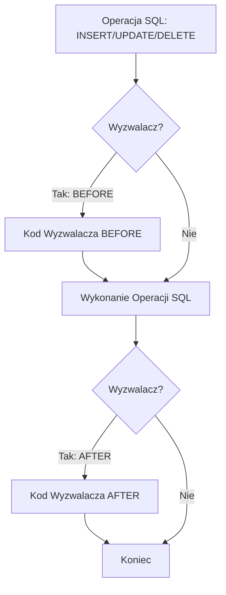

# Laboratorium 8: Wyzwalacze i zaawansowana logika proceduralna

## Cel laboratorium
Poznanie mechanizmu wyzwalaczy (triggers) w SQLite do automatyzacji zadań w bazie danych.

## Podstawy teoretyczne

### Wyzwalacze (Triggers)
Wyzwalacz to nazwany obiekt bazy danych, który jest automatycznie uruchamiany (**wyzwalany**) w odpowiedzi na określone zdarzenie (`INSERT`, `UPDATE`, `DELETE`) na konkretnej tabeli.

Kluczowe elementy wyzwalacza:
- **Czas wykonania**: `BEFORE` (przed operacją) lub `AFTER` (po operacji).
- **Zdarzenie**: `INSERT`, `UPDATE` lub `DELETE`.
- **Zmienne specjalne**: 
  - `OLD` – przechowuje wartości sprzed zmiany (dostępne w `UPDATE` i `DELETE`).
  - `NEW` – przechowuje nowe wartości (dostępne w `INSERT` i `UPDATE`).
- **Zastosowania**: Automatyczna walidacja danych, logowanie zmian (historia), utrzymywanie spójności kaskadowej.

### Mechanizm działania wyzwalacza (Mermaid)


### Przykład: Logowanie zmian cen
Stwórzmy tabelę do przechowywania historii cen:
```sql
CREATE TABLE HistoriaCen (
    id_historia INTEGER PRIMARY KEY,
    id_produktu INTEGER,
    stara_cena REAL,
    nowa_cena REAL,
    data_zmiany TIMESTAMP DEFAULT CURRENT_TIMESTAMP
);
```

Tworzymy wyzwalacz:
```sql
CREATE TRIGGER log_zmiany_cen
AFTER UPDATE OF cena ON Produkty
BEGIN
    INSERT INTO HistoriaCen (id_produktu, stara_cena, nowa_cena)
    VALUES (OLD.id, OLD.cena, NEW.cena);
END;
```

## Zadanie: Walidacja danych przez wyzwalacz
Stwórz wyzwalacz `BEFORE INSERT`, który zablokuje dodanie produktu z ujemną ilością (używając funkcji `RAISE(ABORT, 'wiadomość')`).

## Ćwiczenie
Stwórz wyzwalacz, który przy usuwaniu klienta automatycznie usuwa wszystkie jego zamówienia (kaskadowe usuwanie realizowane przez trigger).

## Ćwiczenia dodatkowe
1. Stwórz wyzwalacz `BEFORE UPDATE` na tabeli `Produkty`, który zablokuje ustawienie ujemnej ceny lub ilości (użyj `RAISE(ABORT, 'komunikat')`).
2. Zademonstruj `INSTEAD OF` trigger na widoku: utwórz widok łączący `Klienci` i `Zamowienia`, a następnie wyzwalacz `INSTEAD OF INSERT` wstawiający dane do tabel bazowych.
