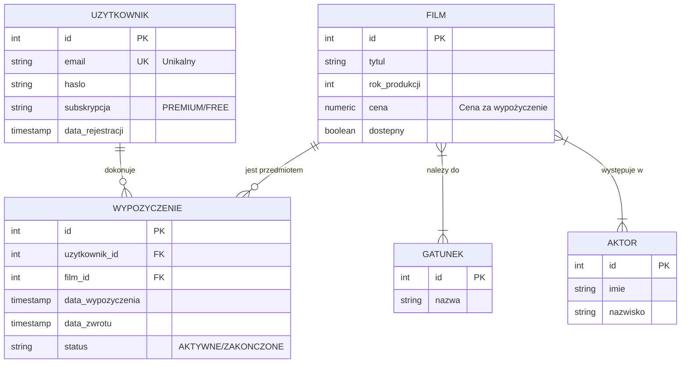

# Bazy danych - projekt

## ZAKRES PROJEKTU

### Opis bazy danych

W tym punkcie umieszczamy w formie opisu, jakie jest przeznaczenie bazy danych, co baza danych umożliwia, jakich danych dostarcza itd.

### Diagram ERD

Diagram encji (+relacje), czytelny, min. 5 encji lub konceptualny projekt bazy opisujący klasy obiektów i związki między nimi.



### Prezentacja encji

Minimalna liczba tabel: 5. W tym punkcie umieszczamy:

- Opis każdej tabeli – z czym są związane dane.
- Wykaz atrybutów każdej tabeli zgodnie z poniższym wzorem (czcionka: Consolas, 9):

```sql
SELECT
    column_name AS atrybut,
    data_type   AS typ_danych
FROM information_schema.columns
WHERE table_name = 'studenci';
```

**Wynik zapytania:**

| atrybut  | typ_danych        |
| :------- | :---------------- |
| id       | integer           |
| imie     | character varying |
| nazwisko | character varying |
| wiek     | integer           |

Oraz wykaz zawartości każdej tabeli zgodnie z poniższym wzorem (czcionka: Consolas, 9):

```sql
SELECT * FROM studenci;
```

**Wynik zapytania:**

| id  | imie  | nazwisko  | wiek |
| :-- | :---- | :-------- | :--- |
| 1   | Jan   | Kowalski  | 22   |
| 2   | Anna  | Nowak     | 21   |
| 3   | Piotr | Zieliński | 23   |

### Prezentacja relacji

W tym punkcie należy:

- Zdefiniować relacje między tabelami.
- Przedstawić definicję kluczy w kodzie SQL.
- Sprawdzić istnienie kluczy przez `information_schema`.
- Krótko opisać zależności między tabelami.

**UWAGA:** Przed dodaniem kluczy obcych należy upewnić się, że dane spełniają warunki integralności referencyjnej – nie można dodać relacji, jeśli w tabeli są błędne dane np. ocena wskazuje na studenta, który nie istnieje.

#### Przykład kodu SQL:

```sql
ALTER TABLE oceny
ADD COLUMN student_id INT;

ALTER TABLE oceny
ADD COLUMN przedmiot_id INT;

ALTER TABLE oceny
ADD CONSTRAINT fk_oceny_student
FOREIGN KEY (student_id)
REFERENCES studenci(id)
ON DELETE CASCADE;

ALTER TABLE oceny
ADD CONSTRAINT fk_oceny_przedmiot
FOREIGN KEY (przedmiot_id)
REFERENCES przedmioty(id)
ON DELETE CASCADE;
```

#### Przykład opisu:

Relacje między tabelami zostały zdefiniowane po utworzeniu tabel przy użyciu polecenia `ALTER TABLE`. Do tabeli oceny dodano kolumny `student_id` oraz `przedmiot_id`, a następnie zdefiniowano klucze obce wskazujące odpowiednio na tabele `studenci` i `przedmioty`. Zastosowanie kluczy obcych zapewnia integralność referencyjną danych oraz umożliwia poprawne łączenie tabel w zapytaniach SQL.

#### Przykład sprawdzenia:

```sql
SELECT
    constraint_name,
    table_name,
    column_name
FROM information_schema.key_column_usage
WHERE table_name = 'oceny';
```

**Wynik zapytania:**

| constraint_name    | table_name | column_name  |
| :----------------- | :--------- | :----------- |
| fk_oceny_student   | oceny      | student_id   |
| fk_oceny_przedmiot | oceny      | przedmiot_id |
| oceny_pkey         | oceny      | id           |

### Prezentacja widoków

W tym punkcie prezentujemy trzy różne widoki (jeden widok → max 1 pkt). Umieszczamy opis każdego widoku tłumaczący jakie jest jego zadanie/zadania, kod SQL każdego widoku i efekt działania każdego widoku zgodnie z poniższym wzorem.

#### Przykład widoku za 1 pkt:

```sql
CREATE OR REPLACE VIEW v_raport_studentow_oceny AS
SELECT
    s.id,
    s.imie,
    s.nazwisko,
    s.wiek,
    COUNT(o.id) AS liczba_ocen,
    ROUND(AVG(o.wartosc), 2) AS srednia_ocen,
    MIN(o.wartosc) AS min_ocena,
    MAX(o.wartosc) AS max_ocena
FROM studenci s
INNER JOIN oceny o
    ON s.id = o.id
WHERE s.wiek >= 21
  AND o.wartosc >= (
      SELECT AVG(wartosc)
      FROM oceny
  )
GROUP BY
    s.id,
    s.imie,
    s.nazwisko,
    s.wiek
ORDER BY
    srednia_ocen DESC;

SELECT * FROM v_raport_studentow_oceny;
```

**Wynik zapytania:**

| id  | imie  | nazwisko  | wiek | liczba_ocen | srednia_ocen | min_ocena | max_ocena |
| :-- | :---- | :-------- | :--- | :---------- | :----------- | :-------- | :-------- |
| 1   | Jan   | Kowalski  | 22   | 5           | 4.50         | 3.5       | 5.0       |
| 3   | Piotr | Zieliński | 23   | 3           | 4.00         | 4.0       | 4.0       |

### Prezentacja funkcji

W tym punkcie prezentujemy trzy różne funkcje (jedna funkcja → max 2 pkt). Umieszczamy opis każdej funkcji tłumaczący jakie jest jej zadanie/zadania, kod SQL każdej funkcji i efekt działania każdej funkcji zgodnie z poniższym wzorem.

#### Przykład funkcji za 2 pkt:

```sql
CREATE OR REPLACE FUNCTION raport_studentow_oceny()
RETURNS TABLE (
    id INT,
    imie VARCHAR(50),
    nazwisko VARCHAR(50),
    wiek INT,
    liczba_ocen BIGINT,
    srednia_ocen NUMERIC,
    min_ocena NUMERIC,
    max_ocena NUMERIC
)
AS $$
    SELECT
        s.id,
        s.imie,
        s.nazwisko,
        s.wiek,
        COUNT(o.id) AS liczba_ocen,
        ROUND(AVG(o.wartosc), 2) AS srednia_ocen,
        MIN(o.wartosc) AS min_ocena,
        MAX(o.wartosc) AS max_ocena
    FROM studenci s
    INNER JOIN oceny o
        ON s.id = o.id
    WHERE s.wiek >= 21
      AND o.wartosc >= (
          SELECT AVG(wartosc)
          FROM oceny
      )
    GROUP BY
        s.id,
        s.imie,
        s.nazwisko,
        s.wiek
    ORDER BY
        ROUND(AVG(o.wartosc), 2) DESC,
        s.nazwisko ASC;
$$ LANGUAGE sql;

SELECT * FROM raport_studentow_oceny();

-- DROP FUNCTION raport_studentow_oceny();
```

**Wynik zapytania:**

| id  | imie  | nazwisko  | wiek | liczba_ocen | srednia_ocen | min_ocena | max_ocena |
| :-- | :---- | :-------- | :--- | :---------- | :----------- | :-------- | :-------- |
| 1   | Jan   | Kowalski  | 22   | 5           | 4.50         | 3.5       | 5.0       |
| 3   | Piotr | Zieliński | 23   | 3           | 4.00         | 4.0       | 4.0       |

### Prezentacja wyzwalaczy

W tym punkcie prezentujemy trzy różne wyzwalacze (jeden wyzwalacz → max 5 pkt). Umieszczamy opis każdego wyzwalacza tłumaczący jakie jest jego zadanie/zadania, kod SQL każdego wyzwalacza i efekt działania każdego wyzwalacza zgodnie z poniższym wzorem.

#### Przykład wyzwalacza za 5 pkt:

**Tabela pomocnicza:**

```sql
CREATE TABLE log_raport_studentow (
    log_id SERIAL PRIMARY KEY,
    student_id INT,
    imie VARCHAR(50),
    nazwisko VARCHAR(50),
    wiek INT,
    liczba_ocen BIGINT,
    srednia_ocen NUMERIC,
    min_ocena NUMERIC,
    max_ocena NUMERIC,
    data_logu TIMESTAMP DEFAULT CURRENT_TIMESTAMP
);
```

**Funkcja wyzwalacza:**

```sql
CREATE OR REPLACE FUNCTION fn_log_raport_studentow()
RETURNS TRIGGER
AS $$
BEGIN
    INSERT INTO log_raport_studentow (
        student_id,
        imie,
        nazwisko,
        wiek,
        liczba_ocen,
        srednia_ocen,
        min_ocena,
        max_ocena
    )
    SELECT
        x.id,
        x.imie,
        x.nazwisko,
        x.wiek,
        x.liczba_ocen,
        x.srednia_ocen,
        x.min_ocena,
        x.max_ocena
    FROM (
        SELECT
            s.id,
            s.imie,
            s.nazwisko,
            s.wiek,
            COUNT(o.id) AS liczba_ocen,
            ROUND(AVG(o.wartosc), 2) AS srednia_ocen,
            MIN(o.wartosc) AS min_ocena,
            MAX(o.wartosc) AS max_ocena
        FROM studenci s
        INNER JOIN oceny o
            ON s.id = o.id
        WHERE s.wiek >= 21
          AND s.id = NEW.id
          AND o.wartosc >= (
              SELECT AVG(wartosc)
              FROM oceny
          )
        GROUP BY
            s.id,
            s.imie,
            s.nazwisko,
            s.wiek
        ORDER BY
            ROUND(AVG(o.wartosc), 2) DESC,
            s.nazwisko ASC
    ) AS x;

    RETURN NEW;
END;
$$ LANGUAGE plpgsql;
```

**Utworzenie wyzwalacza:**

```sql
CREATE TRIGGER trg_log_raport_studentow
AFTER INSERT OR UPDATE
ON oceny
FOR EACH ROW
EXECUTE FUNCTION fn_log_raport_studentow();
```

**Efekt działania:**

Po wykonaniu instrukcji:

```sql
INSERT INTO oceny (id, student_id, przedmiot_id, wartosc) VALUES (101, 1, 1, 5.0);
```

Tabela `log_raport_studentow` zostanie uzupełniona o nowy wpis:

| log_id | student_id | imie | nazwisko | wiek | liczba_ocen | srednia_ocen | min_ocena | max_ocena | data_logu           |
| :----- | :--------- | :--- | :------- | :--- | :---------- | :----------- | :-------- | :-------- | :------------------ |
| 1      | 1          | Jan  | Kowalski | 22   | 6           | 4.58         | 3.5       | 5.0       | 2026-04-20 20:20:00 |

______________________________________________________________________

## PUNKTACJA

- Estetyka i dokładność wykonania projektu – 2 pkt
- Opis bazy danych – 1 pkt
- Diagram ERD – 2 pkt
- Prezentacja encji – 1 pkt
- Relacje – 3 pkt
- Prezentacja widoków – 3 pkt
- Prezentacja funkcji – 6 pkt
- Prezentacja wyzwalaczy – 12 pkt

### SKALA OCEN

| Punktacja | Ocena |
| :-------- | :---- |
| < 15      | 2     |
| 16 – 18   | 3     |
| 19 – 21   | 3,5   |
| 22 – 24   | 4     |
| 25 – 27   | 4,5   |
| 28 – 30   | 5     |

______________________________________________________________________

## Uwagi końcowe i organizacyjne

- **Raportowanie postępów:** Po każdych dwóch godzinach pracy nad projektem należy sporządzić uaktualnienie do sprawozdania i wysłać je do prowadzącego (e-mail/platforma).
- Projekt wykonujemy w oparciu o wytyczne z bieżącego pliku `Bazy danych - projekt.md` zmieniając jego nazwę na `Projekt-BD-NAZWISKO.md`.
- Zamieniamy plik `Projekt-BD-NAZWISKO.md` na `Projekt-BD-NAZWISKO.pdf` (np. używając rozszerzenia Markdown -> PDF w IDE).
- Wysyłamy plik `Projekt-BD-NAZWISKO.pdf` na platformę ILIAS w wyznaczonym terminie.
- Przykładowy projekt został przedstawiony w pliku [Exemplary_project_VOD.md](Exemplary_project_VOD.md).
- Niewysłanie projektu w wyznaczonym terminie jest równoznaczne z oceną 2 za projekt.
