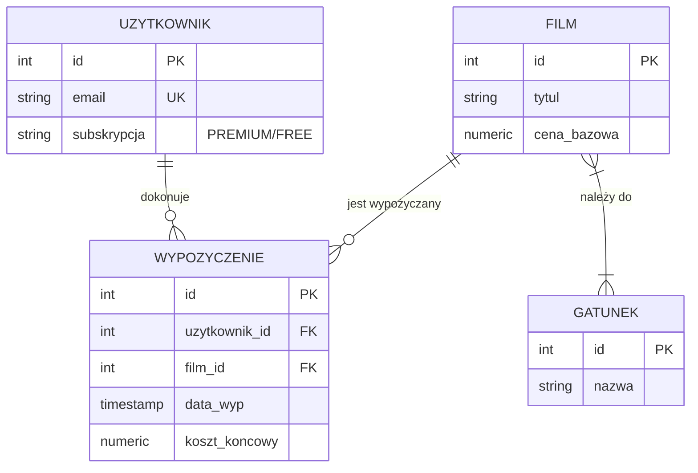

# Przykładowy projekt: System Zarządzania Wypożyczalnią Filmów (VOD)

## 1. Opis projektu

Celem projektu jest zaprojektowanie i implementacja bazy danych dla systemu typu VOD. System pozwala na zarządzanie katalogiem filmów, użytkownikami, ich subskrypcjami oraz historią wypożyczeń.

### Zakres danych:

- **Filmy:** Tytuł, rok produkcji, cena, gatunek, obsada.
- **Użytkownicy:** Dane profilowe, rodzaj subskrypcji (FREE/PREMIUM).
- **Wypożyczenia:** Śledzenie kto, co i kiedy wypożyczył oraz status płatności.

______________________________________________________________________

## 2. Model ERD (Mermaid)

Poniższy diagram przedstawia strukturę bazy danych. Pamiętaj, aby Twój diagram był czytelny i zawierał klucze główne (PK) oraz obce (FK).



______________________________________________________________________

## 3. Implementacja Tabel (DDL)

Przykład tworzenia tabeli z zachowaniem dobrych praktyk (klucze, typy danych, ograniczenia).

```sql
-- Tworzenie tabeli filmów
CREATE TABLE filmy (
    id SERIAL PRIMARY KEY,
    tytul VARCHAR(255) NOT NULL,
    cena_bazowa NUMERIC(10, 2) DEFAULT 0.00,
    rok_produkcji INT CHECK (rok_produkcji > 1888)
);

-- Sprawdzenie struktury (zgodnie z wytycznymi)
SELECT column_name, data_type
FROM information_schema.columns
WHERE table_name = 'filmy';
```

**Dane testowe:**

| id  | tytul    | cena_bazowa | rok_produkcji |
| :-- | :------- | :---------- | :------------ |
| 1   | Incepcja | 15.00       | 2010          |
| 2   | Diuna    | 20.00       | 2021          |

______________________________________________________________________

## 4. Logika biznesowa (Obiekty bazy danych)

### A. Widok (View)

Widok agregujący dane o popularności filmów.

```sql
CREATE VIEW v_popularnosc_filmow AS
SELECT f.tytul, COUNT(w.id) AS liczba_wypozyczen
FROM filmy f
LEFT JOIN wypozyczenia w ON f.id = w.film_id
GROUP BY f.tytul
ORDER BY liczba_wypozyczen DESC;
```

### B. Funkcja (Function)

Funkcja obliczająca cenę po rabacie dla użytkowników PREMIUM.

```sql
CREATE OR REPLACE FUNCTION oblicz_cene_rabat(cena NUMERIC, typ_sub VARCHAR)
RETURNS NUMERIC AS $$
BEGIN
    IF typ_sub = 'PREMIUM' THEN
        RETURN ROUND(cena * 0.8, 2); -- 20% rabatu
    ELSE
        RETURN cena;
    END IF;
END;
$$ LANGUAGE plpgsql;
```

### C. Wyzwalacz (Trigger)

Wyzwalacz automatycznie ustawiający cenę wypożyczenia w momencie wstawienia rekordu.

```sql
CREATE OR REPLACE FUNCTION fn_ustaw_koszt_wypozyczenia()
RETURNS TRIGGER AS $$
DECLARE
    v_cena_bazowa NUMERIC;
    v_sub VARCHAR;
BEGIN
    SELECT cena_bazowa INTO v_cena_bazowa FROM filmy WHERE id = NEW.film_id;
    SELECT subskrypcja INTO v_sub FROM uzytkownicy WHERE id = NEW.uzytkownik_id;

    NEW.koszt_koncowy := oblicz_cene_rabat(v_cena_bazowa, v_sub);
    RETURN NEW;
END;
$$ LANGUAGE plpgsql;

CREATE TRIGGER trg_oblicz_koszt
BEFORE INSERT ON wypozyczenia
FOR EACH ROW EXECUTE FUNCTION fn_ustaw_koszt_wypozyczenia();
```

______________________________________________________________________

## 5. Lista kontrolna dla Studenta (Checklist)

Zanim oddasz projekt, sprawdź, czy:

- [ ] Czy masz minimum 5 tabel?
- [ ] Czy każda tabela ma zdefiniowany Klucz Główny (PRIMARY KEY)?
- [ ] Czy relacje są poprawnie obsłużone przez Klucze Obce (FOREIGN KEY)?
- [ ] Czy kod SQL jest sformatowany i czytelny?
- [ ] Czy dołączyłeś zrzuty tabel z przykładowymi danymi?
- [ ] Czy masz co najmniej 3 widoki, 3 funkcje i 3 wyzwalacze?
- [ ] Czy diagram ERD w Mermaid odpowiada rzeczywistej strukturze bazy?

______________________________________________________________________

## 6. Polecane narzędzia (bezpłatne)

Do sporządzenia diagramu ERD oraz pracy z bazą danych możesz wykorzystać:

- **Mermaid Live Editor** (online) – najprostszy sposób na diagramy tekstowe (użyte w tym przykładzie).
- **draw.io** / **app.diagrams.net** (online/desktop) – uniwersalne narzędzie do schematów, posiada dedykowane kształty dla ERD.
- **DBeaver** (desktop) – potężny klient SQL, który potrafi sam wygenerować diagram na podstawie istniejących tabel.
- **pgAdmin 4** (desktop) – posiada wbudowane narzędzie "ERD Tool".
- **Lucidchart** (online) – wersja darmowa pozwala na stworzenie prostych schematów.

______________________________________________________________________

## 7. Jak zacząć? (Porada)

1. **Szkic:** Weź kartkę i rozrysuj tabelki. Zastanów się, co łączy się z czym.
1. **Setup:** Uruchom PostgreSQL i stwórz pustą bazę.
1. **Kolejność:** Najpierw twórz tabele "słownikowe" (np. Gatunki, Filmy), potem tabele łączące (np. Wypożyczenia).
1. **Testuj na bieżąco:** Po napisaniu funkcji, od razu sprawdź `SELECT moja_funkcja(...)`. Nie czekaj do końca!
1. **Dokumentuj:** Pisz raport w trakcie pracy, nie na samym końcu.
