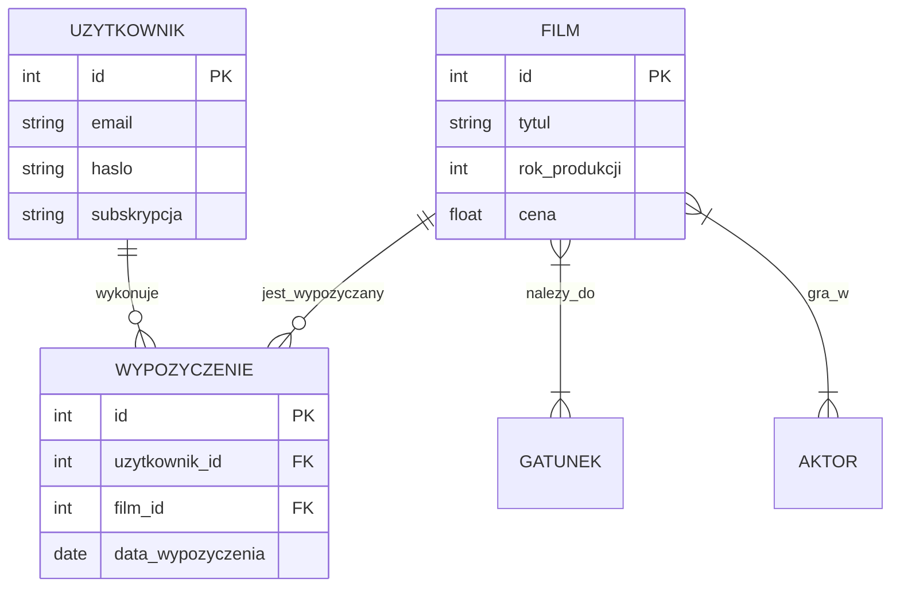

# Etap 1: Projektowanie relacyjnych baz danych (2h)

## Zadania na tym etapie
1. Identyfikacja encji i atrybutów.
2. Określenie relacji (1:1, 1:N, M:N).
3. Stworzenie diagramu ER.
4. Normalizacja do 3 postać normalnej.

## Model ER (Propozycja)

## Wytyczne projektowe
- Każda tabela musi mieć klucz główny (`PRIMARY KEY`).
- Relacje wiele-do-wielu (np. Film-Aktor) muszą być zrealizowane za pomocą tabel łączących.
- Należy zastosować odpowiednie typy danych (TEXT, INTEGER, REAL).
