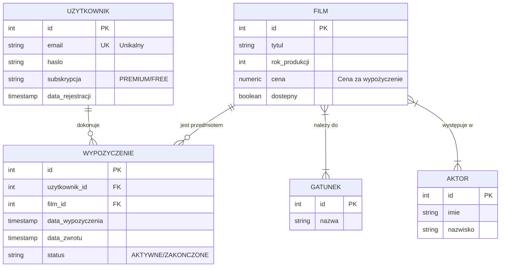
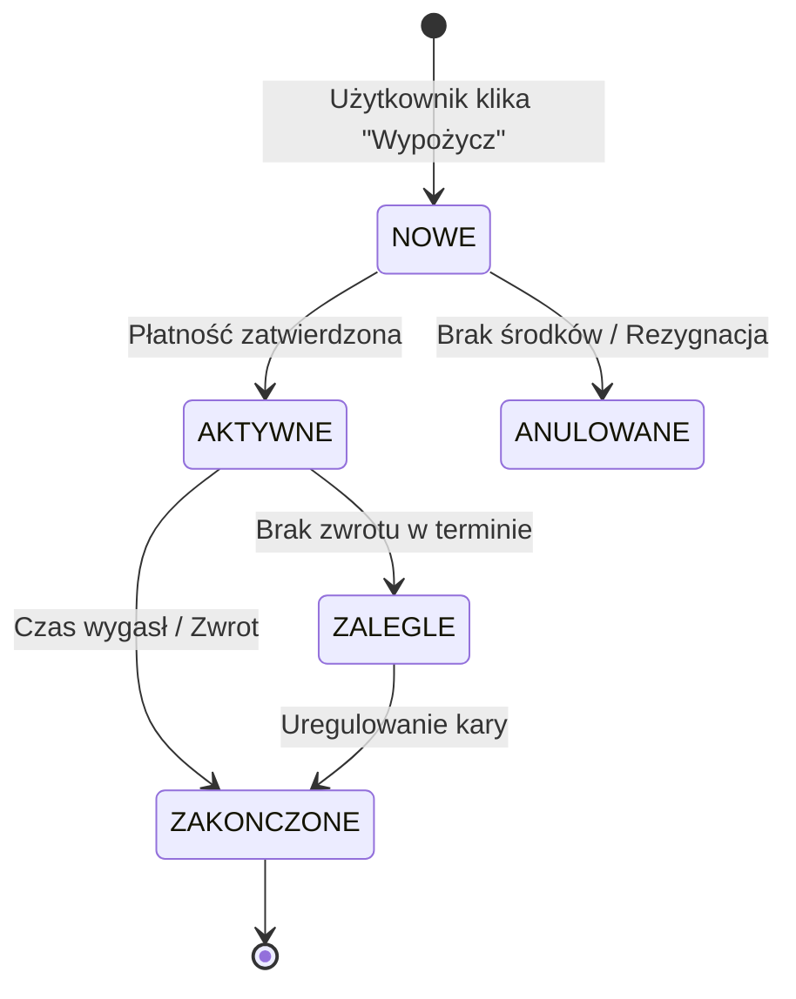

# Etap 1: Projektowanie relacyjnych baz danych (2h)

## Cel etapu

Celem tego etapu jest przekształcenie wymagań biznesowych na logiczny model bazy danych, który jest spójny, wydajny i wolny od redundancji.

## Proces projektowania

Projektowanie bazy danych zazwyczaj przebiega w następujących krokach:

1. **Analiza wymagań**: Zidentyfikowanie danych, które system musi przechowywać (np. "System musi przechowywać e-maile użytkowników").
1. **Modelowanie koncepcyjne (ERD)**: Stworzenie diagramu encji i relacji (Entity-Relationship Diagram), określając powiązania między obiektami.
1. **Modelowanie logiczne**: Mapowanie encji na tabele, określenie kluczy głównych (PK) i obcych (FK).
1. **Normalizacja**: Sprawdzenie, czy struktura spełnia zasady postaci normalnych (zazwyczaj do 3NF).
1. **Modelowanie fizyczne**: Dobór konkretnych typów danych (np. `VARCHAR(255)`, `NUMERIC(10,2)`) dla wybranego silnika bazy danych (PostgreSQL).

## Zadania na tym etapie

1. [ ] Identyfikacja encji i ich atrybutów.
1. [ ] Określenie relacji między encjami (1:1, 1:N, M:N).
1. [ ] Stworzenie diagramu ER (użyj Mermaid).
1. [ ] Normalizacja bazy danych do 3. postaci normalnej (3NF).
1. [ ] Wybór optymalnych typów danych dla każdej kolumny.

## Normalizacja w pigułce

| Postać Normalna    | Zasada                                                                                                            | Cel                                |
| :----------------- | :---------------------------------------------------------------------------------------------------------------- | :--------------------------------- |
| **1NF** (Pierwsza) | Wartości w kolumnach muszą być atomowe (niepodzielne). Brak grup powtarzających się.                              | Eliminacja list wewnątrz pól.      |
| **2NF** (Druga)    | Spełnia 1NF + wszystkie kolumny zależą od całego klucza głównego (ważne przy kluczach złożonych).                 | Eliminacja częściowych zależności. |
| **3NF** (Trzecia)  | Spełnia 2NF + brak zależności przechodnich (kolumna niebędąca kluczem nie zależy od innej kolumny nie-kluczowej). | Eliminacja redundancji i anomalii. |

## Model ER (Propozycja dla VOD)

Poniższy diagram przedstawia podstawową strukturę systemu VOD.

```mermaid
erDiagram
    UZYTKOWNIK ||--o{ WYPOZYCZENIE : "dokonuje"
    FILM ||--o{ WYPOZYCZENIE : "jest przedmiotem"
    FILM }|--|{ GATUNEK : "nalezy do"
    FILM }|--|{ AKTOR : "występuje w"

    UZYTKOWNIK {
        int id PK
        string email UK "Unikalny"
        string haslo
        string subskrypcja "PREMIUM/FREE"
        timestamp data_rejestracji
    }

    FILM {
        int id PK
        string tytul
        int rok_produkcji
        numeric cena "Cena za wypożyczenie"
        boolean dostepny
    }

    WYPOZYCZENIE {
        int id PK
        int uzytkownik_id FK
        int film_id FK
        timestamp data_wypozyczenia
        timestamp data_zwrotu
        string status "AKTYWNE/ZAKONCZONE"
    }

    GATUNEK {
        int id PK
        string nazwa
    }

    AKTOR {
        int id PK
        string imie
        string nazwisko
    }
```

### Cykl życia wypożyczenia (Diagram Stanów)

Zrozumienie stanów obiektu pomaga w projektowaniu logiki biznesowej (Etap 2).

```mermaid
stateDiagram-v2
    [*] --> NOWE: Użytkownik klika "Wypożycz"
    NOWE --> AKTYWNE: Płatność zatwierdzona
    NOWE --> ANULOWANE: Brak środków / Rezygnacja
    AKTYWNE --> ZAKONCZONE: Czas wygasł / Zwrot
    AKTYWNE --> ZALEGLE: Brak zwrotu w terminie
    ZALEGLE --> ZAKONCZONE: Uregulowanie kary
    ZAKONCZONE --> [*]
```

## Wybór typów danych (PostgreSQL)

| Kategoria          | Rekomendowany typ                  | Zastosowanie                                      |
| :----------------- | :--------------------------------- | :------------------------------------------------ |
| **Identyfikatory** | `INT GENERATED ALWAYS AS IDENTITY` | Klucze główne (nowoczesny standard).              |
| **Tekst krótki**   | `VARCHAR(n)`                       | E-maile, nazwy, kody (z ograniczeniem długości).  |
| **Tekst długi**    | `TEXT`                             | Opisy filmów, recenzje (brak sztywnego limitu).   |
| **Finanse**        | `NUMERIC(precision, scale)`        | Ceny, pensje (dokładność dziesiętna).             |
| **Czas**           | `TIMESTAMP` lub `TIMESTAMPTZ`      | Daty operacji (z uwzględnieniem stref czasowych). |
| **Logika**         | `BOOLEAN`                          | Flagi (np. `czy_aktywny`, `dostepny`).            |

## Lista kontrolna projektu (Checklist)

Przed przejściem do implementacji (Etap 3), sprawdź czy Twój projekt spełnia poniższe kryteria:

- [ ] Czy każda tabela posiada **Klucz Główny** (PK)?
- [ ] Czy relacje **Wiele-do-Wielu** są zrealizowane przez tabele łączące (np. `film_aktor`)?
- [ ] Czy nazwy tabel i kolumn są spójne (np. wszystko w liczbie pojedynczej, małe litery, `snake_case`)?
- [ ] Czy unikasz przechowywania danych wyliczanych (np. `liczba_wypozyczen` - to lepiej policzyć zapytaniem)?
- [ ] Czy typy danych są optymalne (np. nie używasz `TEXT` tam, gdzie wystarczy `CHAR(3)`)?
- [ ] Czy zdefiniowałeś więzy integralności (`NOT NULL`, `UNIQUE`, `CHECK`)?
