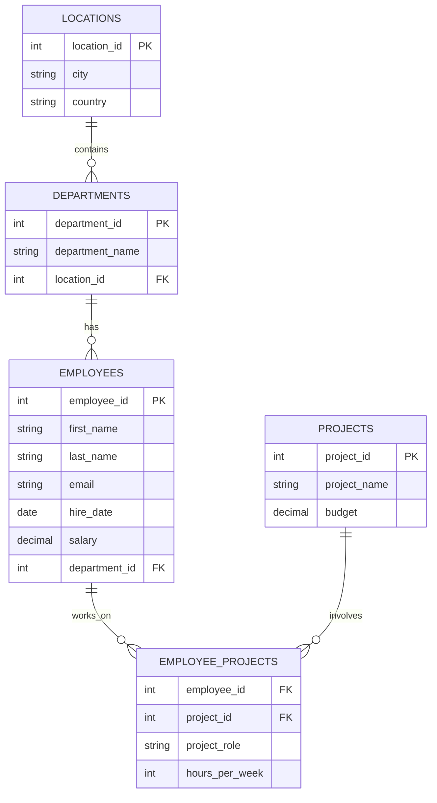
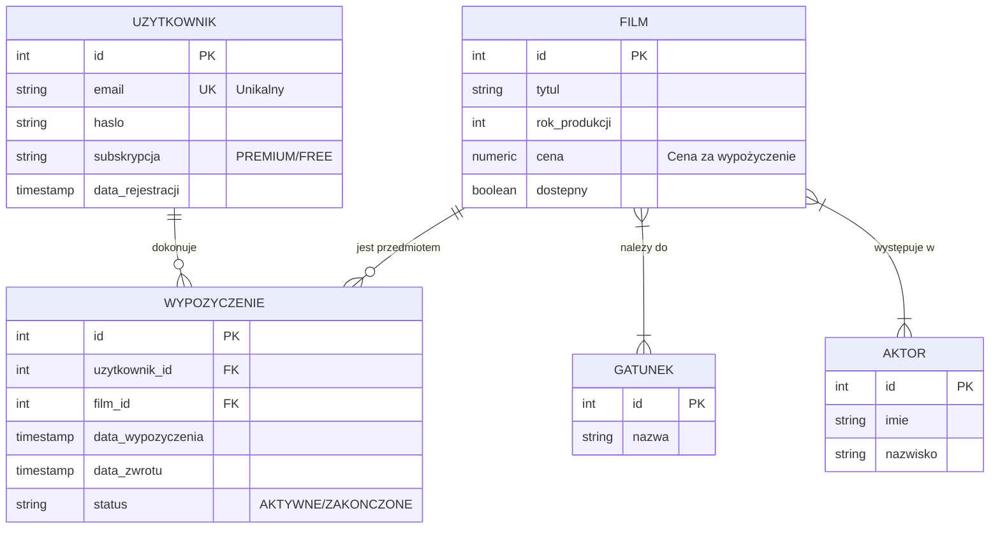
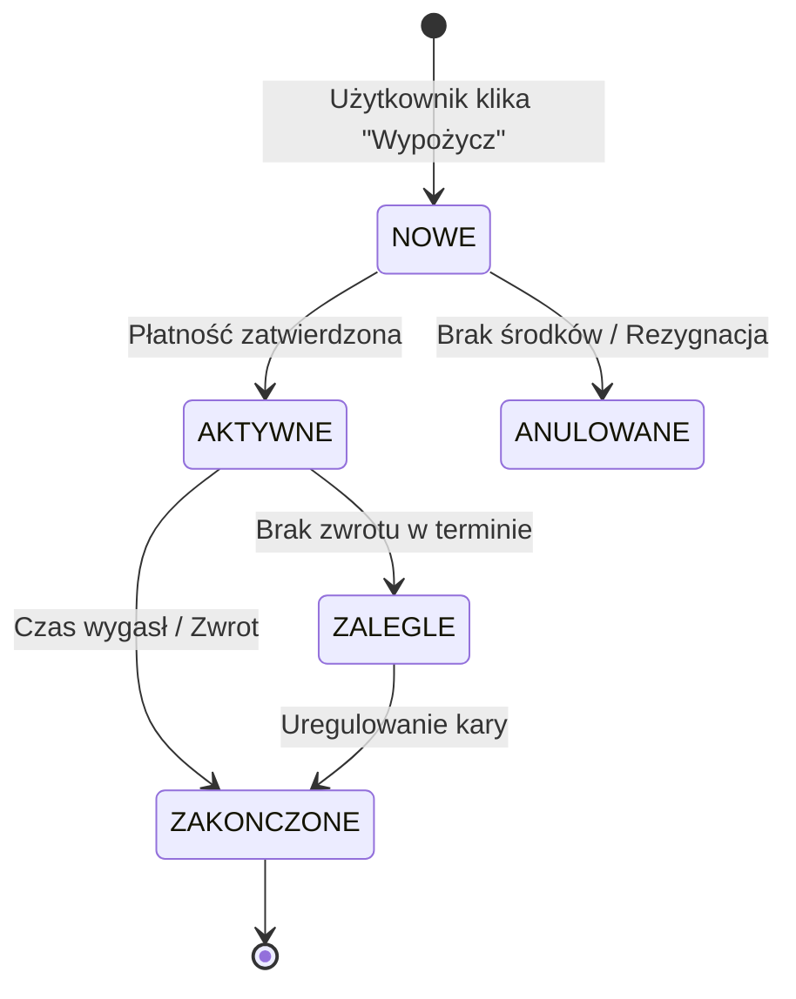

# Etap 1: Projektowanie relacyjnych baz danych (2 godz.)

## Cel etapu

Celem tego etapu jest przekształcenie wymagań biznesowych na logiczny model bazy danych, który jest spójny, wydajny i wolny od redundancji.

## Proces projektowania

Projektowanie bazy danych zazwyczaj przebiega w następujących krokach:

1. **Analiza wymagań**: Zidentyfikowanie danych, które system musi przechowywać (np. "System musi przechowywać e-maile użytkowników").
1. **Modelowanie koncepcyjne (ERD)**: Stworzenie diagramu encji i relacji (Entity-Relationship Diagram), określając powiązania między obiektami.
1. **Modelowanie logiczne**: Mapowanie encji na tabele, określenie kluczy głównych (PK) i obcych (FK).
1. **Normalizacja**: Sprawdzenie, czy struktura spełnia zasady postaci normalnych (zazwyczaj do 3NF).
1. **Modelowanie fizyczne**: Dobór konkretnych typów danych (np. `VARCHAR(255)`, `NUMERIC(10,2)`) dla wybranego silnika bazy danych (PostgreSQL).

## Zadania na tym etapie

1. [ ] Identyfikacja encji i ich atrybutów (min. 5 encji zgodnie z wytycznymi).
1. [ ] Określenie relacji między encjami (1:1, 1:N, M:N).
1. [ ] Stworzenie diagramu ER (użyj Mermaid, zadbaj o czytelność relacji).
1. [ ] Analiza i normalizacja bazy danych do 3. postaci normalnej (3NF).
1. [ ] Przygotowanie opisów tabel i wykazu atrybutów (wykorzystaj zapytania do `information_schema.columns`).
1. [ ] Wybór optymalnych typów danych dla każdej kolumny.

## Rozgrzewka: Analiza przypadku (Pracownicy)

Zanim przejdziesz do projektowania własnej bazy, przeanalizuj poniższe materiały dotyczące normalizacji. Zostały one przygotowane na przykładzie danych o pracownikach, aby pomóc Ci zrozumieć, jak unikać błędów projektowych.

## Normalizacja – teoria i praktyka

Normalizacja to proces organizowania danych w bazie, mający na celu eliminację redundancji (powtarzania się danych), zminimalizowanie ryzyka wystąpienia anomalii oraz zapewnienie logicznej spójności danych.

### Postacie Normalne (NF) - Przykłady

#### 1. Pierwsza Postać Normalna (1NF)

**Zasada:** Każda kolumna musi zawierać wartości atomowe (niepodzielne). Brak list i grup powtarzających się.

**Błędna tabela (Naruszenie 1NF):**

| ID  | Klient       | Telefony                 |
| :-- | :----------- | :----------------------- |
| 1   | Jan Kowalski | 111-222-333, 444-555-666 |

**Poprawna tabela (1NF):**

| ID  | Klient       | Telefon     |
| :-- | :----------- | :---------- |
| 1   | Jan Kowalski | 111-222-333 |
| 1   | Jan Kowalski | 444-555-666 |

______________________________________________________________________

#### 2. Druga Postać Normalna (2NF)

**Zasada:** Musi spełniać 1NF. Wszystkie kolumny niebędące kluczem muszą w pełni zależeć od **całego** klucza głównego (istotne przy kluczach złożonych).

**Błędna tabela (Naruszenie 2NF):**

*Klucz złożony: (ID_Kursu, ID_Studenta)*

| ID_Kursu | ID_Studenta | Nazwa_Kursu | Ocena |
| :------- | :---------- | :---------- | :---- |
| K1       | S1          | Bazy Danych | 5.0   |
| K1       | S2          | Bazy Danych | 4.0   |

*Problem: `Nazwa_Kursu` zależy tylko od `ID_Kursu`, a nie od całego klucza (ID_Kursu + ID_Studenta).*

**Poprawna struktura (2NF):**

*Tabela Kursy:*

| ID_Kursu | Nazwa_Kursu |
| :------- | :---------- |
| K1       | Bazy Danych |

*Tabela Oceny:*

| ID_Kursu | ID_Studenta | Ocena |
| :------- | :---------- | :---- |
| K1       | S1          | 5.0   |
| K1       | S2          | 4.0   |

______________________________________________________________________

#### 3. Trzecia Postać Normalna (3NF)

**Zasada:** Musi spełniać 2NF. Brak zależności przechodnich – kolumna niekluczowa nie może zależeć od innej kolumny niekluczowej.

**Błędna tabela (Naruszenie 3NF):**

| ID_Pracownika | Nazwisko | ID_Biura | Miasto_Biura |
| :------------ | :------- | :------- | :----------- |
| 1             | Nowak    | B10      | Kraków       |

*Problem: `Miasto_Biura` zależy od `ID_Biura`, a `ID_Biura` zależy od `ID_Pracownika`. Mamy zależność przechodnią.*

**Poprawna struktura (3NF):**

*Tabela Pracownicy:*

| ID_Pracownika | Nazwisko | ID_Biura |
| :------------ | :------- | :------- |
| 1             | Nowak    | B10      |

*Tabela Biura:*

| ID_Biura | Miasto_Biura |
| :------- | :----------- |
| B10      | Kraków       |

### Anomalie bazodanowe

- **Anomalia dodawania**: Brak możliwości dodania informacji (np. o nowym departamencie) bez dodania pracownika.
- **Anomalia usuwania**: Usunięcie ostatniego pracownika z departamentu powoduje utratę informacji o samym departamencie.
- **Anomalia modyfikacji**: Konieczność zmiany nazwy departamentu w wielu rekordach jednocześnie.

## Model ER (Przykład znormalizowanej struktury)

Poniższy diagram przedstawia znormalizowaną strukturę bazy danych pracowników (3NF), która może służyć jako wzorzec do analizy zależności:


```mermaid
erDiagram
    LOCATIONS ||--o{ DEPARTMENTS : contains
    DEPARTMENTS ||--o{ EMPLOYEES : has
    EMPLOYEES ||--o{ EMPLOYEE_PROJECTS : works_on
    PROJECTS ||--o{ EMPLOYEE_PROJECTS : involves

    LOCATIONS {
        int location_id PK
        string city
        string country
    }
    DEPARTMENTS {
        int department_id PK
        string department_name
        int location_id FK
    }
    EMPLOYEES {
        int employee_id PK
        string first_name
        string last_name
        string email
        date hire_date
        decimal salary
        int department_id FK
    }
    PROJECTS {
        int project_id PK
        string project_name
        decimal budget
    }
    EMPLOYEE_PROJECTS {
        int employee_id FK
        int project_id FK
        string project_role
        int hours_per_week
    }
```

## Model ER (Twój Projekt - Propozycja dla VOD)

Poniższy diagram przedstawia podstawową strukturę systemu VOD.


```mermaid
erDiagram
    UZYTKOWNIK ||--o{ WYPOZYCZENIE : "dokonuje"
    FILM ||--o{ WYPOZYCZENIE : "jest przedmiotem"
    FILM }|--|{ GATUNEK : "nalezy do"
    FILM }|--|{ AKTOR : "występuje w"

    UZYTKOWNIK {
        int id PK
        string email UK "Unikalny"
        string haslo
        string subskrypcja "PREMIUM/FREE"
        timestamp data_rejestracji
    }

    FILM {
        int id PK
        string tytul
        int rok_produkcji
        numeric cena "Cena za wypożyczenie"
        boolean dostepny
    }

    WYPOZYCZENIE {
        int id PK
        int uzytkownik_id FK
        int film_id FK
        timestamp data_wypozyczenia
        timestamp data_zwrotu
        string status "AKTYWNE/ZAKONCZONE"
    }

    GATUNEK {
        int id PK
        string nazwa
    }

    AKTOR {
        int id PK
        string imie
        string nazwisko
    }
```

### Cykl życia wypożyczenia (Diagram Stanów)

Zrozumienie stanów obiektu pomaga w projektowaniu logiki biznesowej (Etap 2).


```mermaid
stateDiagram-v2
    [*] --> NOWE: Użytkownik klika "Wypożycz"
    NOWE --> AKTYWNE: Płatność zatwierdzona
    NOWE --> ANULOWANE: Brak środków / Rezygnacja
    AKTYWNE --> ZAKONCZONE: Czas wygasł / Zwrot
    AKTYWNE --> ZALEGLE: Brak zwrotu w terminie
    ZALEGLE --> ZAKONCZONE: Uregulowanie kary
    ZAKONCZONE --> [*]
```

Relacje między tabelami należy zdefiniować przy użyciu polecenia `ALTER TABLE` (lub bezpośrednio w `CREATE TABLE`). Klucze obce zapewniają integralność referencyjną danych.

#### Przykład definicji klucza obcego:

```sql
ALTER TABLE wypozyczenie
ADD CONSTRAINT fk_wypozyczenie_uzytkownik
FOREIGN KEY (uzytkownik_id)
REFERENCES uzytkownik(id)
ON DELETE CASCADE;
```

#### Przykład sprawdzenia kluczy:

W wytycznych wymagane jest potwierdzenie istnienia kluczy zapytaniem:

```sql
SELECT constraint_name, table_name, column_name
FROM information_schema.key_column_usage
WHERE table_name = 'wypozyczenie';
```

## Wybór typów danych (PostgreSQL)

| Kategoria          | Rekomendowany typ                  | Zastosowanie                                      |
| :----------------- | :--------------------------------- | :------------------------------------------------ |
| **Identyfikatory** | `INT GENERATED ALWAYS AS IDENTITY` | Klucze główne (nowoczesny standard).              |
| **Tekst krótki**   | `VARCHAR(n)`                       | E-maile, nazwy, kody (z ograniczeniem długości).  |
| **Tekst długi**    | `TEXT`                             | Opisy filmów, recenzje (brak sztywnego limitu).   |
| **Finanse**        | `NUMERIC(precision, scale)`        | Ceny, pensje (dokładność dziesiętna).             |
| **Czas**           | `TIMESTAMP` lub `TIMESTAMPTZ`      | Daty operacji (z uwzględnieniem stref czasowych). |
| **Logika**         | `BOOLEAN`                          | Flagi (np. `czy_aktywny`, `dostepny`).            |

## Lista kontrolna projektu (Checklist)

Przed przejściem do implementacji (Etap 3), sprawdź czy Twój projekt spełnia poniższe kryteria:

- [ ] Czy każda tabela posiada **Klucz Główny** (PK)?
- [ ] Czy masz zaprojektowane **minimum 5 encji**?
- [ ] Czy relacje **Wiele-do-Wielu** są zrealizowane przez tabele łączące (np. `film_aktor`)?
- [ ] Czy przygotowałeś kody SQL do sprawdzenia atrybutów w `information_schema`?
- [ ] Czy nazwy tabel i kolumn są spójne (np. małe litery, `snake_case`)?
- [ ] Czy unikasz przechowywania danych wyliczanych?
- [ ] Czy zdefiniowałeś więzy integralności (`NOT NULL`, `UNIQUE`, `CHECK`)?
