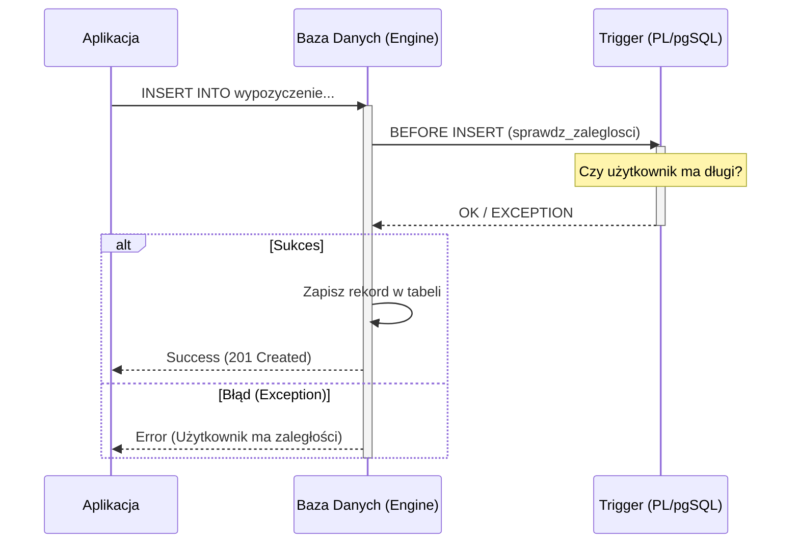

# Etap 2: Proceduralne rozszerzenia w projekcie (3 godz.)

## Cel etapu

Zaimplementowanie logiki biznesowej bezpośrednio w silniku bazy danych przy użyciu języka PL/pgSQL. Pozwala to na zapewnienie spójności danych niezależnie od aplikacji klienckiej.

## Kiedy używać logiki w bazie danych?

| Mechanizm               | Kiedy stosować?                                       | Przykład                                  |
| :---------------------- | :---------------------------------------------------- | :---------------------------------------- |
| **Wyzwalacz (Trigger)** | Automatyczna reakcja na `INSERT`, `UPDATE`, `DELETE`. | Logowanie zmian, walidacja przed zapisem. |
| **Funkcja (UDF)**       | Powtarzalne obliczenia, transformacje danych.         | Obliczanie wieku na podstawie PESEL.      |
| **Procedura**           | Złożone operacje z zarządzaniem transakcjami.         | Przeniesienie środków między kontami.     |

## Zadania na tym etapie

Wymagane jest przygotowanie **minimum 3 funkcji** oraz **minimum 3 wyzwalaczy**.

1. [ ] **Wyzwalacze (min. 3):**
   - [ ] Wyzwalacz walidacyjny (np. `BEFORE INSERT` sprawdzający warunki biznesowe).
   - [ ] Wyzwalacz logujący/audytowy (np. `AFTER UPDATE` zapisujący historię do tabeli pomocniczej).
   - [ ] Wyzwalacz automatyzujący (np. aktualizacja statusu lub daty).
1. [ ] **Funkcje (min. 3):**
   - [ ] Funkcja zwracająca tabelę (np. raport aktywności użytkownika).
   - [ ] Funkcja obliczeniowa (np. wyliczanie ceny po rabacie).
   - [ ] Funkcja walidacyjna (np. sprawdzanie poprawności danych wejściowych).

## Mechanizm działania wyzwalacza (Trigger)

Wyzwalacz (trigger) to procedura składowana, która jest automatycznie wywoływana przez silnik bazy danych w odpowiedzi na określone zdarzenie (np. `INSERT`, `UPDATE`, `DELETE`) na konkretnej tabeli lub widoku.

### Rodzaje wyzwalaczy:

- **BEFORE:** Wykonuje się przed właściwą operacją. Idealny do walidacji danych lub modyfikacji wartości `NEW`.
- **AFTER:** Wykonuje się po operacji. Stosowany głównie do audytu, logowania zmian w tabelach pomocniczych lub kaskadowych aktualizacji.
- **INSTEAD OF:** Zazwyczaj stosowany na widokach, aby umożliwić ich edycję.

### Kluczowe zmienne w PL/pgSQL:

- `NEW`: Rekord zawierający nowe dane (dostępny dla `INSERT` i `UPDATE`).
- `OLD`: Rekord zawierający stare dane (dostępny dla `UPDATE` i `DELETE`).
- `TG_OP`: Zmienna tekstowa zawierająca rodzaj operacji (`INSERT`, `UPDATE`, `DELETE`, `TRUNCATE`).

### Schemat działania:



## Przykłady implementacji

### 1. Wyzwalacz walidacyjny (BEFORE INSERT)

Zapobiega dodaniu wypożyczenia, jeśli użytkownik ma nieuregulowane płatności.

```sql
-- Funkcja wyzwalająca
CREATE OR REPLACE FUNCTION sprawdz_zaleglosci()
RETURNS TRIGGER AS $$
DECLARE
    ma_zaleglosci BOOLEAN;
BEGIN
    -- Sprawdzenie czy istnieje jakakolwiek płatność ze statusem ZALEGLOSC
    SELECT EXISTS (
        SELECT 1 FROM PLATNOSC p
        WHERE p.uzytkownik_id = NEW.uzytkownik_id
          AND p.status = 'ZALEGLOSC'
    ) INTO ma_zaleglosci;

    IF ma_zaleglosci THEN
        RAISE EXCEPTION 'Użytkownik posiada zaległości w płatnościach - operacja przerwana';
    END IF;

    -- Dla wyzwalaczy BEFORE należy zwrócić NEW, aby kontynuować operację
    RETURN NEW;
END;
$$ LANGUAGE plpgsql;

-- Utworzenie wyzwalacza
CREATE TRIGGER trg_sprawdz_zaleglosci
BEFORE INSERT ON WYPOZYCZENIE
FOR EACH ROW
EXECUTE FUNCTION sprawdz_zaleglosci();
```

### 2. Wyzwalacz audytowy (AFTER UPDATE)

Rejestruje każdą zmianę ceny filmu w specjalnej tabeli historii.

```sql
-- Tabela logów
CREATE TABLE historia_cen (
    id SERIAL PRIMARY KEY,
    film_id INT,
    stara_cena NUMERIC,
    nowa_cena NUMERIC,
    data_zmiany TIMESTAMP DEFAULT CURRENT_TIMESTAMP
);

-- Funkcja logująca
CREATE OR REPLACE FUNCTION loguj_zmiane_ceny()
RETURNS TRIGGER AS $$
BEGIN
    IF OLD.cena <> NEW.cena THEN
        INSERT INTO historia_cen(film_id, stara_cena, nowa_cena)
        VALUES (OLD.id, OLD.cena, NEW.cena);
    END IF;
    RETURN NEW;
END;
$$ LANGUAGE plpgsql;

-- Utworzenie wyzwalacza
CREATE TRIGGER trg_log_cena
AFTER UPDATE ON FILM
FOR EACH ROW
EXECUTE FUNCTION loguj_zmiane_ceny();
```

### 3. Funkcja walidująca (Regex)

```sql
CREATE OR REPLACE FUNCTION waliduj_email(email TEXT)
RETURNS BOOLEAN AS $$
BEGIN
    RETURN email ~ '^[A-Za-z0-9._%+-]+@[A-Za-z0-9.-]+\.[A-Za-z]{2,}$';
END;
$$ LANGUAGE plpgsql;
```

## Dokumentacja procedur

Każda procedura, funkcja i wyzwalacz powinny być udokumentowane w raporcie końcowym, wyjaśniając problem biznesowy, który rozwiązują.

## Lista kontrolna (Checklist)

- [ ] Czy zaimplementowałeś **minimum 3 funkcje**?
- [ ] Czy zaimplementowałeś **minimum 3 wyzwalacze**?
- [ ] Czy każda funkcja/wyzwalacz ma krótki opis działania?
- [ ] Czy funkcje mają zdefiniowany język (`LANGUAGE plpgsql`)?
- [ ] Czy wyzwalacze typu `BEFORE` są używane do walidacji, a `AFTER` do logowania (audit)?
- [ ] Czy zdefiniowałeś tabelę pomocniczą dla wyzwalaczy logujących?
