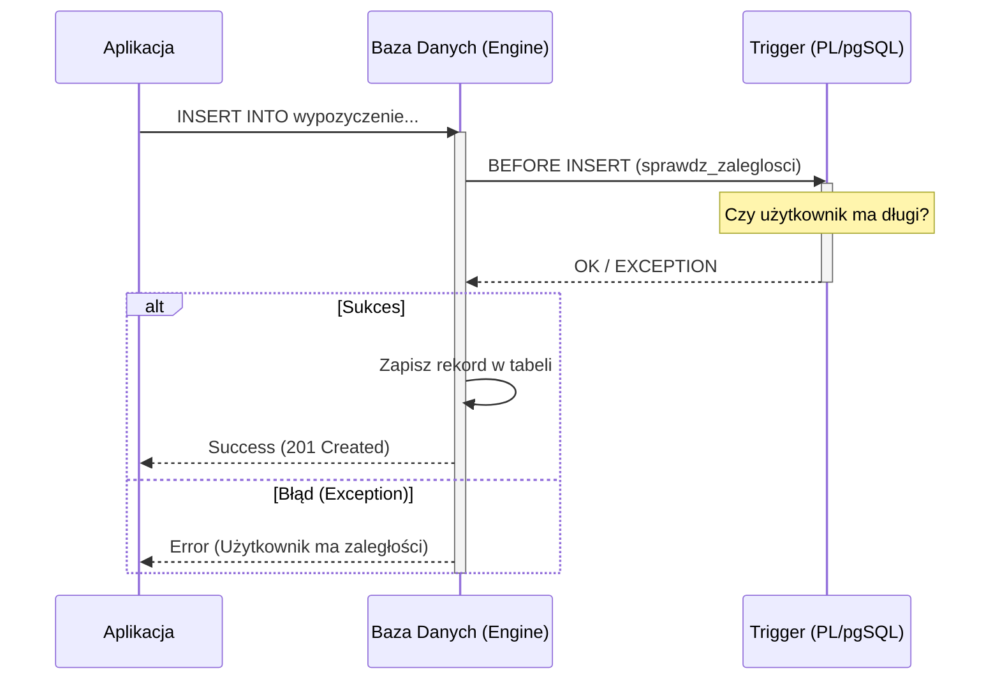

# Etap 2: Proceduralne rozszerzenia w projekcie (2h)

## Cel etapu

Zaimplementowanie logiki biznesowej bezpośrednio w silniku bazy danych przy użyciu języka PL/pgSQL. Pozwala to na zapewnienie spójności danych niezależnie od aplikacji klienckiej.

## Kiedy używać logiki w bazie danych?

| Mechanizm               | Kiedy stosować?                                       | Przykład                                  |
| :---------------------- | :---------------------------------------------------- | :---------------------------------------- |
| **Wyzwalacz (Trigger)** | Automatyczna reakcja na `INSERT`, `UPDATE`, `DELETE`. | Logowanie zmian, walidacja przed zapisem. |
| **Funkcja (UDF)**       | Powtarzalne obliczenia, transformacje danych.         | Obliczanie wieku na podstawie PESEL.      |
| **Procedura**           | Złożone operacje z zarządzaniem transakcjami.         | Przeniesienie środków między kontami.     |

## Zadania na tym etapie

1. [ ] **Wyzwalacze i funkcje walidacyjne:**
   - [ ] Automatyczna aktualizacja daty ostatniego logowania użytkownika.
   - [ ] Blokowanie wypożyczenia filmu, jeśli użytkownik ma zaległości w płatnościach.
   - [ ] Logowanie usuniętych rekordów do tabeli archiwalnej (Audit Log).
1. [ ] **Funkcje obliczeniowe:**
   - [ ] Walidacja adresu e-mail przy rejestracji (wyrażenia regularne).
   - [ ] Funkcja do wyliczania rabatu na podstawie stażu użytkownika.
1. [ ] **Opcjonalnie: Integracja zewnętrzna**
   - [ ] Przygotowanie widoków pod raporty PDF.

## Mechanizm działania wyzwalacza (Trigger)



## Przykłady implementacji

### 1. Wyzwalacz blokujący (PostgreSQL)

Funkcja sprawdzająca status płatności przed nowym wypożyczeniem:

```sql
-- Funkcja wyzwalająca
CREATE OR REPLACE FUNCTION sprawdz_zaleglosci()
RETURNS TRIGGER AS $$
DECLARE
    ma_zaleglosci BOOLEAN;
BEGIN
    SELECT EXISTS (
        SELECT 1 FROM PLATNOSC p
        WHERE p.uzytkownik_id = NEW.uzytkownik_id
          AND p.status = 'ZALEGLOSC'
    ) INTO ma_zaleglosci;

    IF ma_zaleglosci THEN
        RAISE EXCEPTION 'Użytkownik posiada zaległości w płatnościach';
    END IF;

    RETURN NEW;
END;
$$ LANGUAGE plpgsql;

-- Wyzwalacz
CREATE TRIGGER trg_sprawdz_zaleglosci
BEFORE INSERT ON WYPOZYCZENIE
FOR EACH ROW
EXECUTE FUNCTION sprawdz_zaleglosci();
```

### 2. Funkcja walidująca (Regex)

```sql
CREATE OR REPLACE FUNCTION waliduj_email(email TEXT)
RETURNS BOOLEAN AS $$
BEGIN
    RETURN email ~ '^[A-Za-z0-9._%+-]+@[A-Za-z0-9.-]+\.[A-Za-z]{2,}$';
END;
$$ LANGUAGE plpgsql;
```

## Integracja z Pythonem (opcjonalnie)

Jeśli chcesz dodać warstwę aplikacyjną w Pythonie, dla PostgreSQL użyj biblioteki `psycopg` i zarządzaj transakcjami w kodzie aplikacji. Dla prototypów SQLite można użyć `sqlite3` i rejestrować funkcje niestandardowe.

## Lista kontrolna (Checklist)

- [ ] Czy funkcje mają zdefiniowany język (`LANGUAGE plpgsql`)?
- [ ] Czy wyzwalacze typu `BEFORE` są używane do walidacji, a `AFTER` do logowania (audit)?
- [ ] Czy obsłużyłeś sytuacje, w których funkcja może zwrócić `NULL`?
- [ ] Czy Twoje funkcje są odporne na ataki SQL Injection (użycie parametrów zamiast konkatenacji)?
